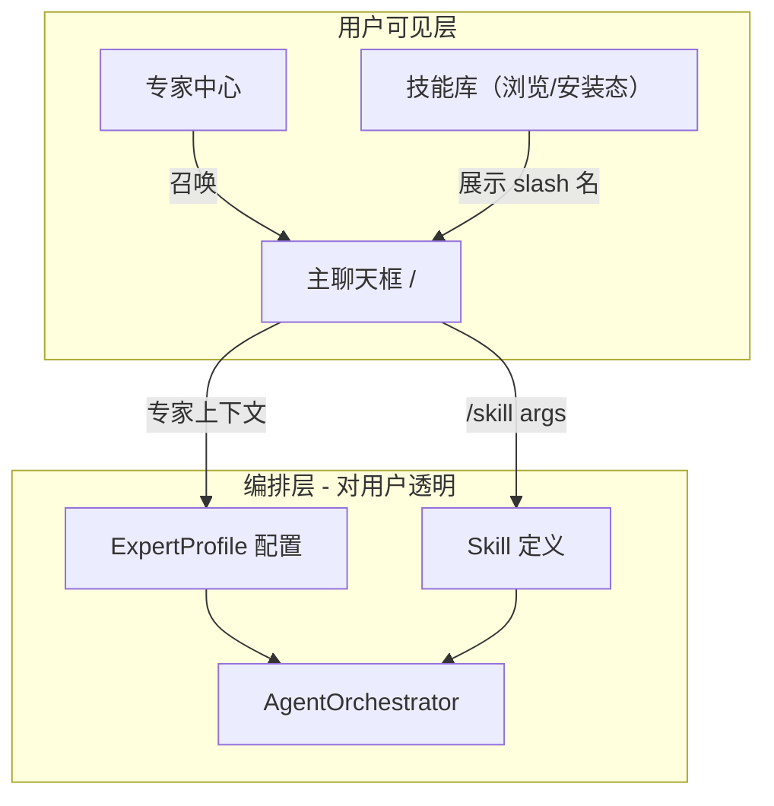
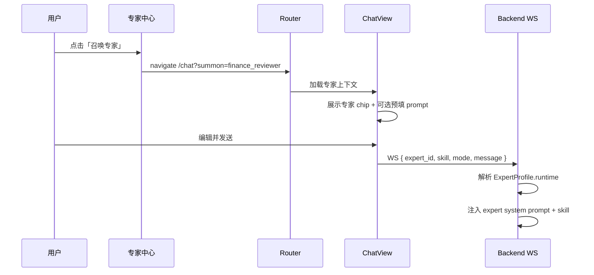

# PRD — WorkBuddy 对标：聊天斜杠技能 & 专家中心

> **版本**：1.1  
> **日期**：2026-07-30  
> **状态**：待评审  
> **变更说明（v1.1）**：移除会员/非会员权限边界，聚焦功能对标；权限策略留待后续统一 PRD 处理  
> **优先级**：P0（产品形态对齐）  
> **关联模块**：聊天页 / 技能编排 / 智能体档案 / Agent 编排 / WebSocket  
> **关联文档**：[技能系统 README](../../skills/README.md)、[Multi-Agent README](../../multi-agent/README.md)、[执行模式详解](../02-执行模式详解.md)、[API 与前端交互](../../defense/08-API与前端交互.md)

---

## 文档说明

本 PRD 覆盖 **两项强关联的产品改造**，目标是将当前「工程导向」的能力暴露方式，对齐 WorkBuddy 的「业务导向」交互范式：

| 编号 | 需求名称 | 一句话目标 |
|------|----------|------------|
| **R1** | 聊天斜杠技能（Slash Skill） | 技能不在独立页面试跑/全局启用，而是在主页聊天框用 `/技能名` 召唤 |
| **R2** | 专家中心（Expert Center） | 智能体档案不再展示「执行引擎」，改为「专家 / 专家团」角色卡片与召唤入口 |

两项需求共享同一产品世界观：**用户面向「谁来做 / 用什么能力」，平台内部消化「怎么跑（ReAct / Plan-Execute / Multi-Agent）」**。

---

## 0. WorkBuddy 调研结论（对标基准）

### 0.1 产品三层架构

WorkBuddy 公开文档与社区资料一致地将能力分为三层（[专家中心官方文档](https://www.workbuddy.cn/docs/workbuddy/From-Beginner-to-Expert-Guide/Function-Description/Expert-Center)、[Enterprise 技能文档](https://cloud.tencent.com/document/product/1831/134432)）：

```
┌─────────────────────────────────────────────────────────┐
│  专家 / 专家团（Expert / Expert Team）                    │
│  「人设 + 方法论 + 工具链」— 用户选择的角色与协作团队        │
├─────────────────────────────────────────────────────────┤
│  技能 Skill                                             │
│  「可执行能力包」— 脚本、工作流、领域 SOP（SKILL.md）      │
├─────────────────────────────────────────────────────────┤
│  连接器 / 插件（MCP / Plugin）                           │
│  外部系统接入 — 邮件、IM、文件系统、第三方 API              │
└─────────────────────────────────────────────────────────┘
```

**用户心智对照：**

| WorkBuddy 概念 | 用户理解 | 内部实现（用户不可见） |
|----------------|----------|------------------------|
| **Skill** | 让 AI **能做**某件事（能力） | 工具白名单 + 工作流 + Prompt 片段 |
| **专家** | 懂某领域的 **AI 顾问**（能力 + 经验） | Agent 人设 + 默认 Skill + 方法论 Prompt |
| **专家团** | 多角色 **协作交付**完整结果 | Multi-Agent 编排 + 团长拆解 + 并行执行 |

官方明确区分（[专家 vs Skill vs 专家团](https://www.workbuddy.cn/docs/workbuddy/From-Beginner-to-Expert-Guide/Function-Description/Expert-Center)）：

- **Skill 是能力**
- **专家是能力 + 经验**
- **专家团是多位专家 + 协作流程**

### 0.2 技能（Skill）的工作形式

#### 安装 vs 启用 vs 调用

| 阶段 | WorkBuddy 行为 | 当前本平台 |
|------|----------------|------------|
| **发现** | 技能市场：上传 / 查找 / 创建 | 技能编排页列表 |
| **安装** | 导入本地技能包，进入「已安装」 | 无安装概念，内置即存在 |
| **启用** | 已安装技能可开关；关闭后对话中不会被调用 | 全局 `activate/deactivate` 单一激活 |
| **调用** | **在对话中召唤** — 输入 `/` 或 AI 自动识别 | WebSocket 传 `skill` 字段；历史上曾有页头下拉 |
| **试跑** | **无独立试跑页**；在聊天框直接描述任务 | SkillsView 有「技能试跑」面板 + REST execute |

#### 斜杠命令机制（CodeBuddy / WorkBuddy 技能文档）

根据 [CodeBuddy Skills 文档](https://www.codebuddy.ai/docs/zh/cli/skills)：

| 特性 | Skill（默认可 AI 自动调用） | Slash Command（用户手动 `/`） |
|------|----------------------------|------------------------------|
| 触发 | AI 根据 description 自动选择 | 用户输入 `/skill-name` |
| 可见性 | 对用户相对透明 | 输入 `/` 弹出菜单，主动选择 |
| 配置 | `user-invocable: false` 可从 `/` 菜单隐藏 | `disable-model-invocation: true` 仅允许手动触发 |

**WorkBuddy 用户侧关键体验：**

1. 用户在**主聊天输入框**输入 `/`
2. 弹出已安装且可召唤的技能列表（含搜索）
3. 选择或输入 `/financial_audit 请审阅以下报表…`
4. 输入区上方/内显示**当前已启用技能**标识（chip / 标签）
5. 发送后，该轮对话在 Skill 约束下执行
6. **没有**「去技能页点启用 → 再去聊天页说话 → 再去技能页试跑」的割裂流程

### 0.3 专家中心的工作形式

根据 [WorkBuddy 专家中心文档](https://www.workbuddy.cn/docs/workbuddy/From-Beginner-to-Expert-Guide/Function-Description/Expert-Center)：

**页面结构：**

- **专家中心**：按行业分类浏览官方专家 / 专家团
- **我的专家**（二期）：用户自建专家（本 PRD Phase 1 不做）

**专家卡片信息要素：**

- 能力介绍（一句话价值主张）
- 擅长领域（标签）
- 任务示例（可点击填充到聊天框）
- CTA：**「召唤专家」** → 进入对话，以该专家身份服务

**专家团卡片信息要素：**

- 能力介绍
- 擅长领域
- **团队成员**（角色列表）
- 任务示例
- CTA：**「召唤专家团」** → 进入对话，团长自动拆解协作

**明确不展示的内容：**

- ReAct / Plan-Execute / StateGraph 等**执行引擎**名称
- 「推理-行动闭环引擎」「任务编排引擎」等工程术语

用户选的是 **「财务审阅专家」**，不是 **「任务编排智能体」**。

### 0.4 与本平台的差距矩阵

| 维度 | WorkBuddy | 当前平台（2026-07-30） | 差距 |
|------|-----------|------------------------|------|
| 技能启用入口 | 聊天框 `/` | 技能页「启用技能」+ WS `skill` 字段 | 入口分散、非主路径 |
| 技能试跑 | 无，直接在聊天验证 | SkillsView「技能试跑」textarea + execute API | 多余环节 |
| 技能与对话关系 | 对话内即时召唤 | 全局进程级单激活 (`skill_registry.activate`) | 语义不符 |
| 智能体档案 | 专家 / 专家团 | 执行引擎 + 智能体单元（工程命名） | 暴露实现 |
| 用户选择单位 | 专家、专家团 | execution_mode、agent key | 心智错位 |
| 编排内核 | Harness 内部消化 | 前端/文档多处暴露 execution_mode | 需下沉 |

---

## 1. 背景与目标

### 1.1 背景

本平台以**会计学场景**（财务审阅、报表分析、协同决策）为主要演示领域，底层已具备：

- 3 个内置 Skill（`financial_audit` / `document_analysis` / `data_visualization`）
- 3 种执行引擎（ReAct / Plan-Execute / AccountingDebateTeam）
- 技能注册中心、工具白名单、Pipeline 执行器

但产品层仍呈现**开发者控制台**气质：

- `SkillsView.vue`：启用按钮 + 试跑面板
- `AgentsView.vue`：首屏「执行引擎」+ 「推理行动智能体」类命名
- 用户需理解 execution_mode 才能选对能力

这与 WorkBuddy「职场人数字同事」的定位不一致，答辩/demo 时也难以让非技术评委一眼理解价值。

### 1.2 产品目标

| 目标 ID | 描述 | 成功标准 |
|---------|------|----------|
| **G1** | 技能主入口统一到聊天框 `/` | 90% 技能使用路径不经过技能页按钮 |
| **G2** | 移除技能试跑独立环节 | SkillsView 无试跑 UI；验收用例全部在聊天完成 |
| **G3** | 智能体档案重构为专家中心 | 页面零处出现「执行引擎」对用户可见文案 |
| **G4** | 专家/专家团可一键召唤 | 从专家卡片到发出首条消息 ≤ 2 次点击 |
| **G5** | 工程实现与用户界面解耦 | execution_mode 仅出现在运维文档/API 调试，不出现在主 UI |

### 1.3 不在本次范围（Phase 1 Out of Scope）

- **会员 / 普通用户权限差异化**（技能锁、专家锁、升级提示等 — 见 §1.4，后续统一 PRD 处理）
- 用户自定义创建专家（WorkBuddy「我的专家」）
- 技能市场上传 / 第三方 Skill 包导入
- OpenClaw 社区 Skill 兼容
- MCP 连接器管理 UI
- 积分/配额消耗展示（WorkBuddy 专家团 3–5 倍积分提示）
- 项目级 `.codebuddy/skills/` 文件系统 Skill 热加载
- 多 Skill 同时激活（Phase 1 保持**单会话单 Skill**；见 §4.1.6 演进说明）

### 1.4 权限策略说明（本次 deliberately 跳过）

本 PRD **仅描述功能形态与交互**，不定义 regular / member 的访问边界。

| 本次不做 | 后续统一考虑 |
|----------|--------------|
| `membership_required` 字段与 UI 锁标识 | 多用户 PRD / 会员 PRD 中统一定义 |
| 专家 / 技能按用户类型过滤列表 | 与配额、知识库 visibility 一并设计 |
| `403 MEMBERSHIP_REQUIRED` 拦截逻辑 | 功能上线后再挂权限层 |

**开发约定：** Phase 1 所有内置 Skill、专家、专家团对**全部登录用户**开放；API 响应中**不包含** `membership_required` 字段；前端**不出现**会员锁、升级引导等与本次功能无关的 UI。

---

## 2. 用户与场景

### 2.1 目标用户

| 用户 | 诉求 |
|------|------|
| **业务用户** | 快速完成财务审阅、文档分析，无需理解 Agent 原理 |
| **答辩演示者** | 3 分钟内展示「选专家 → 对话 → 出报告」闭环 |
| **开发/运维** | 通过配置扩展专家与 Skill，不改动聊天主流程 |

> 会员体系、配额、升级引导等不在本 PRD 用户画像内展开。

### 2.2 核心场景 — R1 斜杠技能

| 编号 | 场景 | 当前路径 | 期望路径 |
|------|------|----------|----------|
| **S1-1** | 用户要做财务审阅 | 技能页启用 → 回聊天 → 输入 | 聊天框输入 `/financial_audit` → 描述需求 → 发送 |
| **S1-2** | 用户忘记技能名 | 翻技能页找名字 | 输入 `/` 弹出可搜索技能菜单 |
| **S1-3** | 用户想换技能 | 技能页先停用 A 再启用 B | 新消息使用 `/other_skill` 或清除当前 Skill chip |
| **S1-4** | 用户不带 Skill 普通问答 | 需确认未启用技能 | 直接输入，无 Skill chip，走默认 Agent |

### 2.3 核心场景 — R2 专家中心

| 编号 | 场景 | 当前路径 | 期望路径 |
|------|------|----------|----------|
| **S2-1** | 用户要做财务审阅 | 自选模式 + 自选 skill | 专家中心点「财务审阅专家」→ 召唤 → 聊天 |
| **S2-2** | 用户要多角度评审 | 知道要选「协同决策」模式 | 专家中心点「财务评审委员会」专家团 → 召唤 |
| **S2-3** | 用户浏览能力 | 看到「推理-行动闭环引擎」 | 看到「资深报表分析师」+ 任务示例 |
| **S2-4** | 用户想快速试任务 | 自己编 prompt | 点击专家卡片上的任务示例，自动填充聊天框 |
| **S2-5** | 用户从聊天页发现专家 | 无 | 空状态推荐专家卡片（可选 P1） |

---

## 3. 术语与概念模型

### 3.1 对外术语（用户可见）

| 术语 | 定义 | 示例 |
|------|------|------|
| **技能（Skill）** | 可召唤的能力包，用 `/名称` 启用 | `/financial_audit` |
| **专家（Expert）** | 单角色领域顾问，含人设、方法论、默认技能 | 「财务审阅专家」 |
| **专家团（Expert Team）** | 多专家协作，团长拆解任务 | 「财务评审委员会」 |
| **召唤（Summon）** | 选择专家/团后进入对话并注入上下文 | 按钮「召唤专家」 |
| **已安装技能** | 平台（或用户）可用技能集合 | Phase 1 = 全部内置技能 |

### 3.2 对内术语（实现层，不对用户展示）

| 术语 | 与对外概念映射 |
|------|----------------|
| `execution_mode` | 专家/专家团的 `runtime.mode` 字段 |
| `ReActAgent` / `PlanExecuteAgent` / `AccountingDebateTeam` | 专家 `runtime.agent_class` |
| `skill_registry` | Skill 运行时注册表 |
| `active_skill` | 会话级当前 Skill（由 `/` 或专家召唤注入） |

### 3.3 概念关系图



### 3.4 WorkBuddy 对齐：Skill vs 专家 vs 专家团（本平台落地）

| 类型 | 用户看到 | 内部打包内容 |
|------|----------|--------------|
| **Skill** | `/financial_audit` | tools + prompt + pipeline |
| **Expert** | 「财务审阅专家」卡片 | 默认 Skill + 专家 Prompt + 推荐 mode |
| **Expert Team** | 「财务评审委员会」 | multi_agent team + 成员人设 + 默认 mode |

**原则：专家 ⊃ Skill，专家团 ⊃ 多 Expert 角色；执行引擎 never 露出。**

---

## 4. 功能需求 — R1：聊天斜杠技能

### 4.1 聊天输入框

#### F-R1-01 `/` 触发技能菜单（P0）

**描述：** 用户在聊天输入框输入 `/` 时，弹出技能选择菜单（类似 WorkBuddy / CodeBuddy CLI 的 `/` 菜单）。

**交互细则：**

| 规则 | 说明 |
|------|------|
| 触发字符 | 行首 `/` 或空格后 `/`（Phase 1 仅支持**行首** `/`，降低解析复杂度） |
| 菜单内容 | 当前用户**已安装且可召唤**的技能列表 |
| 每项展示 | `display_name`、`description` 摘要、`/name` 命令 |
| 搜索 | 菜单内输入过滤（匹配 name / display_name / 描述） |
| 键盘 | ↑↓ 选择，Enter 确认，Esc 关闭 |
| 选中后 | 输入框变为 `/skill_name ` + 光标，等待用户补充任务描述 |

**验收：** 输入 `/` 300ms 内出现菜单；内置 3 个 Skill 均可见。

#### F-R1-02 斜杠指令解析（P0）

**描述：** 发送消息时，后端/前端解析 `/skill_name [args]` 格式。

**解析规则：**

```
/financial_audit 请分析以下 JSON 数据：{...}
│                │
│                └─ user_message（剥离 slash 后传入 Agent）
└─ skill_id = financial_audit
```

| 字段 | 规则 |
|------|------|
| `skill_id` | 正则 `^/([a-z][a-z0-9_]{1,63})(?:\s+(.*))?$`（单行首） |
| 未知 skill | 返回系统提示「未找到技能 `{name}`」，不发送 LLM |
| 无参数 | 允许；Skill 使用默认示例或追问 |
| 多 slash | 仅首个有效；`/a /b` 中 `/b` 视为正文 |

**与 WS 协议：**

```json
{
  "message": "请分析以下 JSON 数据：{...}",
  "skill": "financial_audit",
  "skill_invocation": "slash",
  "mode": "adaptive"
}
```

- `message`：**不含** `/skill_name` 前缀的纯用户任务文本
- `skill_invocation`：`slash` | `expert` | `auto` | null

#### F-R1-03 当前 Skill 状态展示（P0）

**描述：** 聊天输入区显示当前会话激活的技能 chip。

| 状态 | UI |
|------|-----|
| 无 Skill | 不显示 chip |
| 通过 `/` 激活 | 输入框上方显示 `[财务审阅技能 ×]` |
| 通过专家召唤 | `[财务审阅专家 · 财务审阅技能 ×]` |
| 清除 | 点击 × 清除会话 Skill，下次消息走默认 |

**说明：** 清除 Skill **不**影响已发送历史消息。

#### F-R1-04 会话级 Skill 绑定（P0）

**描述：** 用**会话级**状态替代全局进程级 `skill_registry.activate()`。

| 维度 | 现况 | 目标 |
|------|------|------|
| 作用域 | 全局单例 active skill | `session_id` 级 `active_skill` |
| 并发 | 用户 A 激活影响用户 B | 隔离 |
| 持久化 | 无 | 可选写入 session 表 metadata（P1） |

**实现要求：**

- WebSocket 连接上下文 / Session 存储 `active_skill`
- `resolve_system_prompt()` / `get_langchain_tools()` 从会话上下文读取
- 保留 `skill_registry.get(name)` 定义查询，**废弃**全局 activate 作为用户路径

#### F-R1-05 斜杠菜单数据来源（P0）

**新 API：** `GET /api/skills/invocable`

响应示例：

```json
{
  "skills": [
    {
      "name": "financial_audit",
      "display_name": "财务审阅技能",
      "slash_command": "/financial_audit",
      "description": "三表校验、比率分析、杜邦分解与审计报告生成",
      "category_label": "财务智能",
      "user_invocable": true,
      "installed": true
    }
  ]
}
```

字段说明：

| 字段 | 说明 |
|------|------|
| `user_invocable` | 对应 WorkBuddy `user-invocable`；false 则不出现在 `/` 菜单 |
| `installed` | Phase 1 内置技能恒为 true |

#### F-R1-06 与专家召唤的 Skill 优先级（P0）

当用户通过专家召唤进入聊天（R2），再手动输入 `/other_skill`：

| 情况 | 行为 |
|------|------|
| 新消息含 `/skill` | **以 slash 为准**，覆盖专家默认 Skill |
| 新消息不含 `/`，会话已有专家上下文 | 沿用专家绑定的默认 Skill |
| 清除 Skill chip | 若专家仍在，回退专家默认 Skill；否则无 Skill |

#### F-R1-07 空状态引导（P1）

ChatView 空状态快捷场景改为展示 **推荐技能** 与 **推荐专家**（与 R2 联动）：

- 点击「财务审阅」→ 等效输入 `/financial_audit ` 并 focus 输入框
- 不再展示 execution_mode 四卡片（与已删除的页头模式选择一致）

---

### 4.2 技能编排页（SkillsView）改造

#### F-R1-10 移除「技能试跑」（P0）

**删除：**

- 「技能试跑」textarea
- 「执行试跑」按钮
- `trialInputs` / `trialResults` 状态
- 对 `POST /api/skills/{name}/execute` 的前端调用（API 可保留供调试，文档标注 `@deprecated`）

**替换文案：**

> 在主页聊天框输入 **`/技能名`** 即可召唤该技能。例如：`/financial_audit 请审阅附件中的资产负债表`

#### F-R1-11 移除「启用技能 / 运行中」切换（P0）

**删除：**

- 「启用技能」「运行中 ✓」按钮
- 页头 Stat「当前启用」

**替换为安装态 UI（WorkBuddy 对齐）：**

| 元素 | 说明 |
|------|------|
| 安装状态 | Phase 1：内置技能显示「已安装」 |
| 召唤方式 | 醒目展示 `` `/financial_audit` `` 可复制 |
| 开关（P1） | 「在 `/` 菜单中显示」toggle → 写 `user_invocable` 配置 |

#### F-R1-12 页面定位调整（P0）

| 现标题 | 新标题 |
|--------|--------|
| 技能编排 | **技能库** |
| 副标题「工具组合 + Prompt…」 | **扩展 Agent 能力的工作流包；在对话中用 `/` 召唤** |

#### F-R1-13 保留信息架构（P0）

仍展示（帮助用户理解 Skill 价值，但不执行）：

- 技能描述
- 工作流步骤（workflow）
- 依赖能力（required_tools → 展示为「能力要求」而非工具内部名）

---

### 4.3 后端

#### F-R1-20 会话 Skill 上下文（P0）

**文件：** `backend/app/core/connection_context.py`（或新建 `session_context.py`）

```python
# 伪代码
set_session_skill(session_id: str, skill_name: str | None)
get_session_skill(session_id: str) -> str | None
```

WebSocket `chat.py` 在收到消息时：

1. 若 payload 含 `skill` → 更新 session skill
2. 若 payload 含 `skill: null` 且 `clear_skill: true` → 清除
3. 将 `active_skill` 写入 `AgentConfig`

#### F-R1-21 废弃用户路径的全局 activate（P0）

| 路径 | 处理 |
|------|------|
| `POST /api/skills/{name}/activate` | 标记 deprecated；内部改为设置**当前会话**（需 session_id 参数）或 410 |
| `POST /api/skills/deactivate` | 同上 |
| `skill_registry.activate()` | 仅 SkillExecutor 内部临时使用，不作为用户态 |

#### F-R1-22 Skill 元数据扩展（P0）

`BaseSkill` / `enrich_skill()` 增加：

```python
user_invocable: bool = True          # 是否出现在 / 菜单
slash_aliases: list[str] = []        # 可选别名，如 ["/audit"]
```

> `membership_required` 等权限字段**不在 Phase 1 引入**；若后续会员 PRD 需要，在 catalog 层扩展即可，不影响 slash / 召唤主流程。

---

### 4.4 前端 Store

#### F-R1-30 chatStore 扩展（P0）

```typescript
interface ChatSessionState {
  activeSkill: string | null
  activeExpert: string | null      // R2 联动
  skillInvocationSource: 'slash' | 'expert' | null
}

// 发送前解析
function parseSlashCommand(input: string): { skill: string | null; message: string }
```

#### F-R1-31 新增 SlashMenu 组件（P0）

- 文件：`frontend/src/components/chat/SlashSkillMenu.vue`
- Props：`query`, `visible`, `skills[]`
- Events：`select(skill)`, `close`

---

## 5. 功能需求 — R2：专家中心

### 5.1 信息架构

#### F-R2-01 页面更名（P0）

| 现况 | 目标 |
|------|------|
| 导航「智能体档案」 | **专家中心** |
| 路由 `/agents` | 可保留路径，改 `meta.title`；或迁移 `/experts` 并做 alias |
| PageHeader 副标题「执行单元…」 | **按领域挑选专家或专家团，一键召唤进入对话** |

#### F-R2-02 移除「执行引擎」区块（P0）

**完全删除** `AgentsView` 中：

- 「执行引擎」section 及 `executionModes` 网格
- PageHeader stat「执行引擎」
- 任何 `reasoning_action` / `task_orchestration` 用户可见文案

**execution_modes 数据：**

- 保留于 `backend/app/core/catalog.py` 供 API 调试
- 从 `GET /api/agents` **移除**对外字段，或移入 `_internal` 管理端点

#### F-R2-03 Tab 分区：专家 | 专家团（P0）

```
专家中心
├── [专家]      ← 默认 Tab
└── [专家团]
```

可选：**按行业筛选**（Phase 1 会计学单行业可简化为「财务与审计」单分类）

---

### 5.2 专家（Expert）卡片规格

#### F-R2-10 ExpertProfile 数据模型（P0）

**新 catalog：** `EXPERT_PROFILES`（替代用户面的 `AGENT_PROFILES`）

```yaml
id: finance_reviewer
type: expert                    # expert | team
name: 财务审阅专家
title: 资深 CPA · 四大会计师事务所背景
avatar: finance_reviewer.svg   # 或 icon key
tagline: 三表勾稽、比率分析、审计意见一站式输出
domains: [财务审计, 报表分析, 合规初筛]
example_tasks:
  - prompt: 请审阅以下资产负债表，指出异常科目与流动性风险
    label: 资产负债表审阅
  - prompt: 对以下利润表做同比分析并给出审计关注点
    label: 利润表同比分析
equipped_skills:
  - name: financial_audit
    display_name: 财务审阅技能
runtime:                        # 对用户不可见
  mode: task_orchestration      # adaptive | reasoning_action | ...
  default_skill: financial_audit
  agent_profile_key: null       # team 专用
```

#### F-R2-11 专家卡片 UI（P0）

**卡片必含：**

| 区块 | 内容 |
|------|------|
| Header | 头像 + 名称 + 头衔 |
| Tagline | 一句话价值 |
| Domains | 擅长领域 tags |
| Skills | 「配备技能：财务审阅技能」— 不展示工具名 |
| Examples | 2–3 个任务示例（可点击） |
| CTA | 主按钮 **「召唤专家」** |

**卡片不含：**

- execution_mode 名称
- LangGraph / ReAct 等术语
- 工具列表（`balance_sheet_analyzer` 等）

#### F-R2-12 内置专家清单（P0 — 会计学定向）

Phase 1 至少 3 专家 + 1 专家团，与现有能力**一一映射**：

| 专家 ID | 展示名 | 内部 mode | 默认 Skill | 说明 |
|---------|--------|-----------|------------|------|
| `finance_reviewer` | 财务审阅专家 | task_orchestration | financial_audit | 原 Plan-Execute + 审计 Pipeline |
| `report_analyst` | 报表解读专家 | reasoning_action | null | 原 ReAct + 会计工具集 |
| `document_insight` | 文档洞察专家 | reasoning_action | document_analysis | 文档分析场景 |
| `finance_review_board` | 财务评审委员会 | collaborative_decision | null | 原 AccountingDebateTeam |

> **命名原则：** 用户看到「财务审阅专家」，不是「任务编排智能体」。

---

### 5.3 专家团（Expert Team）卡片规格

#### F-R2-20 ExpertTeam 扩展字段（P0）

```yaml
id: finance_review_board
type: team
name: 财务评审委员会
tagline: 分析师 · 质疑官 · 裁决官 三轮协作，输出评审结论
domains: [投资评审, 风险识别, 并购尽调]
members:
  - role: 财务分析师
    stance: 基于数据提出分析结论与假设
  - role: 审计质疑官
    stance: 挑战假设，识别会计红旗与舞弊信号
  - role: 投资裁决官
    stance: 综合辩论，给出最终评审意见
collaboration_flow:
  - 分析师独立分析并引用工具结果
  - 质疑官逐条挑战
  - 裁决官形成最终报告
example_tasks:
  - prompt: 请对以下公司财务数据组织一场评审委员会辩论，并给出投资意见
    label: 多视角投资评审
runtime:
  mode: collaborative_decision
  team_class: AccountingDebateTeam
```

#### F-R2-21 专家团卡片 UI（P0）

| 区块 | 内容 |
|------|------|
| Header | 团队名 + 协作图标 |
| Members | 成员角色 + 一句话立场 |
| Flow | 简化的协作流程（3 步） |
| Warning（可选） | 「多角色协作，耗时与 token 消耗高于单专家」 |
| CTA | **「召唤专家团」** |

---

### 5.4 召唤（Summon）流程

#### F-R2-30 召唤交互（P0）



#### F-R2-31 召唤后聊天态（P0）

进入 ChatView 后：

| UI 元素 | 内容 |
|---------|------|
| 专家 chip | `[财务审阅专家 ×]` |
| Skill chip | 若专家有 default_skill，联动显示 |
| 输入框 placeholder | `向财务审阅专家描述您的任务…` |
| 首条 system 事件（可选） | 「已召唤 **财务审阅专家**，将按 CPA 审阅方法论为您服务」 |

#### F-R2-32 WebSocket 扩展（P0）

```json
{
  "message": "请审阅以下数据…",
  "expert_id": "finance_reviewer",
  "skill": "financial_audit",
  "mode": "task_orchestration",
  "skill_invocation": "expert"
}
```

**后端 `AgentOrchestrator`：**

1. 若存在 `expert_id` → 加载 `EXPERT_PROFILES[expert_id].runtime`
2. `mode` / `skill` 以 expert runtime 为默认，允许 slash 覆盖 skill
3. 注入 `expert_system_prompt`（来自 Expert 配置，**不**暴露 mode 名）

#### F-R2-33 任务示例点击（P0）

点击专家卡片上的 example_task：

1. 跳转 ChatView
2. 设置 expert 上下文
3. 输入框填充 `prompt` 文本
4. **不自动发送**（让用户补充数据后再发）

---

### 5.5 API

#### F-R2-40 新端点（P0）

**`GET /api/experts`**

```json
{
  "experts": [ /* ExpertProfile, type=expert */ ],
  "teams": [ /* ExpertProfile, type=team */ ],
  "categories": [
    { "key": "finance", "label": "财务与审计" }
  ]
}
```

**`GET /api/experts/{id}`** — 详情页（P1）

#### F-R2-41 旧端点迁移（P0）

| 旧 | 新 |
|----|-----|
| `GET /api/agents` | `GET /api/experts`（agents 返回 301 或兼容层转 experts） |
| `execution_modes` in response | **移除** |

---

### 5.6 与 R1 的联动

| 用户操作 | 结果 |
|----------|------|
| 召唤「财务审阅专家」 | 自动绑定 `financial_audit` + chip 展示 |
| 在专家对话中输入 `/document_analysis` | 一切换为文档技能，专家 chip 保留或灰显 |
| 清除 Skill chip | 回退专家默认 Skill |
| 清除 Expert chip | 清除专家与关联 Skill，回到普通对话 |

---

## 6. 非功能需求

### 6.1 性能

| 指标 | 要求 |
|------|------|
| `/` 菜单打开 | ≤ 300ms（技能 ≤ 50 条） |
| 专家列表加载 | ≤ 500ms |
| 召唤跳转 | 路由切换 ≤ 200ms |

### 6.2 兼容

| 项目 | 要求 |
|------|------|
| 旧 WS 客户端传 `skill` 字段 | 继续支持，视为显式指定 |
| 旧 WS 传 `mode` | 支持；**前端主路径不再暴露** |
| `GET /api/agents` | 保留 3 个月兼容，文档 deprecated |

### 6.3 权限（本次跳过）

本 PRD **不定义** regular / member 的功能边界。Phase 1 假定：**任意已登录用户**均可使用全部 Skill、专家、专家团。

会员锁、列表过滤、`MEMBERSHIP_REQUIRED` 等留待 [多用户 PRD](../../多用户/prd/README.md) 或独立「会员与配额 PRD」统一挂载，本功能开发时**无需预留**权限 UI 占位。

### 6.4 安全

- Slash 解析仅允许 `[a-z0-9_]` skill 名，防注入
- 专家 `runtime` 配置仅服务端可读，不下发 `team_class` / `agent_class` 给前端

---

## 7. 数据与配置

### 7.1 新增 catalog 文件结构

建议：`backend/app/core/expert_catalog.py`

```
expert_catalog.py
├── EXPERT_PROFILES      # type=expert
├── EXPERT_TEAMS         # type=team（或合并在 PROFILES）
├── EXPERT_CATEGORIES
├── get_expert(id)
└── list_experts(category?)
```

`catalog.py` 中 `AGENT_PROFILES` / `EXECUTION_MODES` 标记 `@deprecated`，仅内部引用。

### 7.2 前端路由与导航

| 导航文案 | 路由 | 组件 |
|----------|------|------|
| 专家中心 | `/experts` | `ExpertsView.vue`（由 AgentsView 重构） |
| 技能库 | `/skills` | `SkillsView.vue`（改造） |

侧边栏顺序建议：**对话 → 专家中心 → 技能库 → 知识库 → …**

---

## 8. 交互原型（文字版）

### 8.1 聊天框 Slash

```
┌─────────────────────────────────────────────────────────┐
│  [财务审阅专家 ×]  [财务审阅技能 ×]                        │  ← 专家+Skill chips
├─────────────────────────────────────────────────────────┤
│  /fin█                                                    │
│  ┌──────────────────────────┐                            │
│  │ 🔍 搜索技能…              │                            │
│  │ /financial_audit         │                            │
│  │   财务审阅技能 · 三表校验…  │                            │
│  │ /document_analysis       │                            │
│  │   文档洞察技能 · 要点提取…  │                            │
│  └──────────────────────────┘                            │
│                                              [发送]      │
└─────────────────────────────────────────────────────────┘
```

### 8.2 专家中心

```
专家中心 · 按领域挑选专家，一键召唤进入对话
[ 专家 ] [ 专家团 ]     分类: [ 财务与审计 ▾ ]

┌─────────────────────┐  ┌─────────────────────┐
│ 👤 财务审阅专家       │  │ 👤 报表解读专家       │
│ 资深 CPA · 三表勾稽   │  │ 报表结构 · 指标解读   │
│ #财务审计 #报表分析   │  │ #报表分析 #指标计算   │
│ 配备: 财务审阅技能    │  │ 配备: —              │
│ · 资产负债表审阅      │  │ · 现金流质量分析      │
│ [ 召唤专家 ]         │  │ [ 召唤专家 ]         │
└─────────────────────┘  └─────────────────────┘

┌──────────────────────────────────────────┐
│ 👥 财务评审委员会                          │
│ 分析师 → 质疑官 → 裁决官                   │
│ #投资评审 #风险识别                        │
│ [ 召唤专家团 ]                            │
└──────────────────────────────────────────┘
```

---

## 9. 验收标准

### 9.1 R1 斜杠技能

| ID | 验收项 | 通过条件 |
|----|--------|----------|
| **A1** | `/` 菜单 | 聊天框输入 `/` 弹出技能列表 |
| **A2** | 斜杠发送 | 发送 `/financial_audit {json}` 成功出审计报告 |
| **A3** | 无试跑 | SkillsView 无试跑 UI；代码审查无 `trialRun` |
| **A4** | 无全局启用 | SkillsView 无「启用技能」；会话间 Skill 隔离 |
| **A5** | Chip | 激活后输入区显示 Skill chip，可清除 |

### 9.2 R2 专家中心

| ID | 验收项 | 通过条件 |
|----|--------|----------|
| **B1** | 无执行引擎 | 专家中心页面无「执行引擎」文案与区块 |
| **B2** | 专家卡片 | ≥3 专家卡，含领域/示例/召唤按钮 |
| **B3** | 专家团 | ≥1 专家团卡，含成员列表 |
| **B4** | 召唤 | 点击召唤跳转聊天，expert chip 展示 |
| **B5** | 示例填充 | 点击任务示例，输入框预填 prompt |
| **B6** | 端到端 | 召唤财务审阅专家 → 出报告，全程无 mode 选择 |
| **B7** | 专家团 | 召唤财务评审委员会 → 触发三方辩论 |

### 9.3 对标 WorkBuddy 体验（定性）

| 检查项 | 标准 |
|--------|------|
| 评委 3 分钟 demo | 无需解释 ReAct/Plan-Execute |
| 技能路径 | 演示者只展示 `/skill` 与专家召唤 |
| 与 WorkBuddy 录屏对比 | 主路径交互一致度 ≥ 80% |

---

## 10. 实施计划

### Phase 1 — 核心对标（建议 1.5–2 周）

| 序号 | 任务 | 依赖 | 估时 |
|------|------|------|------|
| 1 | `expert_catalog.py` + `GET /api/experts` | — | 2d |
| 2 | 会话级 Skill 上下文 + WS 解析 | — | 2d |
| 3 | `SlashSkillMenu` + chatStore 解析 | #2 | 2d |
| 4 | ExpertsView 重构（删执行引擎） | #1 | 2d |
| 5 | 召唤流程 + expert chip | #1,#2 | 1d |
| 6 | SkillsView 去试跑/去启用 | #3 | 1d |
| 7 | 联调 + 验收用例 | all | 2d |

### Phase 2 — 增强（可选）

- 用户自定义专家（我的专家）
- Skill 安装/卸载与 `user_invocable` 开关
- 专家详情页
- Session 持久化 expert/skill 选择
- Chat 空状态推荐专家

### Phase 3 — 权限与商业化（独立 PRD，不在 v1.1 范围）

- 会员 / 普通用户 Skill、专家访问控制
- 列表过滤、锁标识、升级引导
- 与配额、知识库 visibility 统一策略

---

## 11. 风险与对策

| 风险 | 影响 | 对策 |
|------|------|------|
| 全局 `skill_registry.activate` 耦合深 | 并发 Skill 串扰 | 会话上下文 + 保留内部临时 activate |
| 专家与 mode 映射错误 | 召唤后行为不符预期 | ExpertProfile 集成测试矩阵 |
| 旧前端缓存 `/agents` | 页面空白 | API 兼容层 + 前端 fallback |
| 评委仍看到工具内部名 | 出戏 | `toolLabel` 仅用于工具调用过程，专家页不用 |

---

## 12. 附录

### 附录 A — 现网代码映射表

| 现 UI / API | 本 PRD 目标 |
|-------------|-------------|
| `SkillsView` 试跑 | 删除 |
| `SkillsView` 启用按钮 | 删除 → 展示 `/slash` |
| `ChatView` header 模式/技能下拉 | 已删除 → 仅 `/` + 专家召唤 |
| `AgentsView` 执行引擎区 | 删除 |
| `AGENT_PROFILES.inference_action_agent` | → `EXPERT_PROFILES.report_analyst` |
| `AGENT_PROFILES.task_orchestration_agent` | → `EXPERT_PROFILES.finance_reviewer` |
| `AGENT_PROFILES.financial_review_board` | → `EXPERT_TEAMS.finance_review_board` |
| `POST /api/skills/{name}/activate` | deprecated |
| `GET /api/agents` + execution_modes | → `GET /api/experts` |

### 附录 B — WorkBuddy 参考链接

- [专家中心 — 官方文档](https://www.workbuddy.cn/docs/workbuddy/From-Beginner-to-Expert-Guide/Function-Description/Expert-Center)
- [WorkBuddy Enterprise 技能](https://cloud.tencent.com/document/product/1831/134432)
- [CodeBuddy Skills vs Slash Commands](https://www.codebuddy.ai/docs/zh/cli/skills)
- [WorkBuddy 专家-技能-插件架构综述（社区）](https://www.xmsumi.com/detail/3686)

### 附录 C — 答辩演示脚本（建议）

1. 打开 **专家中心** → 介绍「财务审阅专家」（不提执行引擎）
2. 点击 **召唤专家** → 进入聊天
3. 粘贴 sample 财务 JSON → 发送 → 展示 Pipeline + 报告
4. 输入 `/document_analysis` → 切换技能完成文档任务
5. 返回专家中心 → **召唤财务评审委员会** → 展示多 Agent 辩论

---

**文档结束 — 评审通过后进入 Phase 1 开发，本 PRD 为 R1 + R2 的单一事实来源（SSOT）。**
