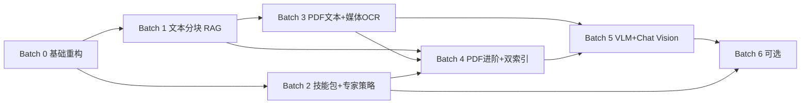

# 00 — Target 架构分批开发顺序与路线图

> **版本**：1.0  
> **日期**：2026-07-31  
> **状态**：实施规划  
> **适用范围**：`docs/architecture/target/` 下 01–05 全部目标架构  
> **原则**：**小步可交付、依赖先行、每批可独立验收**；不追求单批做完全部设计

---

## 1. 总览

### 1.1 分几批？

建议拆为 **6 个开发批次（Batch 0 – Batch 5）**，另加 **Batch 6 可选增强**。

| 批次 | 名称 | 周期（参考） | 核心价值 |
|:----:|------|:------------:|----------|
| **0** | 基础重构与契约 | 1–2 周 | 后续所有批次的共用地基 |
| **1** | 文本知识库 + 分块 RAG | 2–3 周 | 知识资产「能存能搜」质变 |
| **2** | 技能包化 + 专家策略层 | 2–3 周 | 能力可配置、少改代码扩展 |
| **3** | PDF 原生文本 + 媒体 OCR | 3–4 周 | 支持 PDF（文本层）与图片上传 |
| **4** | PDF 进阶 + 双索引精细化 | 3–4 周 | 表格、预处理、fact 表、Query Router |
| **5** | 多模态 VLM + 对话 Vision | 2–3 周 | 图表理解、聊天读图 |
| **6** | 可选增强 | 按需 | CLIP、技能市场、企业自定义专家 |

**合计（Batch 0–5）**：约 **13–19 周**（按 1–2 人全职估算；可并行部分任务缩短日历时间）。

### 1.2 依赖关系



### 1.3 与现状的关系

| 已有能力（截至 2026-07） | 本路线图中的位置 |
|--------------------------|------------------|
| 专家中心 UI + `expert_catalog.py` | Batch 2 升级为 YAML + Summon API |
| 斜杠技能 + `SlashSkillMenu` | Batch 2 对接 SKILL.md Registry |
| 文本知识上传（整篇、无分块） | Batch 1 重构为 chunk 主存 |
| Hybrid RAG（整 doc 量） | Batch 1 改造；Batch 4 加 Query Router |
| 无 PDF / 无图片入库 | Batch 3 起 |

---

## 2. Batch 0 — 基础重构与契约

**目标**：不打业务大功能，先把「数据模型 + 异步任务 + 模块边界」定死，避免后面返工。

**对应文档**：02（部分）、01/05（前置）

### 2.1 范围

| 工作项 | 说明 |
|--------|------|
| Chunk 主存表 | 新增 `knowledge_chunks`；`knowledge_documents` 补 `parse_status` 等字段 |
| 异步 Job 框架 | Celery/ARQ + Redis；统一 `Job` 状态机（pending/parsing/ready/failed） |
| 对象存储抽象 | MinIO/S3 封装；原文件 + NDM JSON 路径规范 |
| `IndexRouter` 接口 | 定义入库路由接口（先实现 text chunk → vector + graph stub） |
| API 契约 | 上传返回 `doc_id + status`；轮询/SSE 解析进度 |

### 2.2 不做

- PDF 解析、OCR、VLM
- SKILL.md 安装器
- 专家 YAML 热加载

### 2.3 交付物

- [ ] Alembic migration：`knowledge_chunks`、文档状态字段
- [ ] `app/jobs/` 任务队列 + `parse_document` 空壳 Job
- [ ] `app/storage/` 对象存储客户端
- [ ] `app/rag/index_router.py` 接口 + 单测

### 2.4 验收标准

- [ ] 上传文本后异步 Job 可追踪状态
- [ ] 原文件可写入对象存储并可回读
- [ ] 新 chunk 表可 CRUD，旧 `upload_text` 路径不破坏（兼容层）

### 2.5 人力建议

1 后端，1 周架构 + 1 周落地。

---

## 3. Batch 1 — 文本知识库 + 分块 RAG

**目标**：在**不改 PDF** 的前提下，让 `.txt/.md/.csv/.json` 走「分块 → 主存 → 向量 → 图谱」正确路径。

**对应文档**：[01](./01-PDF知识资产入库与预处理.md)（分块/NDM 子集）、[02](./02-向量库与知识图谱分工与存储.md)

### 3.1 范围

| 工作项 | 说明 |
|--------|------|
| 轻量 NDM | 纯文本文档的 Normalized Document Model（无 PDF 页） |
| 结构感知分块 | 按标题/段落；300–800 tokens；10% overlap |
| 向量索引改造 | Chroma 以 `chunk_id` 为主键；不存整篇 duplicate |
| 图谱双写 | 规则实体抽取 + Document/Entity/MENTIONS（保持现有 extractor 可升级） |
| 检索改造 | 按 chunk 召回；citation 含 section |
| 前端 | 知识资产列表展示 `chunk_count`、解析状态 |

### 3.2 不做

- PDF、图片
- Query Router（仍用 hybrid 默认）
- fact 表

### 3.3 交付物

- [ ] `TextIngestionPipeline`：paste + file → NDM → chunks
- [ ] `HybridRetriever.add_knowledge` 重构为 chunk 级写入
- [ ] `HybridRetriever.retrieve` 回查 MySQL 取全文
- [ ] 知识搜索 UI 展示分块级 citation

### 3.4 验收标准

- [ ] 1 万字 Markdown 上传后 `chunk_count > 1`
- [ ] 检索命中中间章节段落（非仅首段）
- [ ] 删除文档时 chunk + vector + graph 同步删除
- [ ] 向量库不含重复全文（抽查 metadata）

### 3.5 依赖

Batch 0 完成。

---

## 4. Batch 2 — 技能包化 + 专家策略层

**目标**：能力扩展从「改 Python 注册」变为「配置驱动」；专家召唤前后端状态一致。

**对应文档**：[03](./03-专家中心运行时架构.md)、[04](./04-技能包导入与运行时.md)

### 4.1 范围

| 工作项 | 说明 |
|--------|------|
| SKILL.md v1 | 3 个内置 skill 迁为 skillpack 目录结构 |
| Skill Registry DB | `skill_installations` 表；启动加载 bundled |
| 运行时改造 | 聊天路径读 manifest → prompt/tools/context，废弃全局 `active_skill` |
| Expert YAML | `expert_catalog.py` → `experts/*.yaml`；保留 Python loader |
| Summon API | `POST /api/sessions/{id}/summon`；前后端 clear 同步 |
| Policy 雏形 | `tool_policies/`、`memory_policies/` 各 1 个示例 |
| Runtime Policy Resolver | 统一 skill/mode/engine 优先级（见 03 文档 8.1） |

### 4.2 不做

- ZIP 技能安装（Batch 6）
- Pipeline YAML 引擎（Batch 4 或 6）
- Team Protocol 配置化（Batch 4）
- Intent Router 完整版（仅保留现有 adaptive 关键词）

### 4.3 交付物

- [ ] `skills/financial_audit/SKILL.md` 等 3 套
- [ ] `experts/*.yaml` + `ExpertProfileLoader`
- [ ] Summon / clear API + ChatView chip 调 API
- [ ] 文档：内置 skill 新增流程（改 YAML 非改 main.py）

### 4.4 验收标准

- [ ] 新增 skill = 新增目录 + 注册条目，无需改 `register_all_skills()` 硬编码列表
- [ ] 召唤专家后刷新页面，专家 chip 仍正确（服务端 session context）
- [ ] 斜杠 `/skill` 优先级高于专家 default_skill
- [ ] 并发 10 会话 skill 状态互不干扰

### 4.5 依赖

Batch 0（session 持久化可选 Redis）；与 Batch 1 **可并行**。

### 4.6 备注：与已上线 WorkBuddy 功能的关系

当前代码已有专家中心、斜杠菜单的 **MVP**；本批是 **架构债偿还 + 配置化**，不是从零做 UI。

---

## 5. Batch 3 — PDF 原生文本 + 媒体 OCR（Phase 1）

**目标**：支持**有文本层的 PDF** 与**独立图片上传**；扫描件仅标记 `needs_ocr` 不强行上线。

**对应文档**：[01](./01-PDF知识资产入库与预处理.md)（原生文本路径）、[05](./05-媒体资产与多模态解析.md)（Phase 1）

### 5.1 范围

| 工作项 | 说明 |
|--------|------|
| Document Classifier v1 | 区分 native_text / scanned_image / table_heavy |
| PDF 文本抽取 | PyMuPDF 文本层 + 阅读顺序 |
| 预处理 v1 | 页眉页脚重复检测删除；空白折叠 |
| PDF 入库 API | `accept=.pdf`；异步 Job |
| MediaAssetService v1 | 独立 `.png/.jpg/.webp` 上传 |
| 图片 OCR | PaddleOCR → figure_summary chunk |
| NDM 扩展 | 支持 `page`、`block` 结构 |
| 前端 | 知识资产支持 PDF + 图片；解析进度 |

### 5.2 不做

- 扫描 PDF OCR（Batch 4）
- 表格结构化（Batch 4）
- VLM 图表（Batch 5）
- 聊天附件 vision（Batch 5）

### 5.3 交付物

- [ ] `PdfIngestionPipeline`（native_text 路径）
- [ ] `MediaAssetService` + `media_assets` 表
- [ ] `POST /api/knowledge/upload/media`
- [ ] 页眉页脚去除单测（构造 10 页重复页眉 PDF）

### 5.4 验收标准

- [ ] 可复制文本的 PDF 入库后可分块检索
- [ ] 页眉页脚内容不出现在 top-K 检索结果
- [ ] 截图 PNG 上传后 OCR 文字可被问答引用
- [ ] 扫描 PDF 标记 `needs_review`，不写入乱码

### 5.5 依赖

Batch 0 + Batch 1（chunk 主存、Job 框架）。

---

## 6. Batch 4 — PDF 进阶 + 双索引精细化

**目标**：表格、扫描 OCR、fact 表、Query Router；专家团配置化；技能 Pipeline 雏形。

**对应文档**：01、02、03、04

### 6.1 范围

#### 6.1.1 知识入库（01 + 02 + 05 Phase 2 部分）

| 工作项 | 说明 |
|--------|------|
| 表格检测 | pdfplumber + 规则；table_summary + table_row chunks |
| 扫描 PDF OCR | PaddleOCR 全页；接入 01 文档 OCR 流水线 |
| fact 表 | `knowledge_facts`；财报数值写入 |
| IndexRouter 完整 | text/table/entity/fact 分流 |
| Query Router v1 | intent 分类 → vector/graph/fact 权重 |
| Reranker | bge-reranker 或 API rerank（可选） |

#### 6.1.2 专家 & 技能（03 + 04）

| 工作项 | 说明 |
|--------|------|
| Team Protocol Engine | `debate_v1` 配置驱动；替代硬编码 `AccountingDebateTeam` 入口 |
| Pipeline YAML v1 | `financial_audit` 的 `audit_flow.yaml` |
| Skill hybrid 运行时 | pipeline 触发匹配 → 失败 fallback ReAct |

### 6.2 不做

- VLM 图表读数（Batch 5）
- Chat vision
- ZIP 技能市场

### 6.3 交付物

- [ ] 表格入库 + 行级 chunk 检索
- [ ] `knowledge_facts` + 图谱 VALUE 边
- [ ] Query Router + 检索日志
- [ ] `team_protocols/debate_v1.yaml`
- [ ] `financial_audit` pipeline 跑通 JSON 财报输入

### 6.4 验收标准

- [ ] 含三表 PDF：科目名 + 数值问答准确率 > 85%（评测集 20 题）
- [ ] 「XX 公司货币资金多少」类问题优先走 fact 表
- [ ] hybrid 召回 MRR@10 优于 Batch 1 纯 chunk 基线
- [ ] 财务评审委员会由 YAML 定义角色，无新增 Python Team 类
- [ ] JSON 财报输入走 pipeline，自由文本走 ReAct fallback

### 6.5 依赖

Batch 1 + Batch 2 + Batch 3。

---

## 7. Batch 5 — 多模态 VLM + 对话 Vision

**目标**：PDF 内图表、独立图表图片的 VLM 理解；聊天拖图读图。

**对应文档**：[05](./05-媒体资产与多模态解析.md)（Phase 2–3）

### 7.1 范围

| 工作项 | 说明 |
|--------|------|
| Image Classifier v2 | chart / diagram / photo |
| VLM 解析 | chart structured JSON + caption |
| PDF figure 抽取 | 页内 bbox 切图 → MediaAssetService |
| 图表 fact 写入 | VLM 输出 low-confidence 过滤 |
| Vision Provider | LLMFactory `supports_vision` |
| Chat attachments | 上传 + WS `attachments[]` |
| 降级策略 | 无 vision 模型 → OCR/VLM 预解析文本注入 context |

### 7.2 不做

- CLIP 以图搜图（Batch 6）
- 视频

### 7.3 交付物

- [ ] VLM chart pipeline + prompt 模板
- [ ] PDF 内嵌图自动入库
- [ ] ChatView 拖图 UI + vision message 构造
- [ ] Provider 配置文档（哪些模型支持 vision）

### 7.4 验收标准

- [ ] PDF 内柱状图：问答能描述趋势并引用 page/figure
- [ ] 聊天上传报表截图，单轮问答不依赖先入知识库
- [ ] VLM 低置信数值不写入 fact 表
- [ ] gpt-4o / Qwen-VL 至少一种 vision 通路可用

### 7.5 依赖

Batch 3 + Batch 4；Batch 2（Chat WS 契约）。

---

## 8. Batch 6 — 可选增强（按需）

| 工作项 | 文档 | 说明 |
|--------|------|------|
| CLIP 以图搜图 | 05 | 独立 collection |
| 技能 ZIP 安装 / Git 拉取 | 04 | SkillInstaller |
| 企业自定义 Expert CRUD | 03 | 管理后台 |
| MinerU 扫描 PDF 全页 | 01 | 替代基础 OCR |
| 会员共享知识库 | 02 | visibility=member |
| Office docx/xlsx | 01 | 扩展 Classifier |

**触发条件**：Batch 5 验收通过 + 有明确业务需求。

---

## 9. 跨批次横切事项

### 9.1 每批必做

| 事项 | 说明 |
|------|------|
| 迁移脚本 | Alembic revision，可回滚 |
| 监控 | Job 成功率、解析耗时、检索延迟 |
| 文档 | 更新 `docs/rag/` 等现状说明或标注「已实现至 Batch N」 |
| 回归 | 聊天主路径、登录、专家召唤不被破坏 |

### 9.2 测试策略

| 批次 | 测试重点 |
|------|----------|
| 0–1 | 分块一致性、删除同步、租户 filter |
| 2 | skill 优先级、session summon、并发 |
| 3 | PDF 页眉页脚、OCR 截图、乱码防护 |
| 4 | 表格数值、fact 查询、pipeline fallback |
| 5 | VLM 幻觉、vision 降级、 citation 含图 |

### 9.3 基础设施依赖

| 组件 | 最早需要批次 |
|------|--------------|
| Redis（Job 队列） | Batch 0 |
| MinIO/S3 | Batch 0 |
| PaddleOCR（Docker） | Batch 3 |
| VLM API Key | Batch 5 |

---

## 10. 推荐排期（甘特式）

假设 **1 后端 + 1 前端**，部分任务并行：

```
周次    1-2      3-5      6-8      9-12     13-16    17-19
      ┌──────┬────────┬────────┬─────────┬─────────┬────────┐
后端  │ B0   │  B1    │  B2    │   B3    │   B4    │  B5    │
      ├──────┼────────┼────────┼─────────┼─────────┼────────┤
前端  │ B0   │  B1 UI │  B2 UI │   B3 UI │   B4    │  B5 UI │
      └──────┴────────┴────────┴─────────┴─────────┴────────┘
并行       └─ B2 可与 B1 后期重叠 ─┘
```

**压缩日历技巧**：

- Batch 1 与 Batch 2 后期可并行（不同模块）
- Batch 4 的 Team Protocol 与表格 OCR 可两人分工

---

## 11. 批次 ↔ 目标文档映射矩阵

|  | 01 PDF | 02 向量图谱 | 03 专家 | 04 技能 | 05 媒体 |
|--|:------:|:-----------:|:-------:|:-------:|:-------:|
| **B0** | | 接口 | | | |
| **B1** | 分块/NDM | 主存+双写 | | | |
| **B2** | | | YAML/Summon | SKILL.md | |
| **B3** | 原生PDF/预处理 | | | | OCR图 |
| **B4** | 表格/OCR | QueryRouter/fact | Team协议 | Pipeline | |
| **B5** | | | | | VLM/Vision |
| **B6** | Office/MinerU | 共享库 | 企业CRUD | ZIP安装 | CLIP |

图例：● 本批重点实现　○ 部分/接口　空 不涉及

---

## 12. 决策检查点（Go / No-Go）

每批结束前开 30 分钟评审：

| 检查点 | 通过标准 | 不通过则 |
|--------|----------|----------|
| CP-0 | Job + chunk 表稳定 | 不进入 B1 |
| CP-1 | 分块检索优于整篇基线 | 不进入 PDF |
| CP-2 | 3 skill 全 YAML 化 | 不扩新 skill |
| CP-3 | 原生 PDF 无乱码 | 不上 OCR 扫描 |
| CP-4 | fact 表 20 题评测达标 | 不上 VLM |
| CP-5 | vision 降级路径可用 | 不默认开放拖图 |

---

## 13. 最小可行产品（MVP）路径

若资源紧张，**最小 4 批可上线可用产品**：

```
B0 → B1 → B2 → B3（仅原生 PDF + 图片 OCR，跳过 B4/B5）
```

**缺什么**：

- 扫描 PDF、表格精确问答、图表 VLM、聊天读图、Query Router

**适合**：内测演示文本知识库 + 可复制 PDF + 专家/技能配置化。

---

## 14. 文档维护

| 事件 | 动作 |
|------|------|
| 某批开工 | 在本文件对应节标记「进行中」 |
| 某批验收 | 更新 `docs/rag/` 等现状文档；本文件标记「已完成 yyyy-mm-dd」 |
| 范围变更 | 修订本文件版本号，勿 silent drift |

---

## 15. 关联文档

- [Target 架构索引](./README.md)
- [01 PDF 预处理](./01-PDF知识资产入库与预处理.md)
- [02 向量与图谱](./02-向量库与知识图谱分工与存储.md)
- [03 专家中心](./03-专家中心运行时架构.md)
- [04 技能包](./04-技能包导入与运行时.md)
- [05 媒体多模态](./05-媒体资产与多模态解析.md)
- [多用户 Phase2 实施指南](../../多用户/09-实施路线图/phase2/03-开发实施指南.md)
