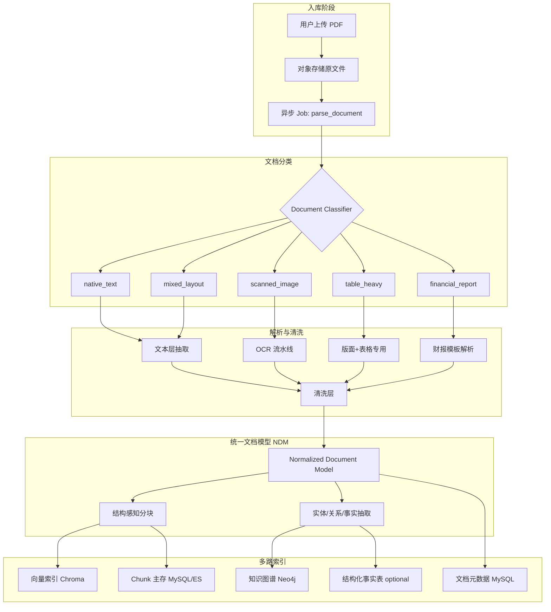
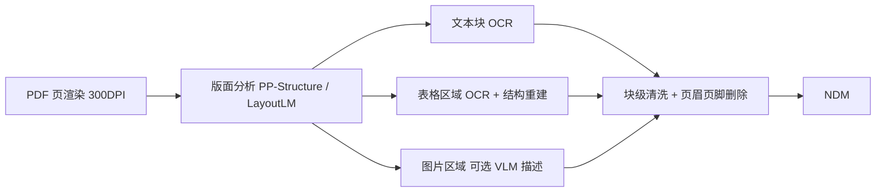
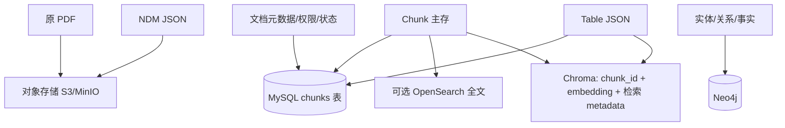
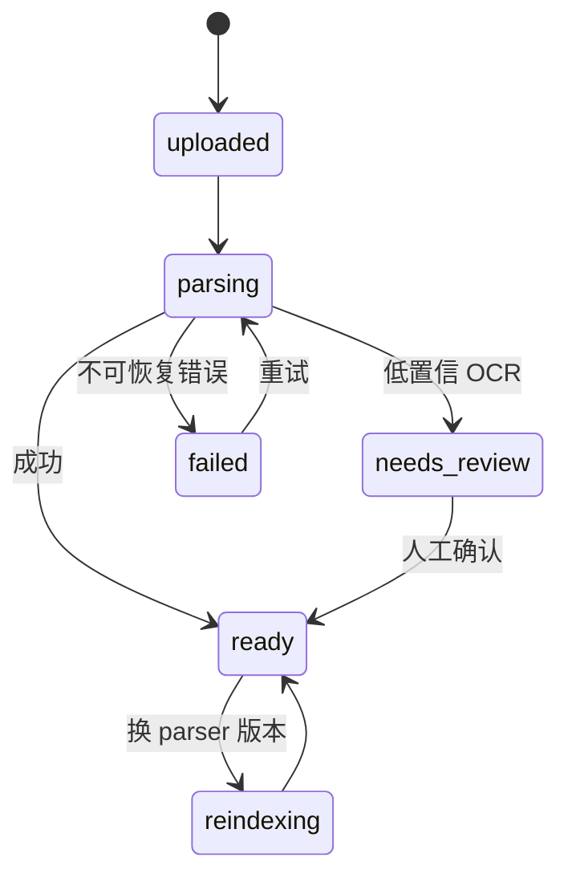

# 01 — PDF 知识资产入库与预处理（目标架构）

> **版本**：1.0 | **状态**：目标设计  
> **范围**：知识资产模块对 PDF（及同类 Office 文档）的完整 ingestion 管线  
> **原则**：PDF 是排版格式，不是语义文档；必须先 **Normalize → Clean → Structure → Chunk → Index**

---

## 1. 设计目标

| 目标 | 说明 |
|------|------|
| **可解析** | 原生文本 PDF、扫描件、表格密集页、图文混排均可处理 |
| **可溯源** | 每条检索结果可定位到原 PDF 页码、区域（bbox）、章节 |
| **可结构化** | 表格、财报科目、数值事实可被单独抽取与查询 |
| **可观测** | 解析质量分、失败原因、重跑版本均可追踪 |
| **可扩展** | Parser 可插拔，按文档类型路由不同策略 |

---

## 2. 总体管线



**关键约束**：用户上传后立即返回 `doc_id` + `status=parsing`；索引完成后 `status=ready`。禁止同步阻塞式解析大 PDF。

---

## 3. 文档分类（Document Classifier）

在进入具体 Parser 前，对每个 PDF 做轻量分类，决定后续策略组合。

### 3.1 分类信号

| 信号 | 检测方式 | 用途 |
|------|----------|------|
| 文本层是否存在 | PyMuPDF `page.get_text()` 非空字符数 / 页 | 区分 native vs scanned |
| 文本密度 | 字符数 / 页面积 | 低密度 → 可能扫描或图片页 |
| 图像占比 | 页内 image xref 面积比 | 高占比 → OCR 路由 |
| 线条/矩形密度 | 矢量路径统计 | 高 → table_heavy |
| 关键词模板 | 封面/目录命中「资产负债表」「审计报告」等 | financial_report |
| 字体分布 | 标题字号层级是否清晰 | 影响章节切分 |

### 3.2 分类输出

```json
{
  "doc_class": "financial_report",
  "confidence": 0.91,
  "signals": {
    "has_text_layer": true,
    "avg_chars_per_page": 1842,
    "image_area_ratio": 0.08,
    "table_line_score": 0.76
  },
  "recommended_pipeline": ["pymupdf", "table_extractor_v2", "financial_template_v1"]
}
```

### 3.3 分类策略（优先级）

1. 命中财报模板关键词 + 三表结构特征 → `financial_report`
2. `table_line_score > 0.6` 且多页连续 → `table_heavy`
3. 无文本层或 `avg_chars_per_page < 阈值` → `scanned_image`
4. 有文本层且版面复杂 → `mixed_layout`
5. 默认 → `native_text`

---

## 4. 预处理层（Preprocessing）

预处理在 **页级（Page-level）** 与 **块级（Block-level）** 两个阶段执行，目标是去掉噪声、统一编码、保留结构。

### 4.1 页级预处理

#### 4.1.1 旋转与裁剪

- 检测页面 `rotation`（0/90/180/270），统一转正后再解析
- 可选：裁切打印机边距（非内容白边），保留原始 bbox 映射关系

#### 4.1.2 页眉 / 页脚识别与删除

**问题**：页眉页脚在每页重复出现，进入向量库会造成大量冗余 chunk，污染检索。

**识别策略（多信号融合）**：

| 方法 | 做法 |
|------|------|
| **位置启发式** | 页面顶部 8–12% 、底部 8–12% 区域内的文本块标记为 header/footer 候选 |
| **重复率检测** | 跨页统计相同/相似文本（归一化后 fuzzy match ≥ 0.9），出现率 > 70% 页 → 页眉或页脚 |
| **模式匹配** | 页码模式：`第 \d+ 页`、`Page \d+ of \d+`、`- \d+ -` |
| **字体/字号** | 页眉页脚通常字号小于正文、颜色偏灰 |
| **语义黑名单** | 「机密」「内部资料」「版权所有」等 |

**删除策略**：

- **硬删除**：标记 `block.role = header|footer|page_number`，**不进入** chunk 与 embedding
- **软保留**：写入 `page_metadata.repeated_boilerplate[]` 供审计，但不索引
- **例外**：若页眉含「文档标题 + 报告期」（如 `XX公司2024年度报告`），提取到 `doc_metadata`，不重复进 chunk

**伪代码**：

```python
def detect_repeated_margin_blocks(pages: list[PageBlocks]) -> set[str]:
    top_candidates = [p.blocks_in_region(y0=0, y1=0.12) for p in pages]
    bottom_candidates = [p.blocks_in_region(y0=0.88, y1=1.0) for p in pages]
    repeated = fuzzy_cluster(top_candidates + bottom_candidates, threshold=0.9)
    return {b.normalized_text for b in repeated if b.page_coverage > 0.7}
```

#### 4.1.3 水印与背景噪声

- 对角线半透明水印：OCR 置信度低 + 倾斜文本 → 丢弃
- 整页背景图：不参与文本抽取

#### 4.1.4 分栏检测

- 检测双栏/三栏排版（x 坐标聚类）
- 阅读顺序：从左栏 top→bottom，再到右栏（非简单按 y 排序）

### 4.2 块级清洗（Text Normalization）

对每个保留的正文 block：

| 步骤 | 规则 |
|------|------|
| Unicode 规范化 | NFKC，全角转半角（数字、标点） |
| 空白折叠 | 连续空格/换行合并，保留段落边界 |
| 连字符断行 | 行末 `-` + 换行合并：`internation-\n al` → `international` |
| 控制字符 | 移除 `\x00` 等不可见字符 |
| 编码修复 | 乱码率过高页标记 `parse_quality_warning` |

### 4.3 结构重建

将清洗后的 span 聚合成逻辑块：

| block.type | 识别依据 |
|------------|----------|
| `heading` | 字号最大层级、加粗、编号模式（`1.`、`1.1`、`第一章`） |
| `paragraph` | 默认正文 |
| `list_item` | 行首 bullet / 数字列表 |
| `table` | 见第 5 节 |
| `figure` | 图片区域 + 可选 caption 块 |
| `footnote` | 页面底部小字号 + 上标引用符号 |
| `caption` | 「图 1」「表 2」模式 |

每个 block 记录：

```json
{
  "block_id": "p3_b12",
  "type": "paragraph",
  "text": "……",
  "bbox": [72, 410, 523, 468],
  "page_no": 3,
  "section_path": ["第三章 财务分析", "3.2 流动性"],
  "font_size": 10.5,
  "confidence": 0.98
}
```

---

## 5. 表格识别与处理

表格是 PDF RAG 最难部分，需 **单独检测、单独存储、单独检索**。

### 5.1 表格检测（Table Detection）

**多策略级联**（按 doc_class 启用子集）：

| 层级 | 方法 | 适用 |
|------|------|------|
| L1 规则 | 矢量线条交点密度、矩形网格 | 有框线表格 |
| L2 pdfplumber | `page.extract_tables()` | 原生 PDF 表格 |
| L3 camelot / tabula | stream/lattice 模式 | 财报、扫描件表格 |
| L4 版面模型 | Table Transformer / PaddleOCR PP-Structure | 复杂混排、无线表 |
| L5 VLM 兜底 | 截图 + 多模态模型输出 HTML/Markdown | 前序失败时的降级 |

**表格区域判定条件（任一满足）**：

- L1 网格线交叉点 ≥ 4×4
- L2 返回 table 且 cell 非空率 > 60%
- 连续多行 x 坐标对齐（列对齐分数 > 0.85）

**误检过滤**：

- 目录页（点线 leader `...`）→ 不是 table
- 页码装饰线 → 不是 table

### 5.2 表格结构化（Table Structuring）

对每个 table block 输出 **三层表示**：

```json
{
  "table_id": "p5_t1",
  "page_no": 5,
  "bbox": [70, 120, 525, 680],
  "caption": "表 2：资产负债表摘要",
  "section_path": ["财务报表", "资产负债表"],
  "representations": {
    "cells": {
      "rows": 15,
      "cols": 4,
      "header_rows": [0],
      "header_cols": [0],
      "data": [
        ["项目", "2024年", "2023年", "变动率"],
        ["货币资金", "1,234,567", "987,654", "25.0%"]
      ],
      "merged_cells": [[0,0,0,1]]
    },
    "markdown": "| 项目 | 2024年 | … |",
    "html": "<table>...</table>"
  },
  "quality": {
    "detection_method": "pdfplumber",
    "cell_fill_rate": 0.94,
    "numeric_cell_ratio": 0.72,
    "confidence": 0.89
  }
}
```

**数值清洗**：

- 去除千分位逗号，统一为可解析数字
- 括号表示负数：`(123)` → `-123`
- 保留原始 display 值用于展示

### 5.3 表格如何进入索引（重要）

**禁止**将整张 HTML 表格原样 embedding 为一个 chunk（语义稀疏、检索差）。

**推荐做法**：

| 存储层 | 存什么 |
|--------|--------|
| **Table Store（主存）** | 完整 `cells` JSON + markdown/html |
| **向量库** | ① 表格摘要 chunk ② 按行展开的「语义行 chunk」 |
| **知识图谱** | 表头实体、行级事实三元组 |
| **对象存储** | 可选：表格区域截图（供前端高亮） |

#### 5.3.1 表格摘要 chunk（1 个/表）

```
[TABLE SUMMARY p5_t1] 表 2：资产负债表摘要（2024年）
列：项目、2024年、2023年、变动率
行数：15
关键行：货币资金 1234567；应收账款 456789；……
```

metadata: `{ "content_type": "table_summary", "table_id": "p5_t1", "page_no": 5 }`

#### 5.3.2 语义行 chunk（每重要行 1 个）

```
[TABLE ROW p5_t1] 资产负债表 | 货币资金 | 2024年=1,234,567 | 2023年=987,654 | 变动率=25.0%
```

metadata: `{ "content_type": "table_row", "table_id": "p5_t1", "row_key": "货币资金" }`

**行筛选**：跳过空行、纯「合计」分隔行可合并；保留含数值的行。

#### 5.3.3 图谱事实（结构化）

```
(Company:XX股份) -[HAS_METRIC]-> (Metric:货币资金)
(Metric:货币资金) -[VALUE {period:2024, amount:1234567, unit:CNY}]-> (Document:p5_t1)
```

---

## 6. OCR 流水线（扫描件）

当 `doc_class=scanned_image`：



**质量门控**：

- 页级 `ocr_confidence` 均值 < 0.75 → `status=needs_review`
- 低置信 block 标记，不单独成 chunk，或降权

**推荐引擎组合**（可按部署环境切换）：

- 中文：PaddleOCR / MinerU
- 企业级：Azure Document Intelligence / AWS Textract
- 离线：Tesseract（仅作兜底）

---

## 7. 财报模板解析（financial_report）

对 `doc_class=financial_report` 启用领域模板：

### 7.1 章节识别

| 章节 | 识别特征 |
|------|----------|
| 审计报告 | 「审计意见」「注册会计师」 |
| 资产负债表 | 「资产负债表」+ 日期行 |
| 利润表 | 「利润表」「综合收益」 |
| 现金流量表 | 「现金流量表」 |
| 附注 | 「财务报表附注」、编号 `（一）（二）` |

### 7.2 特殊处理

- 三表 → 强制走 table pipeline + 科目标准化映射（见会计科目词典）
- 附注长文本 → 按附注编号 chunk
- 审计意见段 → 单独 chunk，高权重标签 `doc_role=audit_opinion`

---

## 8. 统一文档模型（NDM — Normalized Document Model）

所有 Parser 输出必须收敛为 NDM，作为后续分块与索引的**唯一输入**。

```json
{
  "doc_id": "uuid",
  "source": {
    "filename": "2024年报.pdf",
    "mime": "application/pdf",
    "sha256": "...",
    "page_count": 128,
    "doc_class": "financial_report"
  },
  "doc_metadata": {
    "title": "XX股份有限公司2024年年度报告",
    "company": "XX股份有限公司",
    "report_period": "2024",
    "language": "zh-CN"
  },
  "parse_metadata": {
    "parser_version": "pdf_pipeline_v2.1",
    "parsed_at": "2026-07-30T12:00:00Z",
    "overall_quality": 0.92,
    "warnings": []
  },
  "pages": [
    {
      "page_no": 1,
      "width": 595,
      "height": 842,
      "blocks": [ "..." ],
      "tables": [ "..." ],
      "figures": [ "..." ]
    }
  ],
  "outline": [
    { "level": 1, "title": "第一节 重要提示", "page_no": 1 },
    { "level": 1, "title": "财务报表", "page_no": 45 }
  ]
}
```

**持久化**：

- 完整 NDM JSON → 对象存储 `ndm/{doc_id}.json`（版本化）
- MySQL 存摘要字段 + 解析状态

---

## 9. 结构感知分块（Chunking）

### 9.1 分块原则

| 原则 | 说明 |
|------|------|
| 不跨章节 | chunk 的 `section_path` 应单一 |
| 表格独立 | table_summary / table_row 不与普通 paragraph 混合 |
| 大小可控 | 正文 300–800 tokens；表格行 100–300 tokens |
| overlap | 正文 chunk 之间 10–15% overlap |
| 可溯源 | 每个 chunk 必须带 `page_no`、`block_ids[]`、`bbox_union` |

### 9.2 分块算法（正文）

```
for section in outline_traversal(ndm):
    buffers = []
    for block in section.blocks:
        if block.type == "heading":
            flush_buffer()  # 新 section 开始
        elif block.type == "paragraph" or block.type == "list_item":
            append_to_buffer(block)
            if token_count(buffer) > MAX_TOKENS:
                emit_chunk(buffer, overlap=OVERLAP)
        elif block.type == "table":
            emit_table_chunks(block)  # 见 5.3
        elif block.type in ("header", "footer", "page_number"):
            skip
```

### 9.3 Chunk 数据结构

```json
{
  "chunk_id": "uuid",
  "doc_id": "uuid",
  "seq": 42,
  "text": "……",
  "token_count": 512,
  "content_type": "paragraph | table_summary | table_row | figure_caption",
  "section_path": ["第三章", "3.2 流动性"],
  "page_range": [12, 13],
  "block_ids": ["p12_b3", "p12_b4"],
  "bbox_union": [72, 100, 523, 700],
  "metadata": {
    "language": "zh-CN",
    "parse_quality": 0.95
  }
}
```

---

## 10. 存储架构（多存储分工）



### 10.1 MySQL 表（建议）

**knowledge_documents**

| 字段 | 说明 |
|------|------|
| id | doc_id |
| user_id, visibility | 租户 |
| title, filename, mime | 基本信息 |
| doc_class | 分类结果 |
| page_count, chunk_count, table_count | 统计 |
| parse_status | parsing / ready / failed / needs_review |
| parser_version, quality_score | 解析信息 |
| ndm_uri | 对象存储路径 |
| deleted_at | 软删 |

**knowledge_chunks**

| 字段 | 说明 |
|------|------|
| id | chunk_id |
| doc_id | 外键 |
| seq, content_type | 顺序与类型 |
| text | 全文（主存） |
| token_count | |
| section_path | JSON |
| page_range | JSON |
| block_ids, bbox_union | JSON |
| content_hash | 去重用 |

**knowledge_tables**

| 字段 | 说明 |
|------|------|
| id | table_id |
| doc_id | |
| page_no, caption | |
| cells_json | 完整表格 |
| markdown | 渲染用 |
| quality_json | |

### 10.2 向量库（Chroma）存什么

**不存全文**（或仅存 200 字 preview）；以 `chunk_id` 为主键：

```json
{
  "id": "chunk_id",
  "embedding": "[...]",
  "metadata": {
    "doc_id": "...",
    "user_id": 123,
    "visibility": "private",
    "content_type": "paragraph",
    "section_path": "第三章>3.2",
    "page_no": 12,
    "table_id": null,
    "language": "zh-CN"
  }
}
```

### 10.3 Neo4j 存什么

见 [02-向量库与知识图谱分工与存储](./02-向量库与知识图谱分工与存储.md)。

PDF 入库额外写入：

- `Document` 节点（doc 级）
- `Chunk` 节点（可选，仅当需图遍历 chunk 时）
- `Entity` / `Metric` / `Company` 节点
- `MENTIONS`、`HAS_METRIC`、`REPORTED_IN` 关系

---

## 11. 异步任务与状态机



**Job 步骤**（可独立重试）：

1. `save_original`
2. `classify_document`
3. `parse_pages`
4. `clean_and_structure`
5. `extract_tables`
6. `build_ndm`
7. `chunk_document`
8. `embed_chunks`
9. `extract_entities_and_facts`
10. `write_graph`
11. `finalize_metadata`

---

## 12. 检索与引用（消费侧）

用户提问时的最优检索链：

1. Query 分析（是否涉及数值/表格/公司名）
2. 向量召回 chunk（filter: user_id, content_type）
3. BM25 / 关键词补召回（科目名、公司名）
4. 图谱扩展相关实体 → 拉回关联 chunk_id
5. Cross-encoder rerank
6. 返回 **Citation**：doc_title + page_no + section + 原文高亮 bbox

前端知识引用卡片示例：

```
📄 XX公司2024年报 · 第 45 页 · 资产负债表
「货币资金 1,234,567 千元，较上期增长 25.0%」
[查看原文 PDF]
```

---

## 13. 质量、安全与治理

| 维度 | 做法 |
|------|------|
| 解析质量 | 页级/文档级 score；低于阈值进人工队列 |
| PII 检测 | 身份证、手机号可配置脱敏后再索引 |
| 病毒扫描 | 上传时 ClamAV |
| 配额 | 单文件大小、页数、并发 parse job 限制 |
| 版本 | parser_version 变更后可批量 reindex |
| 审计 | 上传人、解析耗时、失败原因全日志 |

---

## 14. 推荐技术选型（参考）

| 环节 | 推荐 |
|------|------|
| PDF 文本 | PyMuPDF (fitz) |
| 表格 | pdfplumber + camelot；复杂用 PP-Structure |
| OCR | PaddleOCR / MinerU；企业用 Azure DI |
| 任务队列 | Celery + Redis / ARQ |
| 对象存储 | MinIO / S3 |
| 向量 | Chroma（现网）→ 可演进 Qdrant/Milvus |
| Embedding | bge-m3 / text-embedding-3-small（按语言） |
| Rerank | bge-reranker / Cohere rerank |

---

## 15. 验收标准（实施完成后）

- [ ] 原生文本 PDF：页眉页脚去除率 > 95%，不误删正文标题
- [ ] 扫描件：中文 OCR 字符准确率 > 92%（抽样人工评估）
- [ ] 有框表格：cell 对齐准确率 > 90%
- [ ] 128 页财报：解析 + 索引 < 3 分钟（异步，不阻塞 UI）
- [ ] 检索返回结果 100% 可定位到 page_no
- [ ] 同一表格数值可通过图谱事实查询精确命中

---

## 16. 关联文档

- [02-向量库与知识图谱分工与存储](./02-向量库与知识图谱分工与存储.md)
- [05-媒体资产与多模态解析](./05-媒体资产与多模态解析.md) — PDF 内嵌图/图表/扫描页的多模态解析（本模块 L4/L5 落地）
- [RAG 模块现状说明](../../rag/README.md)
