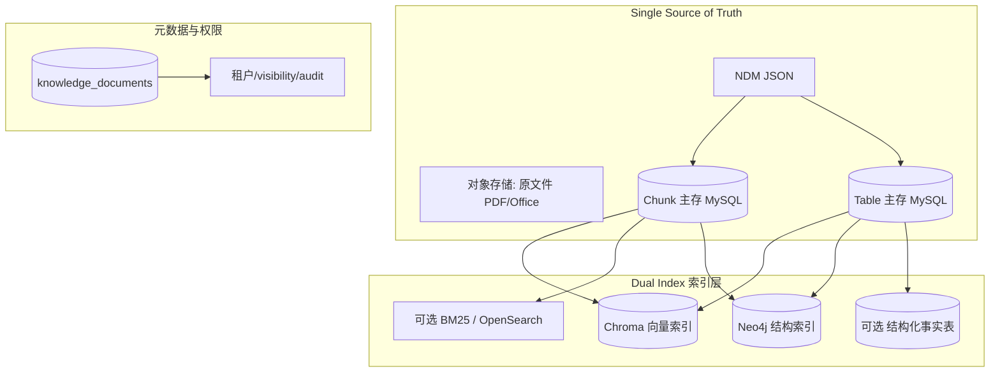
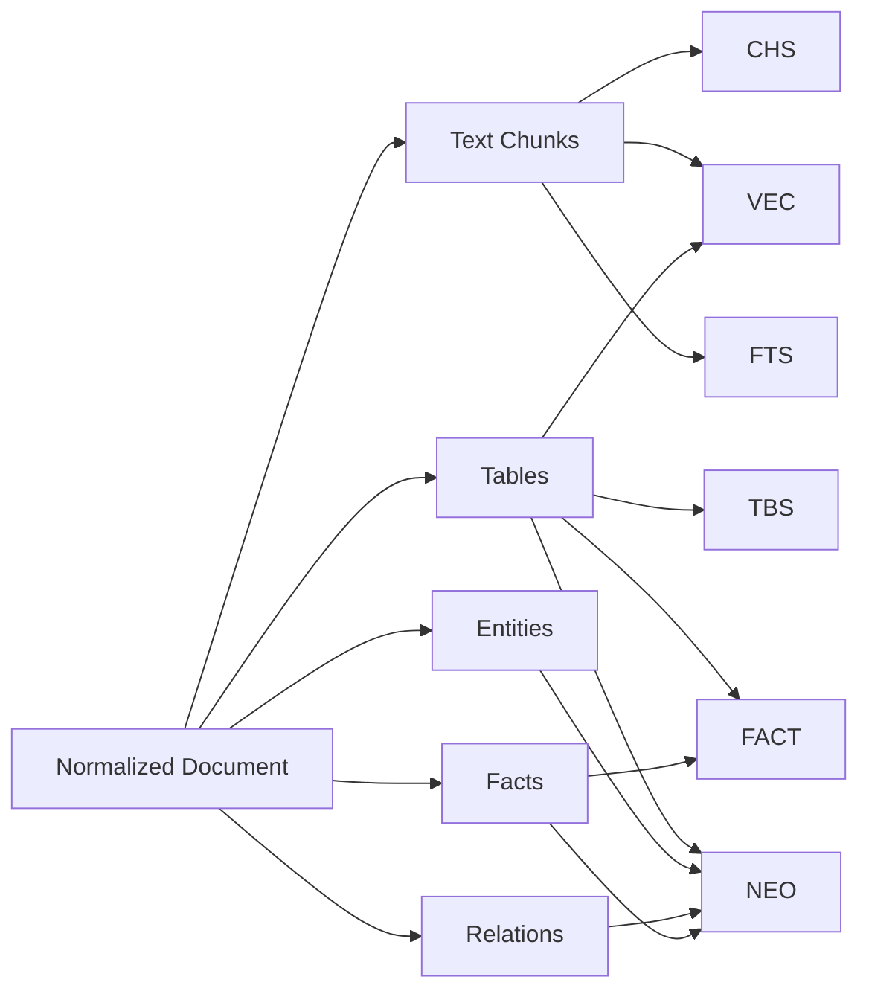
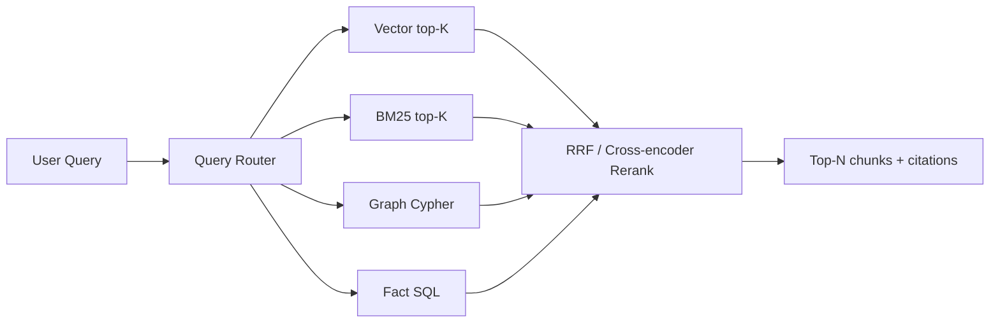

# 02 — 向量库与知识图谱分工与存储（目标架构）

> **版本**：1.0 | **状态**：目标设计  
> **核心原则**：**Single Source of Truth（正文主存一份）+ Dual Index（语义索引 + 结构索引）**  
> **误区澄清**：向量库和图谱不是「同一份全文存两遍」，而是同一知识的不同**可查询视图**

---

## 1. 为什么要两个存储？

### 1.1 各自擅长的问题类型

| 问题类型 | 示例 | 最优存储 |
|----------|------|----------|
| 语义相似 | 「流动性风险怎么理解？」 | 向量库 |
| 精确事实 | 「XX 公司 2024 年 ROE 是多少？」 | 图谱 / 结构化事实 |
| 多跳关系 | 「A 公司的供应商是否与其董事有关联？」 | 图谱 |
| 跨文档关联 | 「哪些文档提到了同一审计师？」 | 图谱 |
| 长文上下文 | 「审计意见怎么说的？」 | 向量库 + chunk 主存 |
| 同义词变体 | 「净资产收益率 / ROE」 | 图谱概念层 + 向量 |

### 1.2 只用一个的后果

| 仅向量库 | 仅图谱 |
|----------|--------|
| 数值问答易幻觉 | 无法处理自由表述 |
| 关系推理弱 | 入库成本高、覆盖难 |
| 表格语义检索差 | 新文档类型扩展慢 |

**结论**：生产级 RAG 最优解是 **Hybrid Retrieval**，但底层存储必须**分工明确**，避免冗余。

---

## 2. 总体存储架构



**空间优化关键**：

- 向量库：**embedding + chunk_id + 轻量 metadata**（可不存全文）
- 图谱：**实体 + 关系 + 指向 chunk/table 的引用**（不存大段正文）
- 全文只在 **Chunk 主存** 保留一份

---

## 3. 什么存到哪里？（入库路由规则）

### 3.1 路由总览

**不是二选一，而是一条内容 → 多种抽取 → 多种索引。**



### 3.2 详细路由表

| 数据类型 | Chunk 主存 | 向量库 | 图谱 | 事实表 | 对象存储 |
|----------|:----------:|:------:|:----:|:------:|:--------:|
| 原 PDF/Office | — | — | — | — | ✅ |
| NDM JSON | — | — | — | — | ✅ |
| 正文 paragraph chunk | ✅ 全文 | ✅ embedding | 引用 | — | — |
| 表格 cells JSON | ✅ table 表 | — | 引用 | ✅ | 可选截图 |
| 表格 summary chunk | ✅ | ✅ | 节点 | — | — |
| 表格 row chunk | ✅ | ✅ | 行级 fact | ✅ | — |
| 图片/图表 | ✅ caption | ✅ caption | 节点 | — | ✅ 原图 |
| 文档元数据 | ✅ doc 表 | doc_id meta | Document 节点 | — | — |
| 公司/人物/科目 | — | 可选 alias 向量 | ✅ Entity | — | — |
| 数值事实 | — | 可选描述向量 | ✅ Fact 边 | ✅ | — |
| 共现关系 | — | — | ✅ RELATED | — | — |
| 会话记忆文本 | ✅ memory 表 | ✅ long_term | 可选 Entity | — | — |
| 会话轮次结构 | ✅ | — | ✅ Message | — | — |

### 3.3 路由决策逻辑（自动化）

入库 Worker 对每个抽取结果执行 `IndexRouter.route(item)`：

```python
def route(item: ExtractedItem) -> list[IndexTarget]:
    targets = [IndexTarget.CHUNK_STORE]  # 默认先进主存

    if item.type in ("paragraph", "list", "heading_text"):
        targets += [IndexTarget.VECTOR, IndexTarget.FTS]

    if item.type == "table":
        targets += [IndexTarget.TABLE_STORE, IndexTarget.VECTOR_SUMMARY, IndexTarget.VECTOR_ROWS]
        targets += [IndexTarget.GRAPH_FACTS, IndexTarget.FACT_TABLE]

    if item.type == "entity":
        targets += [IndexTarget.GRAPH_ENTITY]
        if item.entity_class in ALIAS_ENTITIES:  # 概念/同义词
            targets += [IndexTarget.VECTOR_ALIAS]

    if item.type == "relation":
        targets += [IndexTarget.GRAPH_RELATION]

    if item.type == "fact":
        targets += [IndexTarget.GRAPH_FACT, IndexTarget.FACT_TABLE]

    return dedupe(targets)
```

**无需人工标注「这条进向量还是进图谱」。**

---

## 4. 各存储层详细 Schema

### 4.1 Chunk 主存（MySQL — 权威全文）

**职责**：全文唯一权威来源；向量/图谱均通过 `chunk_id` 回查。

```sql
CREATE TABLE knowledge_chunks (
    id            CHAR(36) PRIMARY KEY,
    doc_id        CHAR(36) NOT NULL,
    user_id       INT NOT NULL,
    seq           INT NOT NULL,
    content_type  ENUM('paragraph','table_summary','table_row','caption','audit_opinion') NOT NULL,
    text          MEDIUMTEXT NOT NULL,
    token_count   INT,
    section_path  JSON,
    page_range    JSON,
    block_ids     JSON,
    table_id      CHAR(36) NULL,
    content_hash  CHAR(64) NOT NULL,
    created_at    DATETIME NOT NULL,
    INDEX idx_doc (doc_id, seq),
    INDEX idx_user (user_id),
    UNIQUE KEY uk_hash (doc_id, content_hash)
);
```

### 4.2 向量库（Chroma — 语义索引）

**职责**：相似度检索；**不是正文仓库**。

**Collection 规划**：

| Collection | 内容 | 说明 |
|------------|------|------|
| `kb_chunks` | 知识 chunk embedding | 与 `long_term_memory` 分离 |
| `kb_table_rows` | 表格行语义 embedding | 可选独立 collection 便于 filter |
| `long_term_memory` | 对话记忆 embedding | 会话跨轮召回 |
| `concept_aliases` | 概念同义词 | 可选，辅助「ROE=净资产收益率」 |

**写入结构**：

```json
{
  "id": "chunk_id",
  "document": "可选 200 字 preview，或空",
  "embedding": "model 输出",
  "metadata": {
    "doc_id": "...",
    "user_id": 123,
    "visibility": "private",
    "content_type": "paragraph",
    "section_path": "第三章>3.2",
    "page_no": 12,
    "table_id": null,
    "language": "zh-CN",
    "embedding_model": "bge-m3@2026-01"
  }
}
```

**检索时**：Chroma 返回 `chunk_id` + score → 应用层回 MySQL 取全文。

### 4.3 知识图谱（Neo4j — 结构索引）

**职责**：实体、关系、事实、文档锚点；支持多跳查询。

#### 4.3.1 节点类型

| Label | 主键 | 核心属性 | 说明 |
|-------|------|----------|------|
| `Document` | doc_id | title, doc_class, user_id, visibility | 文档级 |
| `Chunk` | chunk_id | content_type, page_no, section_path | 可选；用于图遍历 |
| `Table` | table_id | caption, page_no, doc_id | 表格级 |
| `Company` | {user_id, name} | std_name, ticker | 公司 |
| `Person` | {user_id, name} | role | 人物 |
| `Metric` | {user_id, name} | std_code, unit | 财务指标/科目 |
| `Concept` | {user_id, name} | aliases[] | 概念同义词 |
| `AuditFirm` | {user_id, name} | | 审计机构 |
| `Conversation` | session_id | user_id | 会话 |
| `Message` | message_id | role, timestamp | 单轮 |

#### 4.3.2 关系类型

| 关系 | 起点 → 终点 | 属性 |
|------|-------------|------|
| `MENTIONS` | Document/Chunk/Message → Entity | confidence |
| `HAS_CHUNK` | Document → Chunk | seq |
| `HAS_TABLE` | Document → Table | page_no |
| `HAS_METRIC` | Company → Metric | |
| `VALUE` | Metric → Document/Table | period, amount, currency, raw_text |
| `RELATED_TO` | Entity → Entity | relation_type, source_doc |
| `SUPPLIES` | Company → Company | |
| `AUDITED_BY` | Company → AuditFirm | period |
| `CONTAINS` | Conversation → Message | |
| `SAME_AS` | Entity → Entity | 实体对齐 |

#### 4.3.3 图谱不存什么

- ❌ 完整 PDF 文本
- ❌ 完整 chunk 正文（最多 200 字 snippet 用于展示）
- ❌ embedding 向量

**Snippet 示例**（仅供图谱搜索结果预览）：

```cypher
(:Chunk {
  chunk_id: "...",
  snippet: "货币资金较上期增长25%，主要由于……",
  page_no: 45
})
```

### 4.4 结构化事实表（可选 — 精确查询）

适合财务数值问答，可用 MySQL 或 DuckDB：

```sql
CREATE TABLE knowledge_facts (
    id           BIGINT PRIMARY KEY AUTO_INCREMENT,
    user_id      INT NOT NULL,
    doc_id       CHAR(36) NOT NULL,
    table_id     CHAR(36),
    company      VARCHAR(256),
    metric_code  VARCHAR(64),   -- 标准化科目编码
    metric_name  VARCHAR(256),
    period       VARCHAR(32),   -- 2024Q4 / 2024
    value_num    DECIMAL(24,4),
    value_text   VARCHAR(128),
    unit         VARCHAR(32),
    source_page  INT,
    confidence   FLOAT,
    INDEX idx_query (user_id, company, metric_code, period)
);
```

**Query**：「XX 公司 2024 年货币资金」→ 先查 fact 表精确命中 → 再拉 chunk 作 citation。

### 4.5 全文检索（可选 — BM25 / OpenSearch）

**职责**：补召回向量漏掉的**精确 token**（科目名、代码、数字串）。

索引字段：`chunk.text`、`table.caption`、实体名。

---

## 5. 入库流水线（Dual-Write 顺序）

```
1. 写 MySQL knowledge_documents (status=parsing)
2. 写对象存储原文件 + NDM
3. 写 MySQL chunks / tables（主存）
4. 批量 embedding → 写 Chroma（可异步）
5. 实体/关系/事实抽取 → 写 Neo4j + fact 表
6. 更新 knowledge_documents (status=ready, counts)
```

**失败策略**：

| 步骤失败 | 处理 |
|----------|------|
| Chroma 失败 | 标记 `vector_index=degraded`，图谱+主存可用 |
| Neo4j 失败 | 标记 `graph_index=degraded`，向量+主存可用 |
| 主存失败 | 整体失败，不对外 ready |

---

## 6. 检索：Query Router + Fusion

### 6.1 Query 分析（Router）

对用户 query 做轻量分类：

```json
{
  "intent": "fact_lookup | concept_explain | relation_explore | general_qa",
  "entities": ["XX公司", "货币资金"],
  "time_range": "2024",
  "needs_table": true,
  "needs_graph_hop": false
}
```

**路由策略**：

| intent | 主通道 | 辅通道 |
|--------|--------|--------|
| fact_lookup | fact 表 / 图谱 VALUE | 向量 |
| concept_explain | 向量 | BM25 |
| relation_explore | 图谱多跳 | 向量补上下文 |
| general_qa | 向量 + BM25 | 图谱 |

### 6.2 并行召回



### 6.3 RRF 融合（默认）

对每路排名列表中的 item（以 `chunk_id` 或 `fact_id` 去重）：

```
score(item) = Σ 1 / (k + rank_i)    # k=60
```

同一 chunk 在向量、BM25、图谱 snippet 都出现 → 得分叠加。

### 6.4 Cross-encoder Rerank（推荐）

RRF  top-30 → reranker 模型 → 最终 top-8 注入 LLM。

### 6.5 上下文组装

```
[System] 平台基础 prompt
[Knowledge] 检索 chunk 全文（从 MySQL 回查）
[Citations] doc_title, page_no, section
[Graph Context] 相关实体关系路径（自然语言化）
[Fact] 精确数值（若有）
```

---

## 7. 对话记忆的分层存储（扩展）

知识资产之外，**会话记忆**也遵循同一分工原则：

| 记忆层 | 主存 | 向量 | 图谱 |
|--------|------|------|------|
| 短期（最近 N 轮） | Redis / 内存 | — | — |
| 长期（跨会话偏好） | MySQL | ✅ long_term_memory | 可选偏好节点 |
| 情景（事件序列） | MySQL messages | — | ✅ Conversation/Message/Entity |

**同一原则**：可嵌入的自然语言 → 向量；结构化事件与实体 → 图谱。

---

## 8. 空间与成本优化

| 策略 | 做法 |
|------|------|
| 向量不存全文 | 只存 embedding + chunk_id |
| 图谱不存 paragraph | snippet ≤ 200 字 |
| chunk 去重 | content_hash 相同不重复 embed |
| 冷归档 | 180 天未访问 doc 降精度 embedding 或归档 |
| 分 tenant collection | `{user_id}` 或 `{org_id}` partition |
| 表格 facts 优先 | 数值问答走 fact 表，减少 LLM 上下文长度 |
| 增量 reindex | parser/embedding 模型变更只重跑受影响 doc |

**估算示例**（128 页财报，约 400 chunks）：

| 存储 | 量级 |
|------|------|
| 原 PDF | 5 MB |
| NDM JSON | 2 MB |
| MySQL chunks | ~800 KB 文本 |
| Chroma | 400 × 1024 dim × 4B ≈ 1.6 MB |
| Neo4j | ~200 实体 + 500 边 + snippet ≈ 500 KB |

**总增量远小于「全文存三遍」；主要成本在 embedding 计算，而非存储重复。**

---

## 9. 租户隔离

| 层 | 隔离方式 |
|----|----------|
| MySQL | `user_id` / `org_id` 行级 |
| Chroma | metadata filter `$and: [{user_id}, {visibility}]` |
| Neo4j | 所有节点带 `user_id`；Cypher 强制 filter |
| Fact 表 | `user_id` 索引 |
| 未来会员共享库 | `visibility=member` + `org_id` 分支 |

---

## 10. 与 PDF 管线的衔接

PDF 解析产出 NDM + chunks + tables 后，按 [01-PDF知识资产入库与预处理](./01-PDF知识资产入库与预处理.md) 的 chunk 结构，进入本文件的 `IndexRouter` 写入各层。

**表格**：必须同时写 table 主存、vector row chunks、graph facts。  
**页眉页脚**：已在预处理删除，**不应**出现在任何索引层。

---

## 11. 验收标准

- [ ] 任一路索引失败不阻塞其他路（degraded 模式）
- [ ] 检索结果 100% 通过 chunk_id 可还原全文
- [ ] 数值型问题 fact 表命中率 > 85%（财报类评测集）
- [ ] hybrid 召回优于单 vector 的 MRR@10 > 15%
- [ ] 存储增量 ≤ 原文件大小的 3 倍（含 embedding）
- [ ] 图谱节点不含 > 500 字文本

---

## 12. 关联文档

- [01-PDF知识资产入库与预处理](./01-PDF知识资产入库与预处理.md)
- [RAG 模块现状说明](../../rag/README.md)
- [记忆与 RAG 隔离](../../多用户/06-记忆与RAG隔离/README.md)
