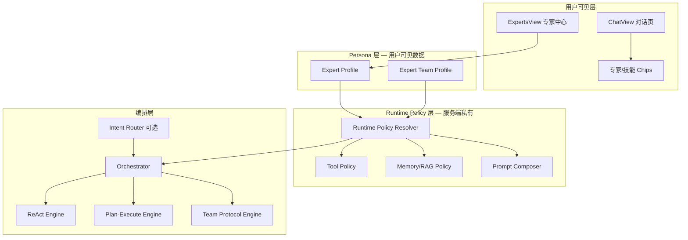
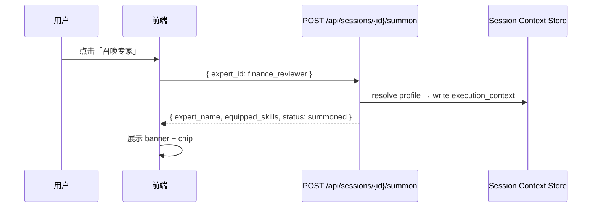
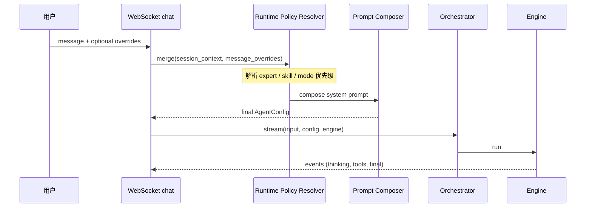
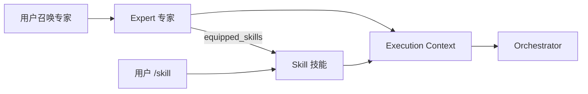

# 03 — 专家中心运行时架构（目标架构）

> **版本**：1.0 | **状态**：目标设计  
> **定位**：专家中心是面向用户的 **Persona + Policy 层**，不是新的 Agent 引擎  
> **原则**：用户选「谁来做」，平台内部决定「怎么跑（ReAct / Plan-Execute / Multi-Agent）」

---

## 1. 设计目标

| 目标 | 说明 |
|------|------|
| **业务语言** | 用户看到专家/专家团，不看到「执行引擎」「ReAct」 |
| **配置驱动** | 新增专家/专家团以 YAML/DB 配置为主，少改 orchestrator 代码 |
| **会话绑定** | 召唤专家 = 绑定 Session Execution Context，跨消息生效 |
| **可组合** | 专家可装备技能；技能可斜杠独立召唤 |
| **可覆盖** | 用户显式选模式/技能时，在规则内 override |

---

## 2. 分层架构



---

## 3. 核心概念定义

| 概念 | 定义 |
|------|------|
| **Expert（专家）** | 单角色 persona，绑定一种主引擎 + 默认技能 + 工具/记忆策略 |
| **Expert Team（专家团）** | 多角色协作 persona，绑定 Team Protocol + 各角色配置 |
| **Summon（召唤）** | 在会话上绑定 Expert/Team 的 Runtime Policy |
| **Execution Context** | 会话级运行时上下文（专家、技能、模式、策略） |
| **Engine** | 底层执行引擎：react / plan_execute / team_protocol |
| **Skill** | 可独立召唤的能力包（见 [04-技能包导入与运行时](./04-技能包导入与运行时.md)） |

---

## 4. Expert Profile 数据模型

### 4.1 存储位置

- **配置源**：`experts/` 目录 YAML（内置）+ DB `expert_profiles` 表（企业自定义）
- **API 输出**：仅 `display` 段；`runtime` / `prompts` 永不暴露给前端

### 4.2 完整 Schema（服务端）

```yaml
# experts/finance_reviewer.yaml
id: finance_reviewer
type: expert
version: "1.0.0"
enabled: true

display:
  name: 财务审阅专家
  title: 资深 CPA · 四大会计师事务所背景
  tagline: 三表勾稽、比率分析、审计意见一站式输出
  category: finance
  domains: [财务审计, 报表分析, 合规初筛]
  avatar: finance_reviewer.png
  equipped_skills:
    - name: financial_audit
      display_name: 财务审阅技能
  example_tasks:
    - label: 资产负债表审阅
      prompt: 请审阅以下资产负债表，指出异常科目与流动性风险

runtime:
  engine: plan_execute              # react | plan_execute | team_protocol
  default_skill: financial_audit
  default_mode: task_orchestration  # 对应用户「Plan」
  tool_policy: accounting_full      # 引用 tool_policies.yaml
  memory_policy: heavy_knowledge    # 引用 memory_policies.yaml
  model_policy: reasoning             # 引用 model_policies.yaml
  max_iterations: 12
  timeout_seconds: 180

prompts:
  persona: |
    你是资深财务审阅专家（CPA），擅长三表勾稽、财务比率分析与审计意见撰写。
  constraints:
    - 禁止心算财务数字，必须调用工具获取精确结果
    - 结论需区分「事实」与「推断」
    - 引用知识库来源时标注 doc/page
  output_format: audit_report_v1    # 可选结构化输出模板

permissions:
  min_user_type: regular            # regular | member
  required_features: []

metadata:
  owner: platform
  updated_at: 2026-07-30
```

### 4.3 对外 API 响应（Public Profile）

```json
{
  "id": "finance_reviewer",
  "type": "expert",
  "name": "财务审阅专家",
  "title": "资深 CPA · 四大会计师事务所背景",
  "tagline": "三表勾稽、比率分析、审计意见一站式输出",
  "domains": ["财务审计", "报表分析", "合规初筛"],
  "equipped_skills": [
    { "name": "financial_audit", "display_name": "财务审阅技能" }
  ],
  "example_tasks": [ "..." ]
}
```

**禁止返回**：`runtime`、`prompts`、`permissions` 内部细节。

---

## 5. Expert Team 数据模型

### 5.1 Team Profile Schema

```yaml
id: finance_review_board
type: team
version: "1.0.0"

display:
  name: 财务评审委员会
  tagline: 分析师 · 质疑官 · 裁决官 三轮协作
  domains: [投资评审, 风险识别, 并购尽调]
  members:
    - role: 财务分析师
      stance: 基于数据提出分析结论与假设
    - role: 审计质疑官
      stance: 挑战假设，识别会计红旗
    - role: 投资裁决官
      stance: 综合辩论，给出最终评审意见
  example_tasks: [ "..." ]

runtime:
  engine: team_protocol
  protocol: debate_v1              # 引用 team_protocols/
  default_mode: collaborative_decision
  tool_policy: accounting_full
  memory_policy: standard
  model_policy: reasoning

team_protocol:
  id: debate_v1
  roles:
    - id: analyst
      persona: 你是财务分析师……
      tools: [balance_sheet_analyzer, financial_ratio_calculator]
      max_rounds: 1
    - id: skeptic
      persona: 你是审计质疑官……
      tools: [financial_ratio_calculator]
      max_rounds: 1
    - id: judge
      persona: 你是投资裁决官……
      tools: []
      max_rounds: 1
  flow:
    - step: analyst_analyze
      role: analyst
    - step: skeptic_challenge
      role: skeptic
      input: previous_outputs
    - step: judge_decide
      role: judge
      input: all_previous
  stop_condition: judge_output_ready
  streaming: per_role              # 前端可展示分角色输出
```

### 5.2 Team Protocol Engine（配置化，非硬编码类）

**目标**：新增「法务评审团」「并购尽调团」只需新增 YAML，不改 Python 类。

**Protocol 类型（可扩展）**：

| protocol | 行为 |
|----------|------|
| `debate_v1` | 分析 → 质疑 → 裁决 |
| `review_v1` | 并行多角色 → 汇总编辑 |
| `handoff_v1` | 角色链式 handoff |
| `map_reduce_v1` | 分片处理 → reduce 汇总 |

**Engine 职责**：

```
TeamProtocolEngine.run(protocol, input, context):
    for step in protocol.flow:
        role = load_role(step.role)
        tools = resolve_tools(role.tools, context.tool_policy)
        output = await run_role_agent(role, input, tools)
        store_step_output(step.id, output)
        stream_event(role=step.role, content=output)
    return finalize(protocol.stop_condition)
```

---

## 6. Policy 子系统（可复用策略）

### 6.1 Tool Policy

```yaml
# tool_policies/accounting_full.yaml
id: accounting_full
allow:
  - balance_sheet_analyzer
  - income_statement_analyzer
  - cash_flow_analyzer
  - financial_ratio_calculator
  - dupont_analysis
  - web_search
deny: []
require_any: []   # 至少命中一个才允许执行
```

**Effective Tools** = `skill.required_tools ∩ expert.tool_policy ∩ user.permissions`

### 6.2 Memory / RAG Policy

```yaml
# memory_policies/heavy_knowledge.yaml
id: heavy_knowledge
max_history_turns: 8
include_short_term: true
include_long_term: true
include_episodic: true
include_knowledge_rag: true
knowledge_top_k: 8
retrieval_mode: hybrid
rerank: true
```

### 6.3 Model Policy

```yaml
# model_policies/reasoning.yaml
id: reasoning
preferred_provider: deepseek
preferred_model: deepseek-reasoner
fallback_chain:
  - { provider: openai, model: gpt-4o }
temperature: 0.2
max_tokens: 8192
```

---

## 7. Execution Context（会话级运行时上下文）

### 7.1 数据结构

```json
{
  "session_id": "uuid",
  "execution_context": {
    "expert_id": "finance_reviewer",
    "expert_type": "expert",
    "expert_name": "财务审阅专家",
    "engine": "plan_execute",
    "active_skill": "financial_audit",
    "skill_invocation": "expert",
    "mode": "task_orchestration",
    "tool_policy_id": "accounting_full",
    "memory_policy_id": "heavy_knowledge",
    "model_policy_id": "reasoning",
    "user_mode_override": null,
    "user_skill_override": null,
    "summoned_at": "2026-07-30T12:00:00Z",
    "version": "expert_profile@1.0.0"
  }
}
```

**存储**：Redis（TTL 续期）+ MySQL `session_context` 持久化。

### 7.2 Summon 语义（最优）

**召唤专家** = 写入/更新 `execution_context`，**不触发 LLM**。



**与「发消息才生效」相比的优势**：

- 前后端状态一致
- 可审计「何时召唤了谁」
- 支持「仅召唤不发消息」的产品语义

### 7.3 Clear / Switch

| 操作 | API | 行为 |
|------|-----|------|
| 清除专家 | `DELETE .../summon` | 清空 expert 相关字段，保留用户模式 |
| 切换专家 | `POST .../summon` | 覆盖 execution_context |
| 清除技能 | `DELETE .../skill` | 若专家有 default_skill 则恢复 |

---

## 8. 端到端执行流（用户发消息 → Agent 运行）



### 8.1 Runtime Policy Resolver

```python
def resolve(session_ctx, message) -> ResolvedRuntime:
    expert = load_expert(session_ctx.expert_id)

    # --- Skill 优先级 ---
    skill = (
        message.parsed_slash_skill          # 1. /skill
        or message.skill                    # 2. 显式字段
        or session_ctx.active_skill         # 3. 会话 sticky
        or expert.runtime.default_skill     # 4. 专家默认
    )

    # --- Mode / Engine 优先级 ---
    if message.mode and message.mode != "adaptive":
        mode = message.mode                 # 用户显式选 Medium/Plan
        engine = mode_to_engine(mode)
    elif session_ctx.engine:
        engine = session_ctx.engine         # 召唤时已解析
        mode = engine_to_mode(engine)
    elif expert:
        engine = expert.runtime.engine
        mode = expert.runtime.default_mode
    else:
        mode = "adaptive"
        engine = intent_router(message)     # Auto

    # --- Policies ---
    tool_policy = intersect(skill.tools, expert.tool_policy, user.perms)
    memory_policy = expert.memory_policy or default

    return ResolvedRuntime(engine, skill, mode, tool_policy, memory_policy, ...)
```

### 8.2 优先级表（最终版）

| 维度 | 优先级（高 → 低） |
|------|-------------------|
| **技能** | 斜杠 `/skill` > 消息 skill 字段 > 会话 active_skill > 专家 default_skill > 无 |
| **引擎/模式** | 用户非 adaptive 模式 > 会话 engine > 专家 runtime > Intent Router (Auto) |
| **System Prompt** | skill.prompt + expert.persona + expert.constraints + platform.base |
| **工具** | skill.tools ∩ tool_policy ∩ 用户权限 |
| **记忆/RAG** | skill.context_strategy 覆盖项 > expert.memory_policy > 平台默认 |

### 8.3 Prompt Composer

```
Final System Prompt =
    [Skill System Prompt]           # 若 active_skill
  + [Expert Persona]                # 若 summoned
  + [Expert Constraints as bullets]
  + [Platform Base Prompt]
  + [Retrieved Knowledge Context]   # MemoryManager 注入
  + [Output Format Template]        # 若配置
```

---

## 9. Intent Router（Auto 模式）

当用户选 **Auto** 且未覆盖专家 engine 时：

```python
def intent_router(message, session_ctx) -> EngineChoice:
    features = {
        "has_attachment": bool(message.attachments),
        "attachment_type": detect_type(message.attachments),
        "expert_domain": session_ctx.expert_category,
        "keywords": extract_intents(message.text),
        "requires_multi_perspective": ...,
        "requires_structured_plan": ...,
    }
    # 若已召唤专家：在专家 domain 内选子策略，不切换 persona
    if session_ctx.expert_id:
        return route_within_expert(features, session_ctx.expert_id)
    return route_global(features)
```

**示例规则**：

| 条件 | 路由 |
|------|------|
| 已召唤 finance_review_board | team_protocol（固定） |
| 已召唤 finance_reviewer + 用户提供 JSON 财报 | plan_execute |
| 关键词「辩论」「评审」「多角度」 | team_protocol |
| 「逐步」「计划」「拆解任务」 | plan_execute |
| 默认 | react |

---

## 10. 前端集成规范

### 10.1 ExpertsView

- 列表数据：`GET /api/experts`
- 召唤：`POST /api/sessions/{id}/summon` + 跳转 `/`
- 示例任务：带 `prompt` query 预填输入框

### 10.2 ChatView

| UI 元素 | 数据来源 |
|---------|----------|
| 专家 banner | `execution_context.expert_name` |
| 专家 chip | 可 dismiss → 调 API clear |
| 技能 chip | `active_skill` + label |
| 模式选择器 | Auto / Medium / Plan |
| 斜杠菜单 | `/api/skills/invocable` |

### 10.3 WebSocket 消息格式

```json
{
  "type": "message",
  "input": "请审阅以下数据……",
  "mode": "adaptive",
  "skill": null,
  "expert_id": "finance_reviewer",
  "skill_invocation": null,
  "provider": "deepseek"
}
```

**推荐**：服务端以 **session execution_context 为准**；消息字段仅作 override。

---

## 11. 与技能库的关系



| 路径 | 行为 |
|------|------|
| 召唤专家 | 绑定 persona + engine + default_skill |
| `/financial_audit` | 绑定 skill；不强制切换 expert |
| 专家 + 斜杠 | expert persona 保留，skill 被 override |
| 专家 chip 清除 | 清除 persona；skill 若来自 expert 则一并清除 |

---

## 12. 治理与扩展

### 12.1 版本管理

- Expert YAML 带 `version`；session 锁定召唤时的 version
- 升级 profile 不影响进行中的 session

### 12.2 企业自定义专家

- 管理后台 CRUD `expert_profiles` 表
- 可继承内置 expert：`extends: finance_reviewer`

### 12.3 审计

- 记录：`summon` / `clear` / 每条 message 的 `resolved_runtime`
- 可复盘「为何走了 Plan-Execute」

### 12.4 权限

- `permissions.min_user_type`：regular / member
- 专家团可标记 `high_cost: true`，UI 提示 token 消耗

---

## 13. 验收标准

- [ ] 新增专家仅加 YAML + 重启/热加载，不改 orchestrator 主代码
- [ ] 新增专家团仅加 team_protocol YAML
- [ ] 召唤 API 与前端 chip 状态 100% 一致
- [ ] Auto + 已召唤专家：不丢失 expert persona
- [ ] 用户选 Plan 可 override 专家的 react 默认
- [ ] API 不泄露 system_prompt / engine 名称
- [ ] 辩论团输出可按 role 分阶段流式展示

---

## 14. 关联文档

- [04-技能包导入与运行时](./04-技能包导入与运行时.md)
- [WorkBuddy 对标 PRD](../../agent-orchestration/prd/WorkBuddy对标-技能斜杠与专家中心-PRD.md)
- [执行模式详解](../../agent-orchestration/02-执行模式详解.md)
- [Multi-Agent README](../../multi-agent/README.md)
