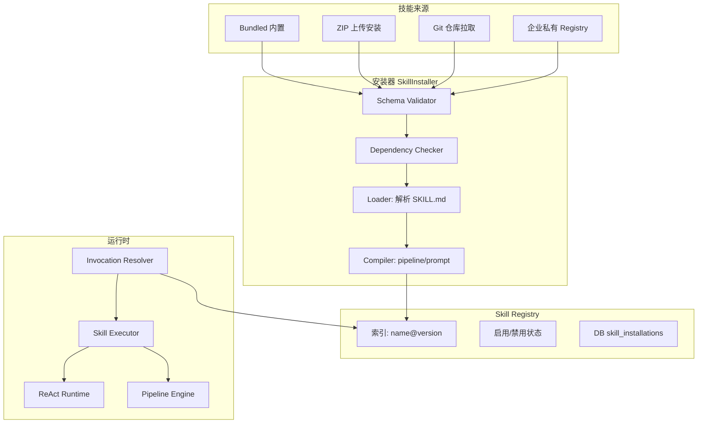
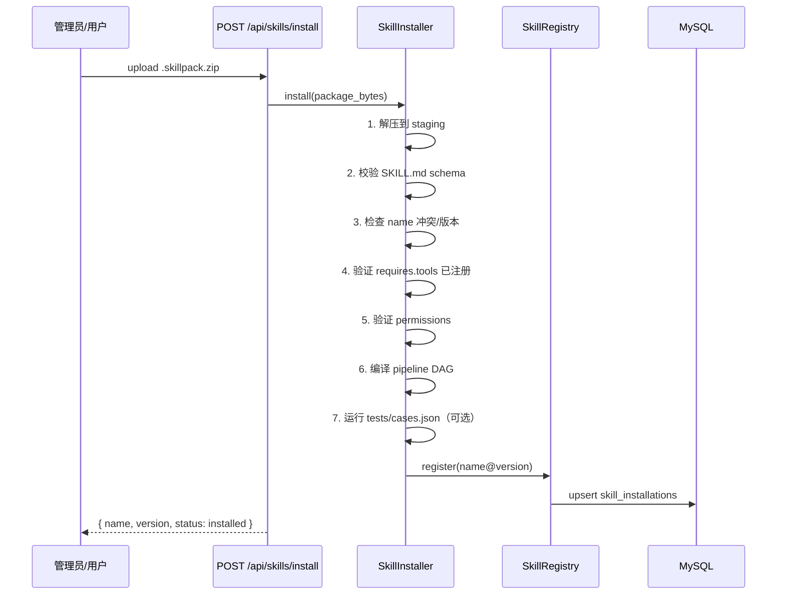

# 04 — 技能包导入与运行时（目标架构）

> **版本**：1.0 | **状态**：目标设计  
> **定位**：技能是可安装、可版本化、可声明式的 **Skill Package**，而非 Python 硬编码类  
> **原则**：`SKILL.md` 为 manifest 权威；运行时支持 **Prompt 模式** 与 **Pipeline 模式** 及 Hybrid 降级

---

## 1. 设计目标

| 目标 | 说明 |
|------|------|
| **声明式** | 技能定义以 SKILL.md + YAML 为主，减少代码改动 |
| **可安装** | 支持内置 / ZIP / Git / 企业私有仓库 |
| **可版本化** | semver；session 可锁定版本 |
| **可校验** | 安装前检查依赖、权限、schema |
| **双运行时** | 开放式任务走 ReAct；结构化任务走 Pipeline |
| **可治理** | 启用/禁用、审计、租户可见性 |

---

## 2. Skill Package 目录结构

```
skills/
  financial_audit/                    # 技能包根目录
    SKILL.md                          # Manifest（必需）
    prompts/
      system.md                       # 系统 prompt 模板
      user_template.md                # 可选用户消息模板
      examples.md                     # few-shot 示例
    policies/
      tools.yaml                      # 依赖工具
      context.yaml                    # 记忆/RAG 策略
      permissions.yaml                # 权限要求
    pipelines/
      audit_flow.yaml                 # 可选固定流水线
    schemas/
      input.json                      # 可选输入 JSON Schema
      output.json                     # 可选输出 Schema
    tests/
      cases.json                      # 回归测试用例
    README.md                         # 人类可读说明
    CHANGELOG.md
    LICENSE
```

**打包分发**：`financial_audit-1.2.0.skillpack.zip`（zip 根目录即为上结构）

---

## 3. SKILL.md Manifest 规范

### 3.1 完整示例

```yaml
---
# === 标识 ===
name: financial_audit
version: 1.2.0
apiVersion: skills.platform/v1

# === 展示（用户可见）===
display:
  name: 财务审阅
  description: 基于三表数据输出结构化审阅意见与风险提示
  category: accounting
  category_label: 财会
  icon: audit
  tags: [财报, 审计, 三表]

# === 调用方式 ===
invocation:
  slash_command: /financial_audit
  user_invocable: true              # 是否出现在聊天 / 菜单
  expert_equippable: true           # 是否可被专家装备
  aliases: [fa, 财报审阅]           # 可选别名（仅展示，不替代 slash）

# === 运行时 ===
runtime:
  type: hybrid                      # prompt_only | pipeline | hybrid
  engine_preference: plan_execute   # react | plan_execute | any
  pipeline: audit_flow              # pipelines/ 下文件名（type=pipeline|hybrid 时）
  fallback: react                   # pipeline 不适用时的降级

# === 依赖 ===
requires:
  tools:
    - balance_sheet_analyzer
    - income_statement_analyzer
    - cash_flow_analyzer
    - financial_ratio_calculator
  tool_policy_min: accounting_core  # 可选：至少满足的 policy
  skills: []                        # 依赖其他 skill（少见）
  platform_version: ">=1.0.0"

# === 权限 ===
permissions:
  min_user_type: regular            # regular | member
  org_features: []                  # 企业功能开关

# === Prompt 入口 ===
prompts:
  system: prompts/system.md
  examples: prompts/examples.md

# === 上下文策略 ===
context:
  file: policies/context.yaml

# === 输入输出 ===
schemas:
  input: schemas/input.json         # 可选：用于 pipeline 触发判定
  output: schemas/output.json

# === 元数据 ===
metadata:
  author: platform
  license: proprietary
  homepage: https://...
  installed: true                   # 由 Registry 维护，不写进包内
---

# 财务审阅技能

（Markdown 正文：人类可读文档，安装后在技能库展示）
```

### 3.2 必填字段

| 字段 | 说明 |
|------|------|
| `name` | 全局唯一，小写+下划线，`[a-z][a-z0-9_]{1,63}` |
| `version` | semver |
| `display.name` | 展示名 |
| `runtime.type` | prompt_only / pipeline / hybrid |
| `requires.tools` | 依赖工具列表（可为空） |
| `prompts.system` | system prompt 路径 |

---

## 4. 子文件规范

### 4.1 prompts/system.md

支持 **模板变量**（Jinja2 风格）：

```markdown
你是资深财务审阅专家。当前任务类型：{{ task_type | default("general") }}。

## 工作流程
1. 若用户提供结构化 JSON 财报，优先调用 balance_sheet_analyzer 等工具
2. 基于工具返回的精确数字撰写审阅意见
3. 输出须包含：概况、关键指标、风险点、建议

## 约束
- 禁止心算财务数字

- {{ c }}

```

### 4.2 policies/tools.yaml

```yaml
required:
  - balance_sheet_analyzer
  - financial_ratio_calculator
optional:
  - web_search
deny:
  - code_executor
```

### 4.3 policies/context.yaml

```yaml
max_history_turns: 6
include_short_term: true
include_long_term: false
include_episodic: false
include_knowledge_rag: true
knowledge_top_k: 6
retrieval_mode: hybrid
rerank: true
skill_specific_filters:
  content_types: [paragraph, table_row, table_summary]
  doc_class: [financial_report]
```

### 4.4 pipelines/audit_flow.yaml

```yaml
id: audit_flow
version: "1.0"
description: 结构化财报 JSON 审阅流水线

trigger:
  type: json_schema_match
  schema: schemas/input.json
  min_confidence: 0.8

steps:
  - id: parse_input
    type: builtin
    handler: extract_financial_json
    output: financial_data

  - id: analyze_balance
    type: tool
    tool: balance_sheet_analyzer
    input: "{{ financial_data.balance_sheet }}"
    output: bs_result

  - id: analyze_ratios
    type: tool
    tool: financial_ratio_calculator
    input:
      balance: "{{ financial_data.balance_sheet }}"
      income: "{{ financial_data.income_statement }}"
    output: ratio_result

  - id: synthesize
    type: llm
    model_policy: reasoning
    prompt_template: prompts/synthesis.md
    input:
      bs: "{{ bs_result }}"
      ratios: "{{ ratio_result }}"
    output: final_report

on_error:
  fallback: react                 # 任一步失败则降级

output:
  schema: schemas/output.json
  format: markdown
```

**Pipeline Step 类型**：

| type | 行为 |
|------|------|
| `builtin` | 平台内置 handler |
| `tool` | 调用 ToolRegistry |
| `llm` | 单次 LLM 调用 |
| `branch` | 条件分支 |
| `parallel` | 并行多 step |
| `human` | 人工确认（可选） |

---

## 5. Skill Registry 架构



### 5.1 Registry 数据模型（DB）

**skill_installations**

| 字段 | 说明 |
|------|------|
| id | UUID |
| name | financial_audit |
| version | 1.2.0 |
| source | bundled / upload / git |
| install_path | 磁盘目录 |
| enabled | bool |
| user_invocable | bool |
| org_id | null=全局 |
| installed_by | user_id |
| installed_at | |
| manifest_json | 完整 manifest 快照 |

**skill_session_bindings**

| 字段 | 说明 |
|------|------|
| session_id | |
| skill_name | |
| skill_version | 锁定版本 |
| invocation_source | slash / expert / api |
| bound_at | |

---

## 6. 安装流程（详细）



### 6.1 校验规则

| 检查项 | 失败处理 |
|--------|----------|
| SKILL.md schema | 拒绝安装 |
| name 格式 | 拒绝 |
| 依赖 tool 未注册 | 警告 + 标记 `degraded` 或拒绝（可配置） |
| 同名更高版本已存在 | 并存；默认启用最新 |
| pipeline DAG 有环 | 拒绝 |
| 恶意路径（../） | 拒绝 |

### 6.2 卸载

```
POST /api/skills/{name}/uninstall
  → 检查是否有 expert 装备引用
  → 禁用 + 归档 install_path（不立即删盘，保留 audit）
```

---

## 7. 运行时 invocation 流程

### 7.1 触发入口

| 入口 | 路径 |
|------|------|
| 聊天斜杠 | `/financial_audit 请分析……` |
| 专家 default | 召唤专家后首条消息 |
| REST 试跑 | `POST /api/skills/{name}/execute` |
| API 编程 | SDK / 自动化 |

### 7.2 Slash 解析

**前后端统一正则**：

```
^/([a-z][a-z0-9_]{1,63})(?:\s+([\s\S]*))?$
```

输出：`{ skill: "financial_audit", message: "请分析……" }`

### 7.3 Invocation Resolver

```python
def resolve_invocation(session, message) -> SkillInvocation:
    # 1. 解析斜杠
    slash = parse_slash(message.text)
    if slash.skill:
        return SkillInvocation(
            skill=slash.skill,
            input=slash.message,
            source="slash",
        )

    # 2. 会话 sticky skill
    if session.active_skill and not message.clear_skill:
        return SkillInvocation(
            skill=session.active_skill,
            input=message.text,
            source=session.skill_invocation_source,
        )

    # 3. 专家 default（由 Expert Resolver 处理，见 03 文档）
    return None
```

### 7.4 Skill Executor 分支

```python
async def execute(skill_name, user_input, agent_config):
    pack = registry.get(skill_name)           # name@version
    manifest = pack.manifest

    if manifest.runtime.type == "prompt_only":
        return await run_react_with_skill(pack, user_input, agent_config)

    if manifest.runtime.type == "pipeline":
        if pipeline_trigger_matches(pack, user_input):
            return await run_pipeline(pack, user_input, agent_config)
        raise SkillInputMismatchError(...)

    if manifest.runtime.type == "hybrid":
        if pipeline_trigger_matches(pack, user_input):
            try:
                return await run_pipeline(pack, user_input, agent_config)
            except Exception:
                log.warning("pipeline failed, fallback react")
        return await run_react_with_skill(pack, user_input, agent_config)
```

### 7.5 ReAct with Skill（prompt_only / fallback）

```
1. load prompts/system.md → render 模板
2. merge expert persona（若 session 有 expert）
3. apply context.yaml → MemoryManager 策略
4. filter tools → requires.tools ∩ policies
5. orchestrator.stream(react, config)
```

**不调用** `skill.execute()` 旧式单体方法；**Skill Package 即配置源**。

---

## 8. 三层状态（避免并发污染）

| 层 | 存储 | 生命周期 | 用途 |
|----|------|----------|------|
| **Global Registry** | 内存 + DB | 永久（安装级） | 已安装技能清单 |
| **Session Binding** | Redis + DB | 会话 | sticky skill / expert default |
| **Message Context** | ContextVar | 单条 WS 消息 | 异步 task 内读取 |

**禁止**使用进程级全局 `active_skill`（并发会话会互相覆盖）。

---

## 9. API 设计

### 9.1 技能库（SkillsView）

| 方法 | 路径 | 说明 |
|------|------|------|
| GET | `/api/skills` | 全部已安装技能 + 分类 |
| GET | `/api/skills/{name}` | 详情含 README 渲染 |
| GET | `/api/skills/invocable` | 聊天 `/` 菜单数据 |

**invocable 响应**：

```json
{
  "skills": [
    {
      "name": "financial_audit",
      "display_name": "财务审阅",
      "slash_command": "/financial_audit",
      "description": "...",
      "category_label": "财会",
      "user_invocable": true,
      "installed": true,
      "version": "1.2.0"
    }
  ]
}
```

### 9.2 安装与管理

| 方法 | 路径 | 说明 |
|------|------|------|
| POST | `/api/skills/install` | 上传 skillpack |
| POST | `/api/skills/install/git` | 从 Git 拉取 |
| POST | `/api/skills/{name}/enable` | 启用 |
| POST | `/api/skills/{name}/disable` | 禁用 |
| DELETE | `/api/skills/{name}` | 卸载 |
| GET | `/api/skills/{name}/versions` | 版本列表 |

### 9.3 试跑（调试）

```
POST /api/skills/{name}/execute
Body: { "input": "...", "mode": "hybrid" }
```

与聊天路径共用 `SkillExecutor`，便于技能开发者测试 pipeline。

---

## 10. 与专家中心的集成

```yaml
# experts/finance_reviewer.yaml
runtime:
  default_skill: financial_audit
  equipped_skills:
    - name: financial_audit
      display_name: 财务审阅技能
```

**绑定规则**：

| 场景 | skill 来源 | skill_invocation |
|------|------------|------------------|
| 召唤专家后首条消息 | expert.default_skill | expert |
| 用户 `/other_skill` | slash 解析 | slash |
| 清除 skill chip | 恢复 expert default 或 null | — |

Expert 的 `equipped_skills` 仅为 **UI 展示 + default 绑定**；不限制用户斜杠召唤其他已安装技能。

---

## 11. 版本与发布

### 11.1 版本策略

- **semver**：breaking manifest 变更 → major
- Session 召唤/绑定时锁定 `skill_version`
- Registry 默认 resolve `name@latest_enabled`

### 11.2 发布渠道

| 渠道 | 说明 |
|------|------|
| bundled | 随平台发版 |
| marketplace | 未来技能市场 |
| private | 企业 Git / 内网 ZIP |

### 11.3 热更新

- 安装新版本 → 旧 session 仍用锁定版本
- 新 session 用 latest
- 支持 `POST /api/skills/{name}/migrate-sessions`（管理员）

---

## 12. 安全与治理

| 维度 | 做法 |
|------|------|
| 代码执行 | pipeline 禁止任意 Python；仅 whitelist handler |
| 文件访问 | tool 层校验路径 |
| 权限 | manifest.permissions + 用户类型 |
| 审计 | install / invoke / execute 全记录 |
| 沙箱 | 第三方 skillpack 签名验证（可选） |
| 资源限额 | pipeline 每 step timeout；LLM token 上限 |

---

## 13. 测试与 CI

每个 skillpack 可带 `tests/cases.json`：

```json
[
  {
    "name": "basic_audit_json",
    "input": "{ \"balance_sheet\": { ... } }",
    "expect_tools": ["balance_sheet_analyzer"],
    "expect_output_contains": ["流动性", "资产负债率"]
  }
]
```

安装时可选跑 smoke test；CI 对 bundled skills 全量回归。

---

## 14. 从现状迁移路径

| 阶段 | 工作 |
|------|------|
| Phase 1 | 现有 Python Skill 类 → 自动生成 SKILL.md + prompts/system.md |
| Phase 2 | Registry 支持 DB；`/invocable` 读 Registry |
| Phase 3 | SkillInstaller + ZIP 安装 |
| Phase 4 | Pipeline YAML 引擎；financial_audit 迁为 hybrid |
| Phase 5 | 废弃 `skill_registry.activate()` 全局态 |

---

## 15. 验收标准

- [ ] 新增技能仅提交 skillpack，无需改 main.py
- [ ] SKILL.md schema 校验 100% 覆盖必填项
- [ ] 斜杠 `/name msg` 与 REST execute 行为一致（同 version）
- [ ] hybrid pipeline 失败自动降级 ReAct
- [ ] 并发 100 会话 skill 状态互不干扰
- [ ] 专家 default_skill 与 slash override 优先级符合 03 文档
- [ ] 卸载被 expert 引用的 skill 时给出明确错误

---

## 16. 关联文档

- [03-专家中心运行时架构](./03-专家中心运行时架构.md)
- [技能系统现状说明](../../skills/README.md)
- [WorkBuddy 对标 PRD](../../agent-orchestration/prd/WorkBuddy对标-技能斜杠与专家中心-PRD.md)
- [工具系统 README](../../tools/README.md)
