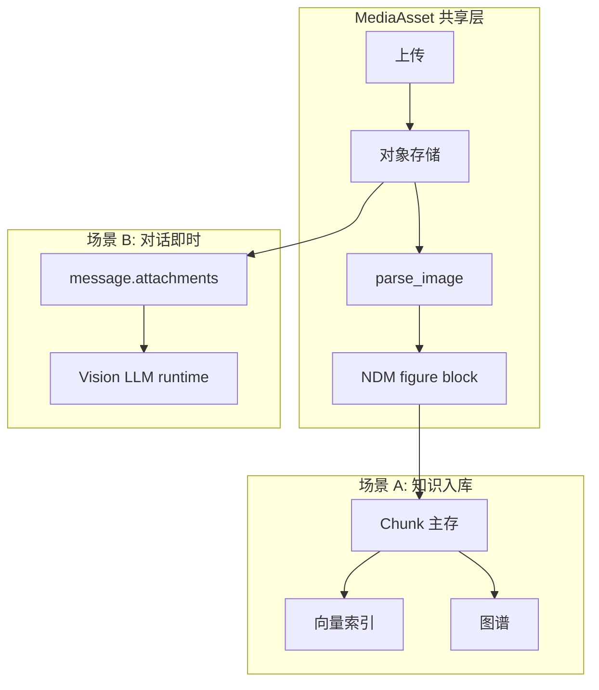
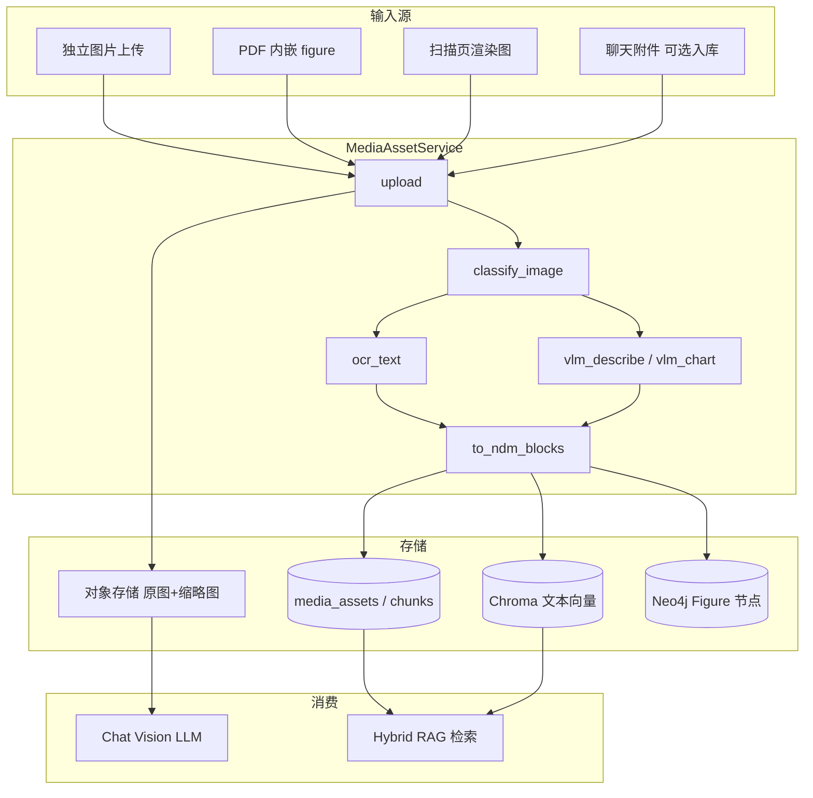
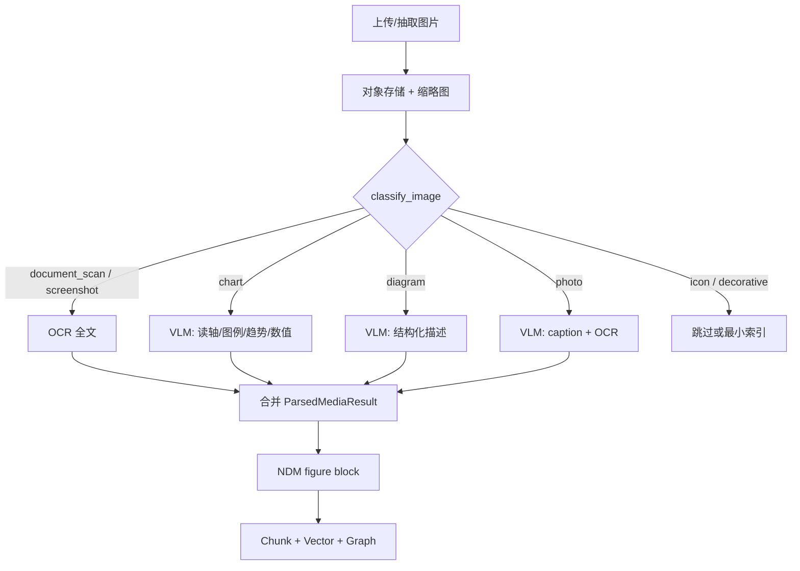
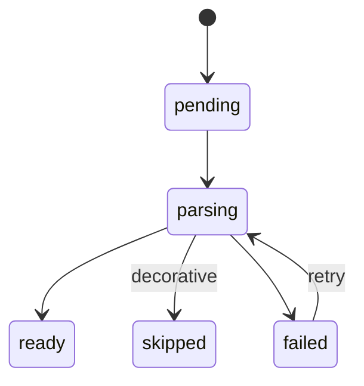

# 05 — 媒体资产与多模态解析（目标架构）

> **版本**：1.0 | **状态**：目标设计  
> **范围**：独立图片上传、PDF 内嵌图/图表、扫描页的多模态解析；知识入库与对话附件两条消费路径  
> **原则**：**文档理解 = OCR + 版面 + 按需 VLM**；RAG 默认「图片 → 文本描述 → 向量」，原图用于溯源与 runtime vision

---

## 1. 背景与问题定义

### 1.1 PDF 与多模态的关系

PDF 入库（见 [01-PDF知识资产入库与预处理](./01-PDF知识资产入库与预处理.md)）必然遇到非纯文本内容：

| 内容类型 | 示例 | 典型处理方式 | 是否必须 VLM |
|----------|------|--------------|:------------:|
| 扫描页 | 纸质合同扫描件 | OCR + 版面分析 | ❌ OCR 通常足够 |
| 内嵌图片 | 产品图、印章、截图 | OCR（若有字）+ VLM 描述 | 复杂图 ✅ |
| 图表 | 柱状图、饼图、K 线图 | 切图 + VLM 读图 / 专用 chart OCR | ✅ 推荐 |
| 矢量表格 | 财报三表 | pdfplumber / camelot | ❌ 不必 VLM |
| 纯文本层 | 可复制 PDF 正文 | 文本抽取 | ❌ |

**结论**：PDF 是**多模态文档问题**，但解决方案是 **OCR + 版面 + 按需 VLM**，不是整条链路都依赖多模态 LLM。

### 1.2 为何要独立「媒体资产模块」

若仅为 PDF 内嵌图单独写一套逻辑，会与「用户直接上传图片进知识库」「聊天临时发图」重复建设。

**最优做法**：统一 **Media Asset Ingestion（媒体资产入库）** 子模块，被以下入口复用：

```
KnowledgeIngestion
├── TextIngestion        (.txt / .md / .csv / .json)
├── PdfIngestion         (页内 figure 调用 MediaAsset)
└── MediaAssetIngestion  (独立 .png / .jpg / .webp 上传)
```

---

## 2. 设计目标

| 目标 | 说明 |
|------|------|
| **统一入口** | 图片上传、PDF 内嵌图、扫描页渲染图走同一 `parse_image()` |
| **分场景消费** | 知识入库（转文本索引）与对话附件（runtime vision）分离 |
| **成本可控** | 仅对 chart/diagram 等分类结果调 VLM；其余优先 OCR |
| **可检索** | 图片内容进入 chunk + 向量 + 可选图谱，问答可引用 |
| **可溯源** | 保留原图 URL、页码、bbox、缩略图 |
| **可扩展** | 支持 Phase 2 CLIP 以图搜图；不阻塞 Phase 1 文本 RAG |

---

## 3. 两种多模态场景（不可混为一谈）

| 场景 | 输入 | 目标 | 是否 runtime 多模态 LLM |
|------|------|------|:----------------------:|
| **A. 知识入库** | PDF 内图 / 图片上传至知识资产 | 可检索、可引用、可溯源 | 通常 **否**（VLM 在入库时转文本/结构化） |
| **B. 对话即时** | 聊天框拖入图片 | 「这张图什么意思？」 | **是**（vision model 直接读图） |

两者共用：**上传 → 对象存储 → 解析 → NDM block**；消费方式不同：

- **入库**：解析结果 → chunk / 图谱 → Hybrid RAG（mostly 文本检索）
- **对话**：原图 URL + 解析摘要 → 作为 `attachments` 送入 vision LLM



---

## 4. 总体架构



---

## 5. MediaAssetService 模块边界

### 5.1 对外接口

```python
class MediaAssetService:
    async def upload(
        self,
        file: bytes,
        filename: str,
        user_id: int,
        *,
        source: Literal["upload", "pdf_extract", "chat_attachment"],
        doc_id: str | None = None,
        page_no: int | None = None,
        bbox: list[float] | None = None,
    ) -> MediaAssetRef: ...

    async def classify(self, asset_id: str) -> ImageClassResult: ...

    async def parse_image(self, asset_id: str) -> ParsedMediaResult: ...

    async def extract_from_pdf_region(
        self,
        pdf_path: str,
        page_no: int,
        bbox: list[float],
        user_id: int,
        doc_id: str,
    ) -> MediaAssetRef: ...

    def to_ndm_blocks(self, parsed: ParsedMediaResult) -> list[NdmBlock]: ...
```

### 5.2 支持格式

| 格式 | MIME | Phase |
|------|------|-------|
| PNG | image/png | 1 |
| JPEG | image/jpeg | 1 |
| WebP | image/webp | 1 |
| GIF（静态） | image/gif | 2 |
| TIFF | image/tiff | 2 |
| PDF 内嵌图 | application/pdf 子资源 | 2（由 PDF 管线调用） |

---

## 6. 图片分类（Image Classifier）

解析前先分类，决定 OCR / VLM / 两者组合。

### 6.1 分类标签

| image_class | 说明 | 解析策略 |
|-------------|------|----------|
| `document_scan` | 文档扫描、表格截图 | OCR 优先，整页文本 |
| `chart` | 柱状/折线/饼图等 | VLM 读轴/图例/趋势 + OCR 轴标签 |
| `diagram` | 流程图、架构图、组织架构 | VLM 结构化描述 |
| `photo` | 照片、实物 | VLM caption + 可选 OCR |
| `screenshot` | UI 截图 | OCR 为主 |
| `stamp_seal` | 印章、签名 | OCR + 标记 `legal_element` |
| `icon_logo` | 图标、Logo | 短 caption 或跳过索引 |
| `decorative` | 装饰图、分隔线 | **不索引** |

### 6.2 分类信号

| 信号 | 方法 |
|------|------|
| 文字密度 | OCR 预览字符数 / 像素面积 |
| 颜色分布 | 图表常有大色块、少纹理 |
| 直线/矩形 | 流程图、表格截图 |
| 宽高比 | 横幅图 vs 方形图 |
| 上下文 | 来自 PDF 的 caption「图 1」「表 2」 |
| 轻量 CV 模型 | 可选 chart vs photo 二分类 |

### 6.3 分类输出

```json
{
  "asset_id": "uuid",
  "image_class": "chart",
  "confidence": 0.88,
  "recommended_pipeline": ["ocr", "vlm_chart"],
  "skip_index": false
}
```

---

## 7. 图片解析流水线



### 7.1 OCR 路径

- **引擎**：PaddleOCR（中文优先）/ Tesseract（兜底）
- **输出**：`ocr_text`、块级 bbox、`ocr_confidence`
- **适用**：扫描件、截图、图内文字、图表轴标签

### 7.2 VLM 路径

- **触发条件**：`image_class in (chart, diagram, photo)` 或 OCR 置信度低且仍含语义
- **推荐模型**（按部署环境选一）：
  - 云端：GPT-4o-mini / Claude Sonnet vision / Qwen-VL-Max
  - 私有化：Qwen2-VL / InternVL / Ollama 视觉模型
- **输出类型**：
  - `vlm_caption`：自然语言描述（1–3 段）
  - `vlm_structured`：JSON（图表：轴、系列、趋势、关键数值）
  - `vlm_confidence`：自评或启发式

**Chart VLM Prompt 要点**（示例）：

```
分析这张图表。输出 JSON：
{
  "chart_type": "bar|line|pie|...",
  "title": "",
  "x_axis": "",
  "y_axis": "",
  "series": [{"name":"","values":[]}],
  "trends": ["..."],
  "key_figures": [{"label":"","value":"","unit":""}]
}
若数值无法确定，value 填 null，勿编造。
```

### 7.3 解析结果结构

```json
{
  "asset_id": "uuid",
  "source": {
    "filename": "chart_q4.png",
    "mime": "image/png",
    "width": 800,
    "height": 600,
    "sha256": "..."
  },
  "provenance": {
    "doc_id": "uuid-or-null",
    "page_no": 12,
    "bbox": [70, 200, 520, 480],
    "extracted_from": "pdf|upload|chat"
  },
  "classification": {
    "image_class": "chart",
    "confidence": 0.88
  },
  "parse_outputs": {
    "ocr_text": "2024Q4 营收 ...",
    "ocr_confidence": 0.82,
    "vlm_caption": "该柱状图展示2024年各季度营收...",
    "vlm_structured": {
      "chart_type": "bar",
      "key_figures": [{"label": "Q4营收", "value": "1.2", "unit": "亿元"}]
    },
    "vlm_confidence": 0.75
  },
  "parse_metadata": {
    "pipeline": ["ocr", "vlm_chart"],
    "parser_version": "media_v1.0",
    "overall_quality": 0.85,
    "warnings": []
  },
  "storage": {
    "original_uri": "s3://.../original.png",
    "thumbnail_uri": "s3://.../thumb.png"
  }
}
```

---

## 8. NDM 集成（figure block）

媒体解析结果写入统一文档模型，与 [01-PDF](./01-PDF知识资产入库与预处理.md) 的 `blocks` 对齐：

```json
{
  "block_id": "p12_f1",
  "type": "figure",
  "page_no": 12,
  "bbox": [70, 200, 520, 480],
  "asset_id": "uuid",
  "caption": "图 3：2024 年各季度营收",
  "section_path": ["第三章 经营分析"],
  "representations": {
    "ocr_text": "...",
    "vlm_caption": "...",
    "vlm_structured": { "..." : "..." }
  },
  "image_class": "chart",
  "confidence": 0.85
}
```

**PDF 管线调用方式**：

```
PdfIngestion.parse_page(page)
  → detect_figure_regions()
  → for each region:
        MediaAssetService.extract_from_pdf_region(...)
        MediaAssetService.parse_image(...)
        append figure block to NDM
```

---

## 9. 存储设计

### 9.1 存什么、不存什么

| 存储 | 内容 | 不存 |
|------|------|------|
| **对象存储** | 原图、缩略图（如 400px 宽） | — |
| **MySQL `media_assets`** | asset 元数据、URI、分类、质量分 | 大段正文 |
| **MySQL `knowledge_chunks`** | 合成文本 chunk（见 9.2） | 原图二进制 |
| **Chroma** | 对 **文本** 的 embedding + metadata | 默认不存 image embedding |
| **Neo4j** | `Figure` 节点、MENTIONS、结构化事实 | 全文 |

**原则**：RAG 默认 **「图片 → 文本描述 → 向量」**；原图用于 citation 展示和 runtime vision。

### 9.2 MySQL `media_assets` 表

```sql
CREATE TABLE media_assets (
    id              CHAR(36) PRIMARY KEY,
    user_id         INT NOT NULL,
    doc_id          CHAR(36) NULL,
    source          ENUM('upload','pdf_extract','chat_attachment') NOT NULL,
    filename        VARCHAR(512),
    mime            VARCHAR(128) NOT NULL,
    width           INT,
    height          INT,
    page_no         INT NULL,
    bbox            JSON NULL,
    image_class     VARCHAR(32),
    original_uri    VARCHAR(1024) NOT NULL,
    thumbnail_uri   VARCHAR(1024),
    ocr_text        MEDIUMTEXT,
    vlm_caption     MEDIUMTEXT,
    vlm_structured  JSON,
    parse_status    ENUM('pending','parsing','ready','failed','skipped') NOT NULL,
    quality_score   FLOAT,
    content_hash    CHAR(64),
    created_at      DATETIME NOT NULL,
    INDEX idx_user (user_id),
    INDEX idx_doc (doc_id)
);
```

### 9.3 Chunk 生成（索引用文本）

每个 figure 至少产生 **1 个 summary chunk**；图表类可额外产生 **fact chunk**：

**Summary chunk 模板**：

```
[FIGURE p12_f1] 图 3：2024 年各季度营收（chart）
OCR: ...
描述: ...
结构化: 柱状图；Q4营收 1.2 亿元；趋势：逐季上升
```

metadata:

```json
{
  "content_type": "figure_summary",
  "asset_id": "uuid",
  "image_class": "chart",
  "page_no": 12,
  "doc_id": "..."
}
```

**结构化事实**（可选，进 fact 表 + Neo4j，见 [02-向量库与知识图谱](./02-向量库与知识图谱分工与存储.md)）：

```
(Company:XX) -[HAS_FIGURE]-> (Figure:uuid)
(Figure:uuid) -[KEY_FIGURE {period:2024Q4, value:1.2, unit:亿元}]-> (Metric:营收)
```

### 9.4 可选 Phase 2：Image Embedding（CLIP）

| 用途 | 说明 |
|------|------|
| 以图搜图 | 用户上传相似图表检索 |
| 辅助召回 | 与文本向量双路融合 |

**默认不启用**；文本 RAG 路径先跑通再考虑。Collection 示例：`kb_image_embeddings`。

---

## 10. 知识入库 vs 对话附件

### 10.1 知识资产 UI

扩展支持格式：

```
.txt .md .csv .json .pdf .png .jpg .webp
```

- 图片上传 → `POST /api/knowledge/upload/media`
- 返回 `asset_id` + `status=parsing` → 完成后 `ready`

### 10.2 聊天附件（Phase 3）

WebSocket 消息扩展：

```json
{
  "type": "message",
  "input": "这张图的营收趋势如何？",
  "attachments": [
    {
      "asset_id": "uuid",
      "mime": "image/png",
      "url": "/api/media/{id}/original",
      "thumbnail_url": "/api/media/{id}/thumb",
      "persist_to_knowledge": false
    }
  ]
}
```

**流程**：

1. 用户选图 → `POST /api/media/upload` → 得 `asset_id`
2. 可选：`parse_image` 预解析（OCR/VLM）供非 vision 模型使用
3. 发消息时带 `attachments`
4. Orchestrator 检测 provider `supports_vision`：
   - **有 vision**：构造 multimodal message（image_url + text）
   - **无 vision**：仅用 `ocr_text` + `vlm_caption` 注入 system/context

### 10.3 LLM Vision 消息格式

LangChain / OpenAI 兼容：

```python
HumanMessage(content=[
    {"type": "text", "text": "这张图的营收趋势如何？"},
    {"type": "image_url", "image_url": {"url": "https://.../original.png"}},
])
```

**Provider 扩展**（`LLMFactory`）：

```yaml
# providers 增加
supports_vision: true
vision_models: [gpt-4o, gpt-4o-mini]
max_images_per_message: 4
```

---

## 11. 与 PDF 管线的关系

[01-PDF](./01-PDF知识资产入库与预处理.md) 中 L4/L5 的图片/图表处理 **委托本模块**：

| PDF 阶段 | 01 文档原描述 | 05 落地 |
|----------|---------------|---------|
| 扫描页 | OCR 流水线 | `classify=document_scan` → OCR |
| 内嵌 figure | 图片区域 | `extract_from_pdf_region` → `parse_image` |
| 图表 | VLM 兜底 | `classify=chart` → VLM chart pipeline |
| 装饰图 | — | `classify=decorative` → skip_index |

**01 文档 L5「VLM 兜底」= 本模块 `vlm_*` 接口**，不在 PDF 模块内重复实现。

---

## 12. 异步任务与状态

与 PDF 共用 Job 框架：



**Job 步骤**：

1. `save_original` + 生成 thumbnail
2. `classify_image`
3. `run_ocr`（若需要）
4. `run_vlm`（若需要）
5. `build_ndm_blocks`
6. `emit_chunks`
7. `embed_vectors`
8. `write_graph_facts`
9. `finalize`

---

## 13. 检索与引用（消费侧）

用户问：「去年年报里营收趋势那张图说明了什么？」

1. Query Router 识别 `needs_figure=true`
2. 向量召回 `content_type=figure_summary` 的 chunk
3. 图谱扩展 `Figure` 节点关联 `Document`
4. Rerank 后返回 chunk + **缩略图 URL + 原图链接 + page_no**

**Citation 卡片**：

```
🖼️ XX公司2024年报 · 第 12 页 · 图 3
「该柱状图展示各季度营收逐季上升，Q4 达 1.2 亿元」
[查看原图] [定位 PDF]
```

---

## 14. 分期实施与可行性

### 14.1 可行性结论

| 问题 | 结论 |
|------|------|
| PDF 是否涉及多模态？ | **是**（OCR + 图片/图表；复杂场景需 VLM） |
| 独立图片上传解析模块是否可行？ | **可行，且建议做** |
| 是否等于全平台变多模态 LLM？ | **否**；入库解析与对话 vision 可分阶段 |
| 与现有架构契合度 | **高**（对象存储、NDM、Chunk、Hybrid RAG 均可复用） |
| 主要增量工程 | MediaAssetService、解析 Worker、vision Provider、前端上传/附件 |

### 14.2 Phase 1 — 图片入库（不做聊天 vision）

- 知识资产支持 `.png / .jpg / .webp`
- OCR（PaddleOCR）+ 规则 caption（无 VLM）
- NDM figure block → text chunk → 向量
- **验收**：上传带文字截图，问答能检索到图中文字

### 14.3 Phase 2 — PDF 内嵌图 + 图表 VLM

- PDF 管线抽取 figure → 调用本模块
- `chart` / `diagram` 走 VLM
- 结构化 key_figures 写 fact 表 + Neo4j
- **验收**：PDF 内柱状图可被问答引用且数值可追溯

### 14.4 Phase 3 — 聊天附件多模态

- Chat 拖图上传
- Vision LLM runtime（gpt-4o 等）
- 无 vision 模型降级为 OCR/VLM 预解析文本
- **验收**：不上传知识库，单轮读图问答可用

### 14.5 Phase 4 — 高级（可选）

- CLIP 以图搜图
- MinerU / PP-Structure 扫描 PDF 全页
- 视频帧抽取（低优先级）

### 14.6 建议实施顺序（相对 01）

```
Phase 1 本模块（独立图 OCR 入库）
    → Phase 2 与 01 PDF 管线联调（内嵌 figure）
    → Phase 3 对话 vision
```

可与 [01-PDF](./01-PDF知识资产入库与预处理.md) 文本 PDF 路径并行开发。

---

## 15. 成本、风险与缓解

| 风险 | 影响 | 缓解 |
|------|------|------|
| VLM 调用贵 | 成本上升 | 仅 chart/diagram 调 VLM；缓存相同 content_hash |
| 图表数值幻觉 | 错误事实 | structured 输出 + confidence；低置信不入 fact 表 |
| 解析慢 | UX 差 | 全异步；聊天与入库分离 |
| 模型不支持 vision | 聊天读图失败 | `supports_vision` 标志 + OCR 文本降级 |
| 存储膨胀 | 磁盘压力 | 缩略图 + 原图分层；向量不存原图 |
| OCR 中文差 | 检索漏召回 | 多引擎 fallback；低置信进 review |

**成本估算（单张图表）**：

| 步骤 | 相对成本 |
|------|----------|
| OCR | 低 |
| VLM caption（mini） | 中 |
| VLM structured chart | 中高 |
| Embedding 文本 chunk | 低 |

---

## 16. API 设计（建议）

| 方法 | 路径 | 说明 |
|------|------|------|
| POST | `/api/media/upload` | 上传图片，返回 asset_id |
| GET | `/api/media/{id}` | 元数据 + 解析状态 |
| GET | `/api/media/{id}/original` | 原图 |
| GET | `/api/media/{id}/thumb` | 缩略图 |
| POST | `/api/knowledge/upload/media` | 上传并绑定知识库 doc |
| POST | `/api/media/{id}/reparse` | 换 parser 版本重跑 |

---

## 17. 验收标准

- [ ] 独立 PNG/JPG 上传 → OCR 文本可被 RAG 检索
- [ ] PDF 内嵌 figure 与独立上传走同一 `parse_image()`
- [ ] chart 类图片 VLM structured 输出 schema 校验通过
- [ ] decorative 类不写入向量库
- [ ] 检索结果含 thumbnail + 原图 + page_no（若来自 PDF）
- [ ] 无 vision provider 时聊天附件降级 OCR 文本可用
- [ ] 相同图片 content_hash 不重复 embed

---

## 18. 关联文档

- [01-PDF知识资产入库与预处理](./01-PDF知识资产入库与预处理.md) — PDF 内 figure 抽取调用本模块
- [02-向量库与知识图谱分工与存储](./02-向量库与知识图谱分工与存储.md) — figure chunk 与 fact 路由
- [RAG 模块现状说明](../../rag/README.md)
