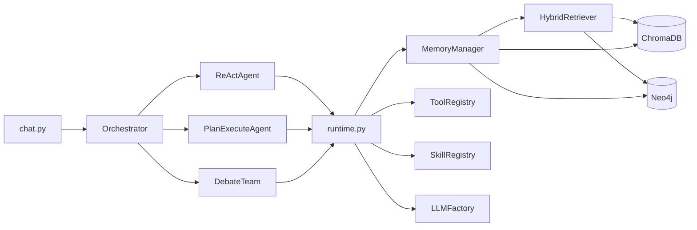

# 01 — 项目总览与系统架构

## 1. 项目是什么

**项目名称：** 会计通用工作台（AgentWorkbench）

**定位：** 面向会计学 / 企业财务分析场景的全栈 LLM Agent 演示平台，用于展示 Agent 工程中的主流范式与工程实践。

**解决的核心问题：**

| 问题 | 本项目的方案 |
|------|-------------|
| 通用 ChatBot 无法做精确财务计算 | 确定性 Python 会计工具 + LLM 解读 |
| 简单 ReAct 难以处理长链路审计任务 | Plan-Execute 任务分解引擎 |
| 单一 Agent 结论可能有偏见 | 三角色 Multi-Agent 结构化辩论 |
| 对话缺乏领域知识 | 混合 RAG（向量 + 知识图谱） |
| 多轮对话上下文丢失 | 三层记忆（短期 / 长期 / 情景） |

---

## 2. 技术栈

| 层级 | 技术 | 作用 |
|------|------|------|
| 后端框架 | FastAPI + Uvicorn | REST API + WebSocket |
| Agent 框架 | LangChain | LLM 抽象、Function Calling、消息模型 |
| 前端 | Vue 3 + TypeScript + Pinia + Vite | 智能体工作台 UI |
| 向量数据库 | ChromaDB | 文档语义检索、长期记忆 |
| 图数据库 | Neo4j | 实体关系、情景记忆 |
| LLM | DeepSeek（默认）| 推理与文本生成 |
| 基础设施 | Docker Compose | 一键启动 Chroma + Neo4j |

---

## 3. 系统分层架构

```
┌─────────────────────────────────────────────────────────────┐
│                    表现层 (Presentation)                     │
│   Vue 3 工作台：Chat / Tools / Skills / Agents / Knowledge   │
└────────────────────────────┬────────────────────────────────┘
                             │ WebSocket + REST
┌────────────────────────────▼────────────────────────────────┐
│                    接口层 (API Layer)                          │
│   chat.py / tools.py / skills.py / knowledge.py / agents.py  │
└────────────────────────────┬────────────────────────────────┘
                             │
┌────────────────────────────▼────────────────────────────────┐
│                  编排层 (Orchestration)                        │
│              AgentOrchestrator — 模式路由 + 事件流             │
└───────┬─────────────────┬─────────────────┬───────────────────┘
        │                 │                 │
┌───────▼──────┐ ┌────────▼────────┐ ┌──────▼──────────────────┐
│ ReActAgent   │ │ PlanExecuteAgent│ │ AccountingDebateTeam    │
│ 推理-行动闭环 │ │ 规划-执行-评估   │ │ 分析师/质疑者/裁判       │
└───────┬──────┘ └────────┬────────┘ └──────┬──────────────────┘
        │                 │                 │
        └─────────────────┼─────────────────┘
                          │
┌─────────────────────────▼───────────────────────────────────┐
│                   运行时层 (Runtime)                          │
│   runtime.py — ReAct 循环 / 上下文构建 / 工具执行 / 事件推送   │
└─────────┬───────────────┬───────────────┬─────────────────────┘
          │               │               │
┌─────────▼─────┐ ┌───────▼───────┐ ┌─────▼─────────────────────┐
│ ToolRegistry  │ │ SkillRegistry │ │ MemoryManager + HybridRAG │
│ 10 个工具      │ │ 3 个技能       │ │ 三层记忆 + RRF 混合检索    │
└───────────────┘ └───────────────┘ └───────────────────────────┘
                          │
┌─────────────────────────▼───────────────────────────────────┐
│                   基础设施层 (Infrastructure)                  │
│        DeepSeek API  │  ChromaDB  │  Neo4j  │  .env 配置      │
└─────────────────────────────────────────────────────────────┘
```

---

## 4. 四种执行模式

平台通过 `core/catalog.py` 定义企业级执行模式命名：

| 模式 Key | 中文名 | 底层 Agent | 触发条件 |
|----------|--------|-----------|----------|
| `adaptive` | 智能路由 | 自动选择 | 默认模式，按关键词路由 |
| `reasoning_action` | 推理闭环 | ReActAgent | 简单问答、工具调用 |
| `task_orchestration` | 任务编排 | PlanExecuteAgent | 含「审计、分析、报告」等关键词 |
| `collaborative_decision` | 协同决策 | AccountingDebateTeam | 含「辩论、评审、委员会」等关键词 |

**智能路由逻辑**（`orchestrator.py`）：

```
用户输入
   │
   ├─ 含 debate_keywords → collaborative_decision
   ├─ 含 complex_keywords  → task_orchestration
   └─ 其他                  → reasoning_action
```

---

## 5. 端到端请求数据流

以用户在 Chat 页面发送一条消息为例：

```
1. 前端 ChatView
   └─ chatStore.sendMessage() → WebSocket 发送 JSON

2. 后端 chat.py
   ├─ 解析 input / mode / skill / temperature
   ├─ skill_registry.activate(skill)  （可选）
   └─ orchestrator.stream(input, config, mode)

3. AgentOrchestrator
   ├─ normalize_agent_config() — 固定 DeepSeek
   ├─ _select_mode() — 智能路由
   ├─ yield START 事件
   └─ agent.stream() — 委托具体 Agent

4. 具体 Agent（以 ReAct 为例）
   ├─ build_initial_messages() — 加载记忆 + RAG 上下文
   ├─ run_react_loop() — LLM ↔ 工具 迭代
   └─ memory_manager.save_context() — 持久化对话

5. WebSocket 推送事件序列
   start → thinking → tool_call → tool_result → reasoning → final → done

6. 前端 chat.ts
   └─ 按事件类型更新消息内容、工具调用列表
```

---

## 6. 模块依赖关系



---

## 7. 启动与注册流程

`main.py` 在 FastAPI `startup` 事件中完成初始化：

1. **register_all_tools()** — 注册 5 个通用工具 + 5 个会计工具
2. **register_all_skills()** — 注册 3 个内置技能
3. 打印可用 LLM Provider 列表

这意味着所有工具和技能在应用启动时**自动发现**，前端 Tools 页面可直接展示。

---

## 8. 答辩要点（本模块）

**可强调：**
- 分层清晰：编排层与执行层分离，新增 Agent 只需实现 `BaseAgent`
- 模式可扩展：catalog 统一管理企业级命名，前后端对齐
- 事件驱动：全链路可观测，适合 demo 展示 Agent「思考过程」

**需诚实说明：**
- README 提及 LangGraph，实际 ReAct 为手写循环（LangChain `bind_tools`）
- Agent 运行时固定 DeepSeek，Settings 页面的 Provider 切换尚未完全打通 Chat

**推荐演示入口：**
- 后端 Swagger：`http://localhost:8000/api/docs`
- 前端工作台：`http://localhost:3000`
- 健康检查：`GET /health`
