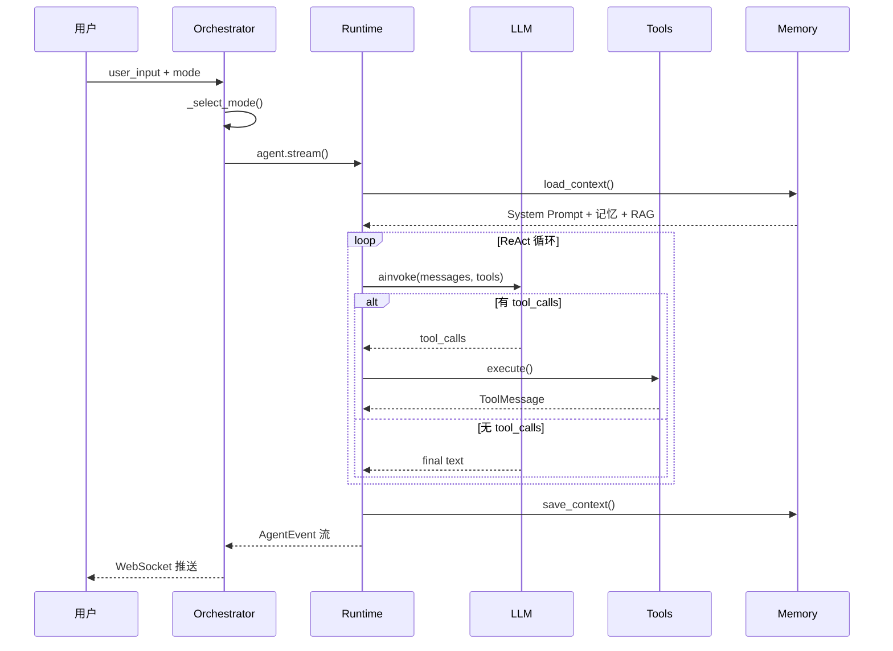

# 02 — Agent 编排与执行引擎

本模块是项目的**技术核心**，涵盖统一编排器、共享运行时、ReAct 与 Plan-Execute 两种执行范式。

---

## 1. 统一抽象：BaseAgent

所有 Agent 继承 `app/agent/base.py` 中的 `BaseAgent`，提供统一接口：

| 方法 | 作用 |
|------|------|
| `invoke()` | 同步执行，返回完整 `AgentResponse` |
| `stream()` | 流式执行，yield `AgentEvent` 序列 |
| `to_runnable()` | 转为 LangChain Runnable（LCEL 集成预留） |

**事件类型枚举 `AgentEventType`：**

```
START        → 任务开始（含模式、技能信息）
THINKING     → Agent 正在思考 / 规划
TOOL_CALL    → 发起工具调用
TOOL_RESULT  → 工具返回结果
REASONING    → 推理文本（流式 token）
INTERMEDIATE → 中间步骤（计划、辩论轮次等）
FINAL        → 最终输出
ERROR        → 异常
DONE         → 执行结束
```

**设计意义：** 无论底层是 ReAct、Plan-Execute 还是 Multi-Agent，上层 WebSocket 和前端只需处理统一事件协议。

---

## 2. AgentOrchestrator — 统一编排器

**文件：** `backend/app/agent/orchestrator.py`  
**模式：** 单例（`orchestrator = AgentOrchestrator.get_instance()`）

### 2.1 职责

1. **配置规范化** — `normalize_agent_config()` 统一 Provider、迭代上限
2. **智能路由** — `_select_mode()` 根据用户输入选择执行引擎
3. **Agent 工厂** — `_get_agent()` 返回对应 Agent 实例
4. **流式封装** — `stream()` 先发 START 事件，再转发子 Agent 事件

### 2.2 路由决策表

| 用户输入特征 | 路由目标 | 典型场景 |
|-------------|----------|----------|
| 含「辩论、讨论、评审、委员会」 | `AccountingDebateTeam` | 「请组织财务评审委员会讨论这家公司」 |
| 含「分析、审计、评估、报告、尽调」 | `PlanExecuteAgent` | 「对以下数据进行完整财务审计并出报告」 |
| 其他 | `ReActAgent` | 「计算 ROE 是多少」「搜索最新会计准则」 |

### 2.3 代码核心逻辑

```python
# 伪代码摘要
async def stream(user_input, config, mode="adaptive"):
    config = normalize_agent_config(config)
    selected = _select_mode(user_input, mode)
    yield START_event(execution_mode=selected, active_skill=...)
    agent = _get_agent(selected)
    async for event in agent.stream(user_input, config):
        yield event
```

---

## 3. Agent Runtime — 共享运行时

**文件：** `backend/app/agent/runtime.py`  
**作用：** 所有 Agent 复用的底层能力，避免重复代码。

### 3.1 核心函数一览

| 函数 | 作用 |
|------|------|
| `normalize_agent_config()` | 固定 DeepSeek，继承全局 max_iterations |
| `resolve_system_prompt()` | 合并技能 Prompt + 默认 Prompt |
| `get_langchain_tools()` | 按激活技能筛选工具列表 |
| `load_agent_context()` | 调用 MemoryManager 加载完整上下文 |
| `build_initial_messages()` | 构建 [SystemMessage, HumanMessage] |
| `create_llm()` | 通过 LLMFactory 创建 ChatModel |
| `execute_tool_call()` | 执行单个工具，返回 ToolMessage |
| `run_react_loop()` | **核心 ReAct 循环（流式事件）** |
| `run_prompt_tool_loop()` | 单 Prompt 工具循环（Multi-Agent 角色用） |

### 3.2 ReAct 循环详解

`run_react_loop()` 是本项目的 Agent 心脏，实现标准 **Thought → Action → Observation** 范式：

```
初始化
  ├─ build_initial_messages()     # System + 记忆/RAG + Human
  ├─ get_langchain_tools()        # 获取可用工具
  └─ llm.bind_tools(tools)        # LangChain Function Calling

循环 (最多 max_iterations 次)
  ├─ yield THINKING
  ├─ response = llm.ainvoke(messages)
  │
  ├─ 若 response 含 tool_calls:
  │     ├─ yield TOOL_CALL
  │     ├─ execute_tool_call() → ToolMessage
  │     ├─ yield TOOL_RESULT
  │     └─ continue 循环
  │
  └─ 否则（无工具调用）:
        ├─ final_output = response.content
        ├─ yield REASONING（分块模拟流式）
        └─ break

收尾
  ├─ yield FINAL（含 output、tool_calls、耗时）
  ├─ memory_manager.save_context()  # 持久化对话
  └─ yield DONE
```

**关键设计决策：**

- 使用 LangChain `bind_tools` + 手动循环，而非 LangGraph StateGraph
- 「流式输出」通过 `stream_text_as_reasoning()` 将完整文本按 24 字符分块推送（非 LLM 原生 token 流）
- 工具执行走 `tool_registry.get(name).execute()`，与 LangChain StructuredTool 双路径兼容

### 3.3 上下文注入顺序

Agent 推理前，`build_initial_messages()` 将以下内容合并进 System Prompt：

```
1. 技能 System Prompt（若激活）
2. 默认 Agent Prompt
3. 知识库 RAG 检索结果（HybridRetriever）
4. 长期记忆召回（ChromaDB 向量）
5. 情景记忆（Neo4j 实体关系）
6. 短期对话历史（最近 N 轮）
```

---

## 4. ReActAgent — 推理-行动闭环

**文件：** `backend/app/agent/react_agent.py`

**适用场景：**
- 单轮或多轮工具调用
- 信息检索、计算验证、轻量分析
- 作为 Plan-Execute 的子执行单元

**实现方式：** 薄封装，核心逻辑全部委托 `runtime.run_react_loop()`。

```python
class ReActAgent(BaseAgent):
    async def stream(self, user_input, config):
        async for event in run_react_loop(user_input, config, persist_memory=True):
            yield event
```

**答辩话术：**  
> ReAct 是最基础的 Agent 范式。LLM 先推理是否需要工具，若需要则调用工具获取 Observation，再将结果追加到消息历史继续推理，直到给出最终答案。本项目通过 LangChain 的 Function Calling 能力实现工具绑定，用手写循环控制迭代上限和事件推送。

---

## 5. PlanExecuteAgent — 规划-执行-评估

**文件：** `backend/app/agent/plan_execute.py`

**适用场景：**
- 财务审计、尽调报告、多步骤分析
- 需要「先想清楚再动手」的复杂任务

### 5.1 执行流程

```
Phase 1: Plan（规划）
  └─ LLM 生成 JSON 计划：{ overview, steps: [{step, description, expected_output}] }

Phase 2: Execute（逐步执行）
  └─ 对每个 step 调用 run_react_loop()，独立执行

Phase 3: Evaluate（评估）
  └─ LLM 判断：complete? needs_replan? gaps?

Phase 4: Replan（可选，最多 1 次）
  └─ 若 needs_replan=true，带 feedback 重新规划

Phase 5: Aggregate（汇总）
  └─ 将所有 step 结果交给 ReAct 生成最终报告
```

### 5.2 事件流（stream 模式）

前端可观察到完整的 Plan-Execute 过程：

| 事件 phase | 含义 |
|------------|------|
| `plan` | 展示生成的步骤列表 |
| `execute_start` / `execute_done` | 每步开始/完成 |
| `evaluate` | 评估结果（是否需重规划） |
| `replan` | 重新规划中 |
| `aggregate` | 最终汇总 |

### 5.3 与 ReAct 的关系

Plan-Execute **不是替代 ReAct，而是编排 ReAct**：

- 规划、评估、汇总：直接调用 LLM
- 每步执行：复用 `run_react_loop()`
- 好处：复杂任务有结构，每步仍可自主选工具

**答辩话术：**  
> Plan-Execute 解决的是 ReAct 在超长任务上容易「一步走偏」的问题。我们让 LLM 先做任务分解，每步用 ReAct 执行，执行完再评估是否需要重规划，最后汇总成结构化报告。这在财务审计场景中非常实用——先验平衡、再分析三表、再算比率、最后出报告。

---

## 6. AgentConfig 配置项

```python
@dataclass
class AgentConfig:
    provider: str = "deepseek"
    model: str = None
    temperature: float = 0.7
    max_iterations: int = 10      # ReAct 最大工具调用轮次
    session_id: str = "default"   # 会话 ID，关联记忆
    streaming: bool = True
    system_prompt: str = None     # 可选自定义 Prompt
```

可通过 `.env` 配置：
- `AGENT_MAX_ITERATIONS=10`
- `DEBATE_MAX_ROUNDS=3`

---

## 7. 架构图



---

## 8. 答辩常见问题

**Q: 为什么不用 LangGraph？**  
A: 当前 ReAct 和 Plan-Execute 的手写循环已满足 demo 需求，逻辑更透明、便于答辩讲解。LangGraph 适合更复杂的状态图场景，可作为后续演进方向。

**Q: max_iterations 达到上限会怎样？**  
A: 返回提示「已达到最大工具调用次数，请简化任务后重试」，避免无限循环消耗 Token。

**Q: Plan-Execute 的步骤是固定的吗？**  
A: 不是。步骤由 LLM 根据任务动态生成 JSON 计划，具有任务适应性。

**Q: 三种 Agent 如何选择？**  
A: 默认 adaptive 模式自动路由；也可在前端手动选择执行模式。
