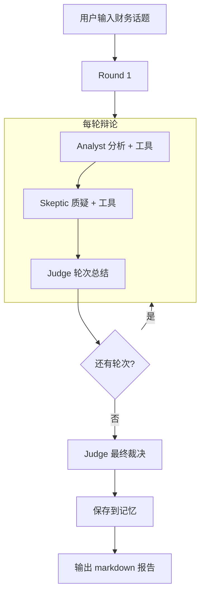

# 03 — 多 Agent 协同辩论

本模块实现**协同决策引擎**（`collaborative_decision`），是项目最具特色的 Multi-Agent 能力，面向财务评审、投资研判等需要多角度论证的场景。

---

## 1. 设计理念

### 1.1 为什么需要多 Agent？

单一 Agent 的财务分析可能存在：
- **确认偏误** — 只找支持自己结论的证据
- **盲区** — 忽略隐性风险、激进会计处理
- **缺乏对抗** — 没有人挑战假设

**解决方案：** 模拟真实财务评审委员会，由三个角色分工协作、相互制衡。

### 1.2 三角色模型

| 角色 | 英文名 | 定位 | 是否调用工具 |
|------|--------|------|-------------|
| 分析师 | Financial Analyst | 正方：提出分析结论，用数据支撑 | ✅ 是 |
| 质疑者 | Audit Skeptic | 反方：挑战结论，寻找风险与红旗 | ✅ 是 |
| 裁判 | Chief Judge | 中立：评估双方论点，给出轮次总结 | ❌ 否（纯 LLM） |

---

## 2. 类结构与文件

**主文件：** `backend/app/multi_agent/accounting/debate_team.py`  
**基类：** `backend/app/multi_agent/team.py` — `MultiAgentTeam`  
**数据结构：** `backend/app/multi_agent/debate.py` — `DebateRound`, `DebateResult`

```python
class AccountingDebateTeam(MultiAgentTeam):
    name = "financial_review_board"
    description = "财务评审委员会：分析师、质疑官、裁决官多轮结构化辩论"
```

---

## 3. 辩论流程

### 3.1 单轮流程（默认共 3 轮）

```
Round N:
  ┌─────────────────────────────────────────┐
  │ 1. Analyst（分析师）                      │
  │    - 读取 topic + 上轮 judge_summary       │
  │    - 调用会计工具（balance_sheet 等）       │
  │    - 输出 proposer_argument               │
  └──────────────────┬──────────────────────┘
                     ▼
  ┌─────────────────────────────────────────┐
  │ 2. Skeptic（质疑者）                      │
  │    - 阅读 Analyst 论点（最多 2000 字）     │
  │    - 调用工具验证/反驳                      │
  │    - 输出 opponent_argument               │
  └──────────────────┬──────────────────────┘
                     ▼
  ┌─────────────────────────────────────────┐
  │ 3. Judge（裁判）— 本轮总结                  │
  │    - 评估双方论点强弱                       │
  │    - 输出 judge_summary → 作为下轮上下文     │
  └─────────────────────────────────────────┘

Final Judgment（所有轮次结束后）:
  └─ Judge 输出完整 markdown 裁决报告
```

### 3.2 多轮上下文传递

- **Round 1：** Analyst 做初始全面分析
- **Round 2+：** Analyst 收到 `previous_context`（上轮 Judge 总结），进行**辩护与修正**
- Skeptic 每轮都针对 Analyst **最新**论点挑战

这种设计模拟了真实评审中「提出观点 → 被质疑 → 修正 → 再质疑」的迭代过程。

---

## 4. Prompt 工程

### 4.1 分析师 Prompt 要点

```
角色：Senior Financial Analyst，四大背景，15 年经验
职责：
  1. 用工具严格分析财务数据
  2. 提出有证据支持的结论
  3. 专业地回应质疑
  4. 诚实承认局限性

方法论：
  - 先验 A = L + E
  - 计算关键财务比率
  - 杜邦分析理解 ROE 驱动
  - 分析现金流质量
```

### 4.2 质疑者 Prompt 要点

```
角色：Audit Partner & Professional Skeptic，法务会计专家
职责：
  1. 专业但激进地挑战 Analyst
  2. 识别隐性风险、激进会计、红旗信号
  3. 质疑假设和方法论
  4. 用工具验证对方声明
```

### 4.3 裁判 Prompt 要点

```
角色：Chief Investment Judge，25 年资本市场经验
职责：
  1. 听取双方论点
  2. 评估哪方更有说服力
  3. 识别共识与分歧
  4. 给出平衡的最终裁决
```

### 4.4 最终裁决报告结构

Judge 被要求输出固定 markdown 结构：

```markdown
## Final Verdict
## Key Findings
## Risks to Monitor
## Consensus Points
## Recommended Next Steps
```

代码中 `_parse_verdict_sections()` 会从 markdown 提取结构化要点供后续使用。

---

## 5. 工具配置

辩论团队使用的工具集合：

```python
self._debate_tools = tool_registry.to_langchain_tools(
    categories=["accounting", "general", "web"]
)
```

| 类别 | 包含工具 |
|------|----------|
| accounting | 五大财务分析工具 |
| general | calculator, datetime 等 |
| web | web_search（查行业信息） |

每个角色最多 **5 轮**工具迭代（`ROLE_MAX_TOOL_ITERATIONS = 5`）。

**温度设置：**
- Analyst: 0.4（偏稳健）
- Skeptic: 0.5（略高，鼓励发散质疑）
- Judge: 0.3（偏确定性）

---

## 6. 流式事件

辩论模式的 WebSocket 事件序列示例：

```
START (execution_mode=collaborative_decision)
  │
  ├─ INTERMEDIATE { phase: "debate_round", round: 1, total_rounds: 3 }
  │
  ├─ THINKING { role: "analyst", message: "分析师正在分析..." }
  ├─ TOOL_CALL / TOOL_RESULT ...（分析师工具调用）
  ├─ REASONING ...（分析师输出）
  │
  ├─ THINKING { role: "skeptic", ... }
  ├─ TOOL_CALL / TOOL_RESULT ...
  ├─ REASONING ...
  │
  ├─ THINKING { role: "judge", ... }
  ├─ REASONING ...（本轮总结）
  │
  ├─ INTERMEDIATE { phase: "debate_round", round: 2, ... }
  │   └─ （重复上述流程）
  │
  ├─ FINAL { output: 完整裁决报告, mode: "debate_verdict" }
  └─ DONE
```

事件 metadata 中包含 `role` 和 `round` 字段，便于前端区分不同角色的输出。

---

## 7. 与 Orchestrator 的集成

```python
# orchestrator.py
def _get_agent(self, canonical_mode):
    if legacy == "multi_agent":
        return AccountingDebateTeam()
```

触发方式：
1. **自动路由** — 输入含「辩论、评审、委员会」等词
2. **手动选择** — 前端 mode 设为 `collaborative_decision`

---

## 8. 答辩演示建议

### 8.1 推荐输入

```
请组织财务评审委员会，对以下公司进行多角度辩论分析：
[粘贴 sample_financial.json 内容]

重点关注：ROE 下降原因、现金流质量、偿债风险
```

### 8.2 演示要点

1. 指出前端出现了 **analyst / skeptic / judge** 不同阶段
2. 展示 Analyst 和 Skeptic **都调用了工具**（如 dupont_analysis）
3. 强调 Skeptic 提出了 Analyst 未提及的风险点
4. 最终 Final Verdict 包含结构化章节

### 8.3 答辩话术

> 我们设计了财务评审委员会的三角色辩论机制。分析师负责用工具做正面分析，质疑者专门找漏洞和风险，裁判每轮总结并推动讨论深入。这种对抗式 Multi-Agent 架构比单一 Agent 更能覆盖财务分析中的盲区，也更接近真实审计/投资评审流程。

---

## 9. 常见问题

**Q: 辩论轮次可以配置吗？**  
A: 可以，通过 `.env` 的 `DEBATE_MAX_ROUNDS`（默认 3）。

**Q: Judge 为什么不调用工具？**  
A: Judge 职责是评估论证质量而非重新计算。避免三个角色都跑一遍工具造成冗余和成本浪费。

**Q: 与 Plan-Execute 的区别？**  
A: Plan-Execute 是「一个 Agent 分步执行」；Multi-Agent 是「多个角色对抗式讨论」。前者适合流水线任务，后者适合需要多角度论证的决策场景。

**Q: debate.py 里的 DebateOrchestrator 呢？**  
A: 是预留的通用辩论框架 stub（`NotImplementedError`），实际使用的是 `AccountingDebateTeam`。

---

## 10. 流程图


