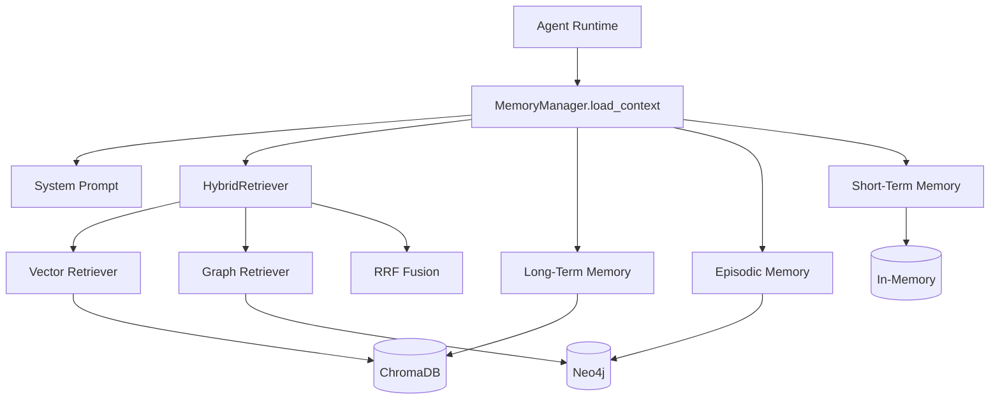

# 06 — 记忆与 RAG 检索增强

本模块解决 Agent 的两个核心问题：**跨轮对话上下文保持**（记忆）和**领域知识注入**（RAG）。

---

## 1. 为什么需要记忆 + RAG？

| 问题 | 没有记忆/RAG | 有记忆/RAG |
|------|-------------|-----------|
| 多轮对话 | 每轮都是「失忆」状态 | 记住之前讨论的内容 |
| 跨会话 | 无法引用历史分析 | 长期记忆召回相关对话 |
| 领域知识 | LLM 只靠预训练知识 | 可检索上传的会计准则文档 |
| 实体关系 | 不知道「这家公司」和「上次分析的 ROE」的关联 | 知识图谱存储实体关系 |

---

## 2. 三层记忆架构

**管理器：** `backend/app/memory/manager.py` — `MemoryManager`

```
┌─────────────────────────────────────────────────────────┐
│                    MemoryManager                         │
├─────────────┬──────────────────┬────────────────────────┤
│ Short-Term  │   Long-Term        │   Episodic             │
│ 短期记忆     │   长期记忆          │   情景记忆              │
├─────────────┼──────────────────┼────────────────────────┤
│ 存储：内存    │ 存储：ChromaDB     │ 存储：Neo4j             │
│ 范围：单会话  │ 范围：跨会话        │ 范围：实体/事件/关系     │
│ 内容：对话历史│ 内容：向量化的对话   │ 内容：实体节点+关系边    │
│ 延迟：即时    │ 延迟：异步持久化     │ 延迟：异步持久化          │
└─────────────┴──────────────────┴────────────────────────┘
```

### 2.1 短期记忆（Short-Term Memory）

**文件：** `backend/app/memory/short_term.py`

| 属性 | 值 |
|------|-----|
| 存储 | Python 内存 dict，key = session_id |
| 内容 | LangChain BaseMessage 列表（HumanMessage / AIMessage） |
| 容量 | 默认保留最近 10 条（可由技能 context_strategy 调整） |
| 生命周期 | 进程重启丢失；可通过 API 清除 |

**作用：** 当前会话的多轮对话连贯性。

### 2.2 长期记忆（Long-Term Memory）

**文件：** `backend/app/memory/long_term.py`

| 属性 | 值 |
|------|-----|
| 存储 | ChromaDB collection: `long_term_memory` |
| 内容 | 对话摘要的 embedding 向量 |
| 召回 | 语义相似度检索，返回 top_k 相关记忆 |
| 持久化 | 异步后台任务（`asyncio.create_task`） |

**保存逻辑：**
```python
combined = f"User: {user_input}\nAssistant: {agent_output}"
importance = 0.7 if len(agent_output) > 200 else 0.5
await long_term.remember(content=combined[:1200], session_id=..., importance=...)
```

**作用：** 跨会话记住「之前分析过哪些公司、得出什么结论」。

### 2.3 情景记忆（Episodic Memory）

**文件：** `backend/app/memory/episodic.py`

| 属性 | 值 |
|------|-----|
| 存储 | Neo4j 图数据库 |
| 内容 | 实体节点（公司、指标、方法）+ 关系边 + 会话事件 |
| 召回 | 关键词匹配 → Cypher 查询关联实体 |
| 实体抽取 | `entity_extractor.py` 规则/关键词 |

**实体类型示例：**
- `Company` — 公司名称
- `FinancialStatement` — 资产负债表、利润表
- `FinancialMetric` — ROE、净利润
- `AnalysisMethod` — 杜邦分析

**作用：** 结构化记住「谁、什么、之间什么关系」。

---

## 3. 上下文加载流程

`MemoryManager.load_context()` 按固定顺序融合上下文，注入 System Prompt：

```
1. System Prompt（基础 + 技能）
       ↓
2. 知识库 RAG（HybridRetriever.retrieve_formatted）
       ↓
3. 长期记忆（long_term.recall_formatted）
       ↓
4. 情景记忆（episodic.recall_graph_context）
       ↓
5. 短期记忆（short_term.get_history_summary）
       ↓
   合并为完整 System Message
```

### 3.1 上下文策略（Context Strategy）

技能可通过 `get_context_strategy()` 控制注入哪些层：

```python
{
    "max_history": 20,           # 短期记忆保留条数
    "include_knowledge": True,   # 是否注入 RAG
    "include_entities": True,    # 是否注入图谱
    "include_long_term": True,   # 是否注入长期记忆
}
```

### 3.2 超时与降级

每层记忆/RAG 加载都有 **5 秒超时**（`MEMORY_LOAD_TIMEOUT`）。超时或异常时**静默跳过**，不阻塞 Agent 执行。这保证了在无 Docker 基础设施时系统仍可运行（只是没有记忆/RAG 增强）。

---

## 4. 上下文保存流程

Agent 输出完成后，`MemoryManager.save_context()`：

```
1. short_term.add_user_message() + add_ai_message()    → 即时
2. asyncio.create_task(_persist_background())           → 异步
   ├─ long_term.remember()                               → ChromaDB
   └─ episodic.log_event()                              → Neo4j
```

**实体抽取：** 从 user_input + agent_output 中自动提取实体写入图谱。

---

## 5. RAG 混合检索

### 5.1 架构

**管理器：** `backend/app/rag/hybrid.py` — `HybridRetriever`

```
                    HybridRetriever
                   /              \
          VectorStoreRetriever   KnowledgeGraphRetriever
                |                        |
           ChromaDB                   Neo4j
         (语义相似度)              (实体/文档/关系)
                   \              /
                    RRF Fusion
                  (倒数排名融合)
```

### 5.2 三种检索模式

| 模式 | 说明 |
|------|------|
| `vector` | 仅向量语义检索 |
| `graph` | 仅知识图谱检索 |
| `hybrid` | RRF 融合（默认） |

### 5.3 RRF 融合算法

**Reciprocal Rank Fusion（倒数排名融合）：**

```
对每个检索结果，按排名计算得分：
  score(doc) += 1 / (k + rank + 1)

其中 k = 60（默认值）

最终按 score 降序排列，取 top_k
```

**为什么用 RRF？**
- 不需要对不同检索器的分数做归一化
- 两个检索器「都排名靠前」的文档会获得更高融合分
- 简单有效，是工业界常用的混合检索策略

**代码核心：**

```python
for rank, doc in enumerate(vector_docs):
    scores[key] = scores.get(key, 0) + 1 / (k + rank + 1)
for rank, doc in enumerate(graph_docs):
    scores[key] = scores.get(key, 0) + 1 / (k + rank + 1)
sorted_keys = sorted(scores.keys(), key=lambda x: scores[x], reverse=True)
```

### 5.4 知识入库流程

`HybridRetriever.add_knowledge()` 同时写入两路：

```
1. vector_retriever.add_document()     → ChromaDB 向量化存储
2. graph_retriever.add_document()      → Neo4j 文档节点
3. extract_entities(content)           → 规则抽取实体
4. 相邻实体间创建 RELATED_TO 关系边
```

**API 入口：** `POST /api/knowledge/upload`

---

## 6. 实体抽取

**文件：** `backend/app/rag/entity_extractor.py`

基于**规则 + 关键词**的轻量抽取（非 LLM）：

| 类型 | 示例关键词 |
|------|-----------|
| FinancialStatement | 资产负债表、利润表、现金流量表 |
| FinancialMetric | ROE、ROA、净利润、毛利率 |
| AnalysisMethod | 杜邦分析、比率分析 |
| Company | 正则匹配公司名 |

**优点：** 快速、无额外 LLM 成本、结果稳定  
**局限：** 覆盖有限，复杂实体需 LLM 抽取（可扩展）

---

## 7. 与 Agent 的集成点

| 集成点 | 文件 | 调用 |
|--------|------|------|
| 加载上下文 | runtime.py | `memory_manager.load_context()` |
| 保存上下文 | runtime.py | `memory_manager.save_context()` |
| 知识检索 | memory/manager.py | `hybrid.retrieve_formatted()` |
| 知识上传 | api/knowledge.py | `hybrid.add_knowledge()` |

---

## 8. 基础设施依赖

| 组件 | Docker 服务 | 端口 | 无 Docker 时 |
|------|------------|------|-------------|
| ChromaDB | chromadb | 8001 | 本地 PersistentClient fallback |
| Neo4j | neo4j | 7474/7688 | 图谱功能静默降级 |

`.env` 配置：
```
CHROMA_HOST=localhost
CHROMA_PORT=8001
NEO4J_URI=bolt://localhost:7688
ENABLE_VECTOR_MEMORY=true
```

---

## 9. 答辩演示建议

### 演示 RAG

1. 在 Knowledge 页面上传一份会计学文档（如「企业会计准则第 X 号」摘要）
2. 在 Chat 中提问文档相关内容
3. 观察 Agent 回答引用了检索到的知识（System Prompt 中有 `## Retrieved Knowledge Base` 段落）

### 演示记忆

1. 第一轮：「请分析示例公司的 ROE」
2. 第二轮：「刚才那家公司负债率是多少？」
3. 展示 Agent 能引用第一轮的分析结果（短期记忆）

### 答辩话术

> 我们设计了三层记忆加混合 RAG 的上下文增强方案。短期记忆保证单会话连贯，长期记忆向量化存储跨会话对话，情景记忆用 Neo4j 图谱记录实体关系。RAG 方面，向量检索捕捉语义相似，图谱检索捕捉结构化关系，通过 RRF 算法融合两路结果，比单一检索更全面。

---

## 10. 常见问题

**Q: 记忆会无限增长吗？**  
A: 长期记忆按 top_k 召回，不会全量注入上下文。ChromaDB 存储可手动清理。

**Q: RRF 的 k=60 怎么选的？**  
A: 这是 RRF 论文中的常用默认值，对排名靠后的结果惩罚更大，平衡两路检索的贡献。

**Q: 没有 Neo4j 能用吗？**  
A: 可以。图谱相关功能静默降级，向量检索和短期记忆仍可用。

**Q: embedding 模型是什么？**  
A: 使用 ChromaDB 默认 embedding 或配置中指定的模型（见 `db/chroma.py`）。

---

## 11. 架构图


