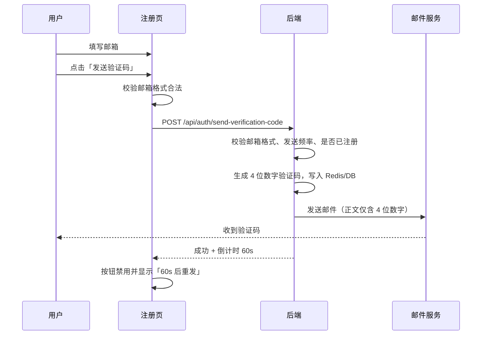
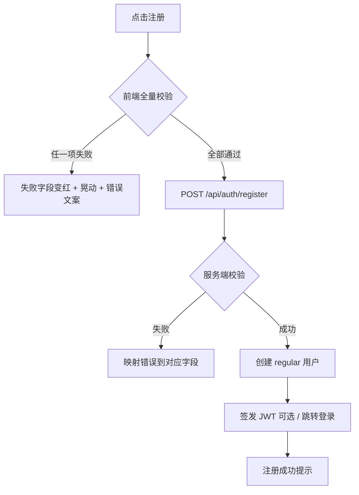

# PRD — 用户注册功能

> **版本**：1.0  
> **日期**：2026-07-28  
> **状态**：待评审  
> **优先级**：P0（Phase 1）  
> **路由**：`/register`  
> **关联页面**：`/login`（注册成功后跳转或自动登录）

---

## 1. 背景与目标

### 1.1 背景

当前系统已具备：

- 登录页初版（用户名 + 密码）
- 后端 `POST /api/auth/register`（用户名、可选邮箱、密码，**无邮箱验证码**）
- 注册页占位（`/register`），尚未实现完整表单

[11 — 页面与功能清单](../11-页面与功能清单/README.md) 将注册页列为 **P0**，要求支持用户名、邮箱、密码、确认密码，注册默认创建 **普通用户（`regular`）**。[03 — 身份认证与会话](../03-身份认证与会话/README.md) 明确开放注册不得直接成为会员。

本 PRD 在既有设计基础上，**补充邮箱验证码注册流程**及完整的前端交互规范，作为注册功能开发的唯一产品依据。

### 1.2 产品目标

| 目标 | 说明 |
|------|------|
| 可注册 | 用户通过邮箱验证完成自助注册，默认成为普通用户 |
| 可验证 | 邮箱归属通过四位数字验证码确认，降低虚假注册 |
| 可感知 | 校验失败时字段变红并晃动，错误信息明确 |
| 可安全 | 验证码有效期、发送频率、尝试次数受控 |
| 可验收 | 前后端规则一致，测试用例可覆盖 |

### 1.3 不在本次范围

- 手机号注册 / 第三方 OAuth（微信、GitHub 等）
- 图形验证码（Captcha）或滑块验证
- 注册后直接成为会员
- 应用内管理后台（用户审核、手动开通）
- 邀请码 / 企业域名白名单注册

---

## 2. 用户与场景

### 2.1 目标用户

首次使用企业智能体工作台、尚无账号的访客。

### 2.2 核心场景

| 编号 | 场景 | 期望结果 |
|------|------|----------|
| S1 | 用户填写合法信息并完成邮箱验证 | 注册成功，成为 `regular` 用户，进入登录页或自动登录 |
| S2 | 用户邮箱格式错误或用户名已存在 | 对应字段变红、晃动，展示错误文案，不提交注册 |
| S3 | 密码与确认密码不一致 | 确认密码框变红，提示「密码不一致」，不发起注册请求 |
| S4 | 用户点击「发送验证码」 | 合法邮箱收到 4 位数字验证码；60 秒内不可重复发送 |
| S5 | 验证码过期或错误 | 验证码输入框变红、晃动，提示无效 |
| S6 | 用户已有账号 | 通过「去登录」链接返回 `/login` |

---

## 3. 页面与布局

### 3.1 路由与入口

| 项 | 说明 |
|----|------|
| 路由 | `/register` |
| 入口 | 登录页「立即注册」链接 |
| 布局 | 与登录页一致：全屏认证布局（无侧栏），`GlassCard` + 系统渐变背景 |
| 已登录访问 | 重定向至 `/`（与登录页行为一致） |

### 3.2 表单字段（自上而下）

页面表单**从上到下**固定包含以下五个输入区域：

| 序号 | 字段 | 控件类型 | 必填 | 占位符示例 |
|------|------|----------|------|------------|
| 1 | **用户名** | 单行文本 | 是 | 请输入用户名（字母、数字、下划线） |
| 2 | **邮箱** | 单行文本 | 是 | 请输入邮箱地址 |
| 3 | **密码** | 密码框（可显示/隐藏） | 是 | 至少 6 位，仅字母、数字、下划线 |
| 4 | **确认密码** | 密码框（可显示/隐藏） | 是 | 请再次输入密码 |
| 5 | **验证码** | 单行文本 + 「发送验证码」按钮 | 是 | 请输入 4 位验证码 |

### 3.3 操作按钮

| 按钮 | 位置 | 说明 |
|------|------|------|
| **注册** | 表单底部主按钮（`ui-btn-primary`） | 提交完整注册流程 |
| **发送验证码** | 验证码输入框右侧或下方 | 向已填写的合法邮箱发送验证码 |
| **去登录** | 表单底部次要链接 | 跳转 `/login` |

### 3.4 视觉规范

与登录页及系统全局风格保持一致：

- 容器：`GlassCard`（`tinted`）
- 输入框：Element Plus `el-input`，沿用 `global.css` 玻璃态样式
- 主按钮：`ui-btn-primary`
- 次要操作：`ui-btn-ghost` 或文字链接
- 错误态：输入框边框 `#DC2626`，浅红背景 `rgba(220,38,38,0.06)`
- 错误文案：字段下方 12–13px 红色提示
- 晃动动效：水平 shake，时长约 400ms（见 §5.4）

---

## 4. 字段校验规则

### 4.1 通用约定

- 所有校验规则**前后端双重校验**；前端用于即时反馈，后端为最终权威。
- 正则说明：下文「字母」指 `A–Z`、`a–z`；「阿拉伯数字」指 `0–9`；「下划线」指 `_`。
- 用户名、密码**不允许**空格、中文、标点及其他特殊字符。

### 4.2 用户名

| 规则 | 说明 |
|------|------|
| 必填 | 不能为空 |
| 字符集 | 仅允许：`[A-Za-z0-9_]` |
| 长度 | 3–64 个字符（与现有 `users.username` 及后端 `RegisterRequest` 对齐） |
| 唯一性 | 服务端查重；已存在时拒绝注册 |
| 错误文案（示例） | 「用户名只能包含字母、数字和下划线」「用户名长度为 3–64 个字符」「用户名已被占用」 |

**正则（前端实时校验）**：

```text
^[A-Za-z0-9_]{3,64}$
```

### 4.3 邮箱

| 规则 | 说明 |
|------|------|
| 必填 | 不能为空（本 PRD 将邮箱从「可选」升级为「必填」） |
| 格式 | 符合常见邮箱格式（见下方正则） |
| 唯一性 | 服务端查重；已注册邮箱不可再次注册 |
| 发送验证码前置 | 仅当邮箱格式合法且通过前端校验后，「发送验证码」按钮才可点击 |
| 错误文案（示例） | 「请输入有效的邮箱地址」「该邮箱已被注册」 |

**正则（前端格式校验，建议）**：

```text
^[A-Za-z0-9._%+-]+@[A-Za-z0-9.-]+\.[A-Za-z]{2,}$
```

> 说明：最终合法性以服务端校验为准；国际化域名（IDN）本期不单独支持。

### 4.4 密码

| 规则 | 说明 |
|------|------|
| 必填 | 不能为空 |
| 字符集 | 仅允许：`[A-Za-z0-9_]` |
| 长度 | 不少于 **6** 位；上限建议 128 位（与现有后端一致） |
| 错误文案（示例） | 「密码只能包含字母、数字和下划线」「密码至少 6 位」 |

**正则**：

```text
^[A-Za-z0-9_]{6,128}$
```

### 4.5 确认密码

| 规则 | 说明 |
|------|------|
| 必填 | 不能为空 |
| 字符集 | 与密码相同：`[A-Za-z0-9_]`，不少于 6 位 |
| 一致性 | **必须与「密码」字段完全一致** |
| 不一致行为 | **不允许进入注册流程**（不调用注册 API） |
| 不一致 UI | 确认密码输入框**变红**，字段下方提示 **「密码不一致」** |
| 触发时机 | 确认密码失焦时预校验；点击「注册」时再次强制校验 |

> 若仅确认密码与密码不一致，其他字段均合法，仍**禁止提交**；仅确认密码框进入错误态。

### 4.6 验证码

| 规则 | 说明 |
|------|------|
| 必填 | 不能为空 |
| 格式 | **仅 4 位阿拉伯数字**：`[0-9]{4}` |
| 有效性 | 必须与服务端当前有效验证码匹配，且未过期 |
| 错误文案（示例） | 「请输入 4 位数字验证码」「验证码错误或已过期」 |

**正则**：

```text
^[0-9]{4}$
```

---

## 5. 验证码策略

### 5.1 发送流程



### 5.2 发送条件

「发送验证码」按钮可点击需同时满足：

1. 邮箱字段非空  
2. 邮箱格式通过前端校验  
3. 当前不在 60 秒发送冷却期内  
4. 无进行中的发送请求  

### 5.3 时间与频率

| 参数 | 值 | 说明 |
|------|-----|------|
| 验证码位数 | **4 位** | 仅数字 `0000`–`9999`（可排除全 0 等弱码，实现时可选） |
| 验证码有效期 | **60 秒** | 自发送成功时刻起算 |
| 发送最小间隔 | **60 秒** | 同一邮箱两次成功发送之间至少间隔 60 秒 |
| 倒计时展示 | 60 → 0 | 前端按钮文案如「58s 后重发」 |

### 5.4 邮件内容

| 项 | 要求 |
|----|------|
| 收件人 | 用户填写的注册邮箱 |
| 主题 | 如「【企业智能体工作台】注册验证码」 |
| 正文 | **仅包含 4 位数字验证码**（可附加一行有效期提示「验证码 60 秒内有效」，但验证码本身必须为 4 位数字） |
| 不含 | 链接、附件、营销内容 |

### 5.5 验证与消费

- 用户点击「注册」时，服务端校验验证码是否正确且在有效期内。  
- **验证成功后立即作废**该验证码（一次性使用），防止重放注册。  
- 同一邮箱在未完成注册前，新验证码发送成功后**覆盖**旧验证码。

### 5.6 限流与安全（后端）

| 维度 | 建议策略 |
|------|----------|
| 单邮箱发送频率 | 60 秒内最多 1 次成功发送 |
| 单 IP 发送频率 | 如 10 次/小时（可配置，见 [07 — 存储与安全](../07-存储与安全/README.md)） |
| 验证码尝试次数 | 同一验证码最多错误 5 次，超出需重新发送 |
| 存储 | 优先 Redis（TTL=60s）；无 Redis 时可用 MySQL 临时表 + 过期清理 |
| 日志 | 审计 `auth.verification_sent` / `auth.verification_failed`；**禁止**在日志中记录完整验证码 |

---

## 6. 注册提交流程

### 6.1 前置条件

用户点击「注册」时，**必须**同时满足以下五项均有效，才允许发起注册 API：

1. 用户名合法且未被占用  
2. 邮箱合法且未被占用  
3. 密码合法  
4. 确认密码与密码一致  
5. 验证码合法且未过期  

任一项无效：**不调用注册接口**（密码不一致时尤其禁止提交）。

### 6.2 提交流程



### 6.3 注册成功后续

| 方案 | 说明 | 推荐 |
|------|------|------|
| A. 自动登录 | 返回 JWT，写入 `auth_token`，跳转 `/` | **推荐**（与现有登录体验一致） |
| B. 跳转登录 | 提示「注册成功，请登录」，跳转 `/login` | 可选 |

默认采用 **方案 A**；`user_type` 固定为 `regular`，不携带会员权益。

### 6.4 与现有后端差异说明

| 项 | 现有实现 | 本 PRD 要求 |
|----|----------|-------------|
| 邮箱 | 可选 | **必填** + 验证码 |
| 密码字符集 | 长度 ≥6，无字符集限制 | **仅字母、数字、下划线** |
| 用户名字符集 | 长度 3–64 | **仅字母、数字、下划线** |
| 验证码 | 无 | **4 位数字，60s 有效** |
| 确认密码 | 前端字段 | **前后端均校验一致** |

> 开发本 PRD 时须**扩展**现有 `POST /api/auth/register`，而非仅做前端；具体接口见 §7。

---

## 7. 接口设计（待开发）

### 7.1 发送邮箱验证码

```http
POST /api/auth/send-verification-code
Content-Type: application/json

{
  "email": "user@example.com",
  "purpose": "register"
}
```

**成功响应（200）**：

```json
{
  "success": true,
  "message": "验证码已发送",
  "retry_after_seconds": 60
}
```

**失败响应（200 或 4xx，建议统一 JSON）**：

```json
{
  "success": false,
  "code": "EMAIL_INVALID | EMAIL_ALREADY_REGISTERED | SEND_TOO_FREQUENT | MAIL_SEND_FAILED",
  "message": "人类可读说明",
  "retry_after_seconds": 42
}
```

### 7.2 用户注册（扩展）

```http
POST /api/auth/register
Content-Type: application/json

{
  "username": "user_name",
  "email": "user@example.com",
  "password": "Pass_123",
  "verification_code": "1234"
}
```

**成功响应（200）**：

```json
{
  "success": true,
  "token": "JWT...",
  "user_id": 1,
  "username": "user_name",
  "user_type": "regular"
}
```

**失败响应（200 + success:false 或 4xx）**：

```json
{
  "success": false,
  "code": "USERNAME_INVALID | USERNAME_TAKEN | EMAIL_INVALID | EMAIL_TAKEN | PASSWORD_INVALID | VERIFICATION_CODE_INVALID | VERIFICATION_CODE_EXPIRED",
  "message": "人类可读说明",
  "field": "username | email | password | verification_code"
}
```

`field` 字段供前端映射到对应输入框错误态。

### 7.3 错误码与字段映射

| code | 对应字段 | 前端提示（示例） |
|------|----------|------------------|
| `USERNAME_INVALID` | username | 用户名只能包含字母、数字和下划线 |
| `USERNAME_TAKEN` | username | 用户名已被占用 |
| `EMAIL_INVALID` | email | 请输入有效的邮箱地址 |
| `EMAIL_TAKEN` | email | 该邮箱已被注册 |
| `PASSWORD_INVALID` | password | 密码只能包含字母、数字和下划线，至少 6 位 |
| `PASSWORD_MISMATCH` | confirm_password | 密码不一致（仅前端，服务端可选二次校验） |
| `VERIFICATION_CODE_INVALID` | verification_code | 验证码错误 |
| `VERIFICATION_CODE_EXPIRED` | verification_code | 验证码已过期，请重新获取 |
| `SEND_TOO_FREQUENT` | email | 发送过于频繁，请稍后再试 |

---

## 8. 交互与错误态

### 8.1 校验触发时机

| 时机 | 行为 |
|------|------|
| 输入过程中 | 用户名/邮箱/密码：格式类错误可在失焦后展示；确认密码：失焦时对比密码 |
| 点击「发送验证码」 | 仅校验邮箱 |
| 点击「注册」 | **全量校验**所有五项；任一失败则进入错误态 |

### 8.2 错误态视觉（统一规范）

当某字段校验失败（含点击注册后服务端返回的字段错误）：

1. **输入框变红**：边框 `#DC2626`，可选浅红背景  
2. **晃动提示**：该输入框（或表单项容器）播放水平 shake 动画，约 400ms  
3. **文案提示**：输入框正下方展示具体错误信息  
4. **多项失败**：所有失败字段同时变红并晃动；首个错误字段滚动至可视区域（可选）

### 8.3 密码不一致（专项）

| 项 | 要求 |
|----|------|
| 触发 | 确认密码 ≠ 密码 |
| 影响范围 | **仅**确认密码输入框 |
| 文案 | **「密码不一致」**（固定 copy，不做改写） |
| 提交 | **阻止**注册 API 调用 |
| 恢复 | 用户修改确认密码或密码后，失焦或输入时自动清除错误态 |

### 8.4 晃动动画参数（建议）

```css
/* 供前端实现参考，非强制代码 */
@keyframes field-shake {
  0%, 100% { transform: translateX(0); }
  20% { transform: translateX(-6px); }
  40% { transform: translateX(6px); }
  60% { transform: translateX(-4px); }
  80% { transform: translateX(4px); }
}
```

动画 class 名建议：`.field-error-shake`；错误态 class：`.field-error`。

### 8.5 加载与禁用态

| 状态 | UI |
|------|-----|
| 发送验证码中 | 按钮 loading，「发送验证码」不可重复点击 |
| 注册提交中 | 「注册」按钮 loading + 禁用，防止重复提交 |
| 冷却倒计时 | 「发送验证码」禁用，展示剩余秒数 |

---

## 9. 数据模型变更（建议）

在 [05 — 数据模型](../05-数据模型与MySQL设计/README.md) 基础上，建议新增：

### 9.1 email_verification_codes（Redis 优先 / MySQL 备选）

| 字段 | 类型 | 说明 |
|------|------|------|
| email | VARCHAR(255) | 索引 |
| code | CHAR(4) | 四位数字 |
| purpose | VARCHAR(32) | `register` |
| attempts | INT | 错误尝试次数 |
| expires_at | DATETIME | 创建时间 + 60s |
| created_at | DATETIME | 用于发送间隔判断 |

**Redis Key 示例**：

```text
verify:register:{email} → { code, attempts, exp }
verify:cooldown:{email} → TTL 60s
```

### 9.2 users 表

- `email` 字段由 **UNIQUE NULL** 调整为业务上的 **必填**（注册路径必须写入）  
- 现有 `username`、`password_hash`、`user_type=regular` 逻辑不变  

---

## 10. 前端模块变更清单（开发参考）

> 本节供排期使用，**本 PRD 阶段不修改代码**。

| 模块 | 变更要点 |
|------|----------|
| `RegisterView.vue` | 五字段表单、发送验证码、错误态与晃动 |
| `stores/auth.ts` | 新增 `register()`，写入 token 与用户信息 |
| `api/client.ts` | `sendVerificationCode()`、`register()` 扩展参数 |
| `router/index.ts` | `/register` 路由（已存在占位，需替换实现） |
| `utils/validation.ts`（新） | 用户名/邮箱/密码/验证码正则与错误 copy |
| 样式 | `.field-error`、`.field-error-shake` 可放入 `global.css` 或组件 scoped |

---

## 11. 后端模块变更清单（开发参考）

| 模块 | 变更要点 |
|------|----------|
| `app/api/auth.py` | 新增 `send-verification-code`；扩展 `register` |
| `app/services/auth.py` | 用户名/密码字符集校验；验证码校验 |
| `app/services/email.py`（新） | SMTP / 邮件服务商发送 |
| `app/services/verification.py`（新） | 生成、存储、校验、频率控制 |
| `.env` | `SMTP_*` 或邮件 API Key 配置项 |
| 审计 | `auth.register`、`auth.verification_sent` |

---

## 12. 验收标准

### 12.1 页面与布局

- [ ] `/register` 自上而下依次为：用户名、邮箱、密码、确认密码、验证码  
- [ ] 视觉风格与登录页一致（GlassCard、系统渐变、Element Plus 输入框）  
- [ ] 存在「注册」「发送验证码」「去登录」操作  

### 12.2 用户名

- [ ] 仅允许字母、数字、下划线，长度 3–64  
- [ ] 非法字符时字段变红、晃动并提示  
- [ ] 重名时注册失败并提示「用户名已被占用」  

### 12.3 邮箱与验证码

- [ ] 非法邮箱无法发送验证码（按钮不可用或点击后提示）  
- [ ] 合法邮箱发送成功后收到 **仅含 4 位数字** 的验证码邮件  
- [ ] 60 秒内不能重复发送，按钮显示倒计时  
- [ ] 验证码 60 秒后失效，过期注册提示重新获取  
- [ ] 错误验证码无法完成注册  

### 12.4 密码与确认密码

- [ ] 密码仅允许字母、数字、下划线，至少 6 位  
- [ ] 确认密码与密码不一致时：**不提交注册**，确认密码框变红，提示 **「密码不一致」**  
- [ ] 一致且其他项合法时可进入注册流程  

### 12.5 注册结果

- [ ] 五项均有效方可注册成功  
- [ ] 新用户 `user_type = regular`  
- [ ] 注册成功后自动登录并进入主界面，或跳转登录页（以最终实现方案为准）  
- [ ] 任一项无效：点击注册后对应输入框变红并晃动  

### 12.6 安全

- [ ] 验证码一次性使用，成功后失效  
- [ ] 同一邮箱 60 秒发送间隔 enforced by 服务端  
- [ ] 日志不记录明文验证码  

---

## 13. 测试用例摘要

| 编号 | 输入要点 | 期望 |
|------|----------|------|
| T1 | 全部合法 + 正确验证码 | 注册成功，regular 用户 |
| T2 | 用户名含 `@` 或中文 | 用户名字段错误，不提交 |
| T3 | 邮箱无 `@` | 邮箱字段错误，不可发码 |
| T4 | 密码 `abc12`（5 位） | 密码字段错误 |
| T5 | 密码含 `!` | 密码字段错误 |
| T6 | 确认密码与密码不同 | 确认密码变红，「密码不一致」，**无 API 请求** |
| T7 | 验证码错误 | 验证码字段错误，注册失败 |
| T8 | 验证码超时（>60s） | 提示过期，注册失败 |
| T9 | 60s 内重复点击发送 | 第二次被拒绝，返回剩余冷却时间 |
| T10 | 重复用户名/邮箱 | 对应字段错误提示 |

---

## 14. 排期建议

| 阶段 | 内容 | 依赖 |
|------|------|------|
| Phase 1a | 后端：验证码发送/校验、register 扩展、邮件配置 | Redis/MySQL、SMTP |
| Phase 1b | 前端：RegisterView 五字段、校验、错误态与晃动 | Phase 1a API |
| Phase 1c | 联调 + 验收用例 T1–T10 | — |

建议纳入 [09 — 实施路线图](../09-实施路线图/README.md) **Phase 1**，与登录页、auth store 同期交付。

---

## 15. 相关文档

- [多用户体系导航](../README.md)  
- [03 — 身份认证与会话](../03-身份认证与会话/README.md)  
- [05 — 数据模型与 MySQL 设计](../05-数据模型与MySQL设计/README.md)  
- [07 — 存储与安全](../07-存储与安全/README.md)  
- [11 — 页面与功能清单](../11-页面与功能清单/README.md)  
- [09 — 实施路线图](../09-实施路线图/README.md)

---

## 16. 修订记录

| 版本 | 日期 | 作者 | 说明 |
|------|------|------|------|
| 1.0 | 2026-07-28 | — | 初版：五字段注册 + 邮箱四位验证码 + 完整校验与交互规范 |
